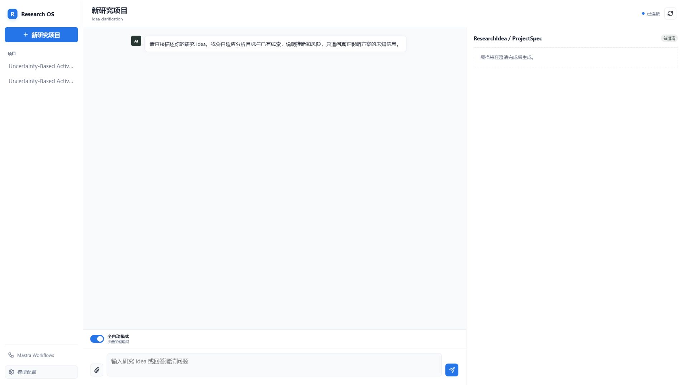
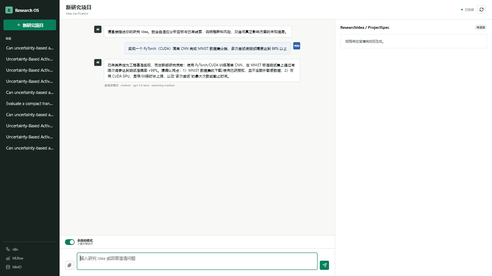
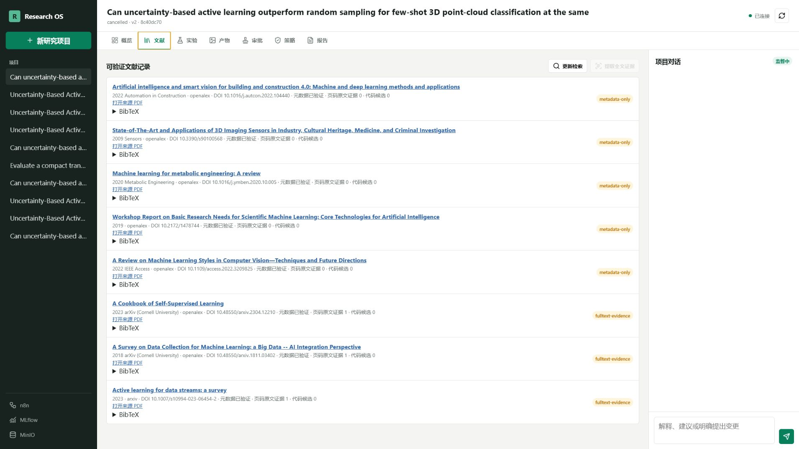
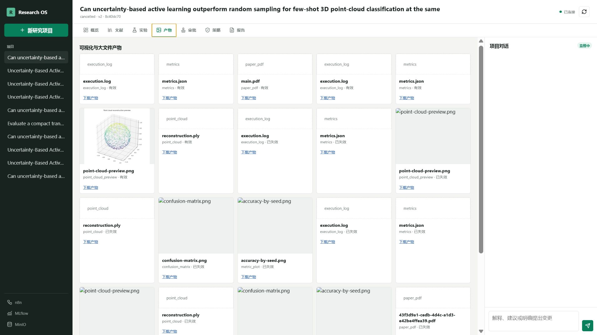
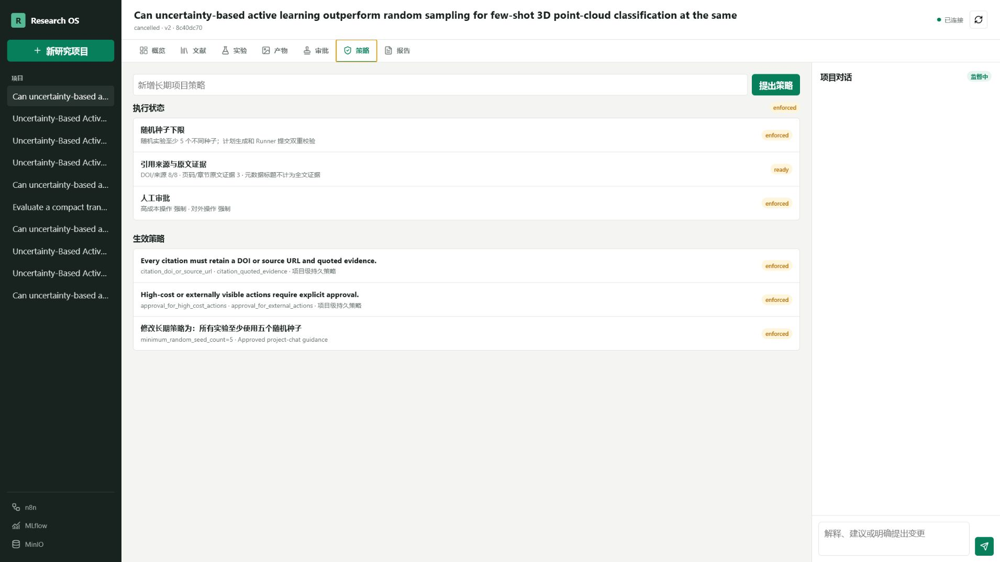
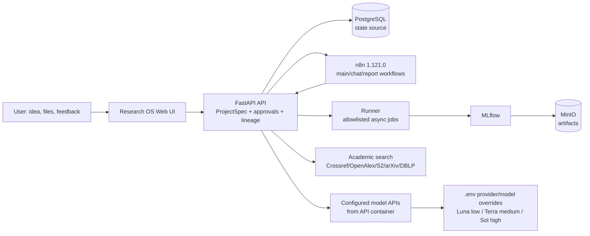

<!-- DOCS_SYNC_VERSION: 2026-07-30-16 -->
<!-- ACCEPTANCE_PROJECT: 6d91ff49-12a5-406c-b7aa-cb96aa3f22e4 -->

<div align="center">

# Research OS

### Local-first, evidence-aware research automation from idea to auditable artifacts

[](docker-compose.yml)
[](n8n/workflows)
[](apps)
[](http://127.0.0.1:5000)

**[English](README.md) · [简体中文](README.zh-CN.md)**

</div>

> **Status: runnable and audited local MVP.** Research OS proves the orchestration, approval, evidence, lineage, runner, and artifact path. It does **not** yet claim production-grade autonomous literature review, official code reproduction, arbitrary GPU scheduling, or complete paper authorship. See [the requirements audit](docs/requirements-audit-2026-07-28.md) before using it for real scientific decisions.



## Why Research OS

Research projects usually lose context between a chat, a paper spreadsheet, an experiment folder, and a manuscript. Research OS keeps those pieces connected around a persistent `project_id` and versioned `ResearchIdea/ProjectSpec`:

- Start with a natural-language idea and an adaptive AI clarification loop that infers obvious context, exposes assumptions, and avoids a fixed questionnaire. Default-on **Automatic mode** asks as little as possible; turning it off selects **Detailed mode** for broader, still-adaptive discovery.
- Refuse incomplete or clearly infeasible ideas before project creation.
- Persist ideas, policies, approvals, checkpoints, tasks, experiments, evidence, and artifacts in PostgreSQL; chat is not the source of truth.
- Search Crossref, OpenAlex, Semantic Scholar, arXiv, and DBLP with DOI/BibTeX records and provider-error tracking.
- Distinguish `metadata-only` candidates from `fulltext-evidence` records with PDF hash, page/section locator, quote, and source URL.
- Require a proposal and explicit approval before expensive experiments, code/config/LaTeX changes, dependency installation, overwrite/delete, or external publication.
- Run a small allowlisted experiment set as a non-root, resource-limited Runner and record metrics in self-hosted MLflow with MinIO artifacts.
- Before an approved run enters the Runner, require a clean project worktree, create an immutable `run/<run_id>` tag, and retain a hashed source/environment/data/model/config snapshot under controlled artifacts.
- Produce inspectable PNG/PDF/JSON/PLY outputs with download links and project lineage instead of returning only an LLM paragraph.
- Preview valid artifacts in the Web UI: bounded JSON/text/CSV/TSV/PDF views, non-executing HTML text, and an interactive ASCII PLY/PCD point-cloud canvas with drag rotation, wheel zoom, reset, optional mesh wireframe, fixed sampling limits, and a download link. Invalidated artifacts remain visible but are not previewable.
- Accept bounded PDF, JSON, CSV/TSV, text, code, image, and ZIP-manifest uploads. Every upload must pass the private ClamAV scan and bounded parser before it is persisted or sent as untrusted context; scanner/parser failure blocks the model request, images use bounded OCR, and ZIP contents are never extracted or executed. Session and project quotas are enforced transactionally.
- Pause, resume from a checkpoint, cancel, revise an Idea, and generate daily/weekly reports from the same project conversation.

## Screenshots

These images are from a real acceptance project and contain no tokens or credentials. The latest full acceptance project is `6d91ff49-12a5-406c-b7aa-cb96aa3f22e4`.



The new-project chat above shows the default-on Automatic-mode toggle, infers deep learning/computer vision from PyTorch, CUDA, CNN, and MNIST, identifies the request as an engineering benchmark rather than automatically claiming novelty, and selects the configurable medium-cost `gpt-5.6-terra` route. Turning the toggle off selects Detailed mode, which investigates more relevant gaps without reverting to a fixed questionnaire. While a response is pending, the UI shows an indeterminate progress bar, elapsed time, and current analysis hint without fabricating a completion percentage.

| Overview | Literature evidence |
| --- | --- |
|  |  |

| Artifact gallery | Persistent policies and approval gates |
| --- | --- |
|  |  |

The screenshots intentionally show the evidence boundary: several DOI records are `metadata-only`, while only records with stored page quotes are marked `fulltext-evidence`. A broken or invalidated artifact remains visible as invalid rather than silently disappearing. Artifact previews are bounded renderings only: HTML is shown as escaped source text, binary PLY/PCD is rejected, and preview data never executes or changes the stored artifact.

## Architecture



The API and Runner are the enforcement boundary. n8n coordinates bounded workflows but cannot read container environment variables, issue arbitrary SQL, or pass arbitrary shell commands to the Runner. Idea clarification is an adaptive, schema-constrained conversational agent: it updates the whole draft each turn, but it has no shell, filesystem, SQL, or network tools. The API container calls the independently configured OpenAI-compatible model URLs directly. It never reads the Windows Codex configuration directory, `auth.json`, or host model service. A failed call is returned as a structured error with no provider switch or local reply.

Runner isolation uses a fresh non-root job container for each Run. The `runner-launcher` service is the only Docker-control boundary and the only service with the Docker socket; API and Runner have no socket, and Windows starts no API, Runner, or model process. The fixed job image, internal network, controlled mounts, task template, command, resource limits, timeout, cancellation, and environment are selected by deployment code. User payloads cannot select an image, command, path, network, or environment. A topic-specific plan executes only the project Git workspace's fixed `experiment/main.py` entrypoint and receives the plan/checkpoint through fixed JSON paths; it must publish numeric `metrics.json` and a structured `checkpoint.json`. Missing files, invalid output, or process failure return structured errors; the API never substitutes a generic demo task or another model/provider.

## Capability matrix

| Area | MVP status | What is real today |
| --- | --- | --- |
| Idea chat and clarification | **Implemented (adaptive MVP)** | Whole-draft AI analysis, default Automatic / optional Detailed mode, assumption/risk tracking, Luna/Terra/Sol cost routing, visible wait state, strict schemas, and structured model errors. Failed model calls do not switch providers or generate rule-based replies. |
| Project initialization | **Implemented** | UUID, Git workspace, directories, Idea v1, PostgreSQL records, checkpoints, n8n trigger. |
| Literature search | **Implemented (bounded)** | Crossref, OpenAlex, Semantic Scholar, arXiv, DBLP, DOI BibTeX; GitHub is a candidate source only. |
| Full-text evidence | **Implemented (MVP)** | Allowlisted HTTPS PDF download, PDF/quote SHA-256, page/section locator, quote and BibTeX persistence. |
| Idea-specific experiment planning | **Implemented (approval-gated)** | The API uses the current ProjectSpec, verified page-level evidence, and active policy snapshot to generate a strict topic-specific plan Proposal with datasets, baselines, metrics, ablations, statistical tests, seeds, budget, risks, and success criteria; an approved plan can execute through the fixed project entrypoint contract. |
| Human supervision | **Implemented (MVP)** | Strict model-backed supervision intent classification for explanation/advice, Idea/policy changes, state, and approval requests; only concrete Idea/policy changes create approval Proposals, while pause/resume/cancel and approval/rejection intents never execute directly from chat. |
| Experiments | **Partial (bounded foundation)** | Eight explicit allowlisted Runner tasks, including the fixed topic entrypoint contract, a fixed image-pinned micromamba/Conda Python environment, non-root per-run containers, bounded CPU/memory/PID/hard per-run tmpfs output volume resources, timeout/cancel, metrics, MLflow, PNG/PLY/PDF/log artifacts, and a pre-run reproducibility gate. Production GPU-host validation remains open. |
| Diagnostics | **Implemented (bounded)** | The Experiments page calculates persisted numeric metrics and structured failure codes with deterministic Python, then creates approval-gated non-executing suggestions. LLMs may explain or challenge results but do not calculate or launch follow-up work. |
| MLflow tracking | **Implemented (bounded)** | Each Runner job records explicit learning-rate/model-version fields, Git/data/seed/image identity, platform and network policy, terminal state in the Runner state, and fixed-interval numeric process/system CPU, memory, and GPU samples in MLflow plus `resource-usage.jsonl`. GPU absence is recorded as `gpu_available=0`; no alternate execution path is used. |
| Lineage | **Implemented (MVP)** | Idea version, experiment, immutable run tag, source tar, ProjectSpec/policy/config/environment/data/model/dependency manifests, Git/data/config hashes, MLflow run, artifact and dependency metadata. A live acceptance is now recorded; release-grade scope remains limited by the MVP boundaries described below. |
| Artifact previews | **Implemented (bounded)** | The Web UI previews JSON/text/CSV/TSV/PDF and HTML as escaped text, and renders ASCII PLY/PCD point clouds with bounded sampling, drag rotation, wheel zoom, reset, optional mesh wireframe, lineage metadata, and download links. Binary point-cloud formats, missing files, invalidated artifacts, and parser-limit failures return structured errors. |
| General research autonomy | **Partial / roadmap** | Production GPU-host validation, richer multimodal material libraries, evidence-grounded Related Work, and full paper writing remain open. The UI can now create an evidence-grounded LaTeX draft Proposal only when page-level verified evidence exists; the generator requires PDF hash, BibTeX, stable URL, locator, claim, and quote, emits a deterministic claim-to-evidence map, rejects metadata-only records, and marks missing experiment results explicitly unexecuted. Topic-specific Runner, controlled Python, fixed micromamba/Conda Python, C++/CMake, and allowlisted GPU request templates run through fixed per-run containers; approved changes expose a dependency graph and create approval-gated rerun Proposals for safe terminal checkpoints. Impact analysis rejects unknown change kinds and unbound code/data/delete roots instead of treating them as no-op changes. Code/config/LaTeX patches now use structured operations, isolated validation, conflict checks, Git commit, audit, and approval-gated Git revert; external publication remains disabled. Official GitHub/GitLab repository verification, approval-gated fixed-commit import, deterministic reports, and an opt-in HTTPS report webhook are implemented. |

## Prerequisites

- Windows 10/11 with Docker Desktop 4.x or newer.
- Docker Desktop switched to **Linux containers** and the `desktop-linux` engine. This means Docker Desktop runs Linux images in its managed VM/WSL2 backend; you do not need to install a separate Linux distribution.
- Docker Compose v2 (`docker compose version`).
- At least 8 GB free memory; 12–16 GB is more comfortable when MLflow, n8n, PostgreSQL, MinIO, API, and Runner are all running.
- Python 3.12+ on the host if you want to run local validation scripts. Model requests are made by the API container; no Windows model service or Codex configuration directory is required.

## Quick start on Windows

### Single-EXE installer status

An online-bootstrap installer definition now lives in [`installer/windows`](installer/windows/README.md). It packages Research OS and Compose/n8n definitions; the current runtime keeps model requests inside the API container and does not start a Windows Bridge. When Docker Desktop is absent, it can download the official installer only after opt-in and verifies the Authenticode signature before elevation. The generated EXE is intentionally ignored by Git. A tag-driven GitHub Actions workflow builds the EXE, checksum, and draft Release. A manual run from the same tag with explicit `publish=true` requires signing certificate Secrets, verifies Authenticode, refreshes the checksum, and only then publishes; this path is **not a released one-click installer yet** because signing credentials, Docker Desktop redistribution/license review, and a clean Windows VM acceptance run remain required by `P2-INSTALLER-029`.

The manual path below remains the supported installation method.

Open PowerShell in the repository root:

```powershell
Set-Location D:\n8n-ai-research-workflows
Copy-Item .env.example .env
```

Edit `.env` before the first start. Replace every `change-me`, `replace-with`, and `*-dev-*` value with a long local random value. A convenient generator is:

```powershell
python -c "import secrets; print(secrets.token_urlsafe(48))"
```

Use separate generated values for `POSTGRES_PASSWORD`, `MINIO_ROOT_PASSWORD`, `N8N_ENCRYPTION_KEY`, `N8N_LOCAL_OWNER_PASSWORD`, and `RUNNER_SHARED_SECRET`. Configure the three model URLs and keys in `.env` or through the Web UI model settings panel. Do not commit `.env`.

The API container calls each configured OpenAI-compatible URL directly. The default routes are `gpt-5.6-luna`/low, `gpt-5.6-terra`/medium, and `gpt-5.6-sol`/high (`reasoning_effort=high`). A failed model request is returned as a structured API error; there is no provider switch, local reply, or unrelated experiment generation.

### Build and start Compose

In the repository PowerShell window:

```powershell
# First checkout, or after changing an image input such as a Dockerfile,
# service dependency, API/Runner source, or MLflow source.
docker compose up --build -d

# Normal startup after the images already exist.
docker compose up -d
docker compose ps
```

Use `--build` only when an image input changed or an image was removed. Changes
under the runtime-mounted `projects/`, `artifacts/`, and `n8n/workflows/`
directories do not require an image build. After changing a mounted n8n
workflow, recreate only n8n so its startup import runs again:

```powershell
docker compose up -d --force-recreate n8n
```

Wait until `postgres`, `api`, `runner`, `n8n`, `mlflow`, `minio`, and `minio-init` are healthy/completed. Open:

| Service | Local URL | Purpose |
| --- | --- | --- |
| Research OS | [127.0.0.1:8080](http://127.0.0.1:8080) | Idea chat and project dashboard |
| n8n auto-login | [127.0.0.1:8080/api/n8n/open](http://127.0.0.1:8080/api/n8n/open) | Local Cookie hand-off to n8n |
| n8n direct | [127.0.0.1:5678](http://127.0.0.1:5678) | Workflow editor and diagnostics |
| MLflow | [127.0.0.1:5000](http://127.0.0.1:5000) | Runs, metrics, parameters, artifacts |
| MinIO Console | [127.0.0.1:9001](http://127.0.0.1:9001) | Object storage administration |
| API docs | [127.0.0.1:8080/docs](http://127.0.0.1:8080/docs) | OpenAPI and bounded endpoints |

The Research OS sidebar opens n8n through `/api/n8n/open`. The API logs into the local n8n Owner with the server-side credentials in `.env`, forwards n8n's own HttpOnly Cookie, and redirects to `/home/workflows`. You do not type or remember an n8n password in normal use. This is convenience authentication for a single-user machine, not a security boundary: keep all ports bound to `127.0.0.1` and do not expose the auto-login route to a LAN, reverse proxy, or tunnel.

## First project walkthrough

### Clarification request status

When a new-project clarification request uses `POST /api/chat/stream`, the UI shows only auditable application events: route selection, request preparation, model invocation, result persistence, failure, and the final structured result. It never displays, claims, or reconstructs model chain-of-thought. A project can be created only after the returned structured specification is `ready_for_confirmation`; an incomplete conversation returns a conflict instead of creating a project.

1. Click **New research project** and enter your Idea. **Automatic mode** is on by default and minimizes interruptions; turn the toggle off for **Detailed mode** when you want broader questions before a specification is prepared.
2. Review the AI's interpretation, inferred domain, assumptions, and grouped questions. Correct bad inferences; neither mode uses a field-by-field questionnaire.
   Use Enter for line breaks; Ctrl+Enter or Cmd+Enter submits. While a request is pending, the composer and mode switch are locked; timeout or connection errors are shown in the conversation and release the controls for retry.
3. Review the generated `ProjectSpec`. Missing fields, unclear ownership, or obvious resource risks keep the project in clarification and prevent creation.
4. Confirm the specification. Research OS creates a UUID, Git workspace, project directories, Idea v1, database state, checkpoints, and an n8n main-workflow task.
5. Inspect the **Literature** page. Treat `metadata-only` rows as discovery candidates. Only `fulltext-evidence` rows with a stable source, PDF hash, locator, and quote can support a factual claim.
6. Inspect the **Related Work** evidence coverage, gap candidates, and duplicate-research candidates. These remain candidates and do not establish novelty or scientific conclusions.
7. In the **Experiments** page, generate an Idea-specific plan only after page-level full-text evidence exists. The API stores the strict plan as a pending Proposal bound to the current Idea version, evidence IDs, and policy snapshot. Approve it in **Approvals**, then execute it through the fixed project `experiment/main.py` contract; the entrypoint must write `metrics.json` and `checkpoint.json`, and failures remain structured without substituting a generic demo.
8. In the project overview, use **Generate evidence-grounded paper draft** only after verified page-level evidence has been ingested. The API creates a reviewable `paper/main.tex` replace patch Proposal bound to the current Idea version, evidence IDs, a deterministic claim map, and recorded successful runs. Each Related Work fact carries an evidence ID, each result carries a run ID, metadata-only evidence is rejected, absent results remain explicitly unexecuted, and approval is required before any file write or LaTeX compile.
9. Use the project chat for explanations, suggestions, or a proposed change. An execution request becomes a structured Proposal and waits for approval; it is never silently applied.
10. Add durable rules such as “all experiments use at least five random seeds” through the **Policies** page. Approved rules are stored in PostgreSQL and enforced at plan generation, API submission, and Runner validation.
11. Pause, resume, cancel, revise the Idea, or request a partial rerun from the appropriate checkpoint. For a succeeded or failed experiment, the UI can create an approval-gated checkpoint rerun Proposal that reuses only the original allowlisted template, configuration, and persisted seeds; after approval, the API automatically submits it through the same guarded `/api/experiments` chain. Code/config/LaTeX changes use structured patch operations, isolated validation, conflict checks, and an approval-gated Git commit; a rollback is a new approval Proposal. Submission failures remain structured errors and never select an unrelated experiment. Unknown change types, changes without a verifiable Git/data/artifact root, and external publication are rejected. A cancelled project is terminal.

## Running the supplied acceptance examples

All research-Idea and project-dialog test inputs live as visible UTF-8 JSON text files in [`tests/idea-cases`](tests/idea-cases). This is the only permitted source: test code cannot embed or inject extra Ideas. Add or review cases there, then run:

```powershell
python scripts/check_idea_case_sources.py
```

For a single low-cost live check, `test_mnist_idea.py` reads only `mnist-cnn.json`, performs one API/model turn, and writes the ignored result to `artifacts/idea-tests/mnist-cnn-latest.json`:

```powershell
python scripts/test_mnist_idea.py
```

The full acceptance below invokes several visible cases, real models, external academic APIs, and Runner jobs, and therefore costs more. Run it only when that scope is intended.

The latest Automatic/Detailed-mode change has targeted `mnist-cnn` verification plus the complete multi-case end-to-end regression recorded below as `P0-REGRESSION-032`.

The acceptance script exercises the configured container-direct model route, academic APIs, PostgreSQL state, n8n, and evidence-first Related Work:

```powershell
python scripts/acceptance_test.py
```

Useful probes:

| Input | Expected behavior |
| --- | --- |
| `AI` | Remains in clarification; it must not invent a complete specification. |
| A PyTorch/CUDA CNN targeting 99% on MNIST | Infers deep learning/computer vision, identifies an engineering benchmark, uses the Terra tier by default, and asks about research scope, data authorization, compute, and evaluation constraints. |
| The 3D active-learning idea above | Creates a project, searches papers, runs bounded experiments after approval, and emits inspectable artifacts. |

The previous acceptance record is retained as historical evidence at [`acceptance-20260730-015132.json`](docs/evidence/acceptance-20260730-015132.json); it must not be interpreted as a current automatic experiment path. A focused plan check writes only local test output, uses the configured Luna/Terra/Sol routes directly from the API container, verifies evidence coverage, and verifies that unrelated demo execution is rejected.

## Configuration reference

`.env.example` is the safe, versioned template. The table below documents every value used by Compose and the API container.

| Variable | Required | Description |
| --- | --- | --- |
| `POSTGRES_DB`, `POSTGRES_USER`, `POSTGRES_PASSWORD` | Yes | PostgreSQL database and credentials. Use a unique password; changing these after the volume exists requires a migration/restore plan. |
| `API_DB_USER`, `API_DB_PASSWORD` | Yes | Dedicated API runtime role. The API does not use the PostgreSQL bootstrap role or perform schema DDL at startup. |
| `N8N_DB_USER`, `N8N_DB_PASSWORD` | Yes | Dedicated n8n role for the `n8n` schema. It also needs database `CREATE` because n8n runs `CREATE SCHEMA IF NOT EXISTS` during startup; it receives no business-table access. |
| `MLFLOW_DB_USER`, `MLFLOW_DB_PASSWORD` | Yes | Dedicated MLflow role and owner of the separate `research_os_mlflow` database. |
| `MINIO_ROOT_USER`, `MINIO_ROOT_PASSWORD` | Yes | MinIO administration credentials. MLflow uses them to store artifacts in `research-artifacts`. |
| `N8N_ENCRYPTION_KEY` | Yes | Stable n8n encryption key. Keep it across restarts; losing it can make stored n8n credentials unreadable. |
| `N8N_LOCAL_OWNER_EMAIL`, `N8N_LOCAL_OWNER_PASSWORD` | Yes for auto-login | Internal local Owner used only by `/api/n8n/open`. The password is server-side and never rendered into the UI. |
| `RESEARCH_LLM_PROVIDER`, `MODEL_REQUEST_TIMEOUT_SECONDS` | Yes | Must be `openai`; the API container calls the configured provider and returns failures directly. |
| `OPENAI_BASE_URL`, `OPENAI_API_KEY` | Default source | Shared `.env` defaults for all three tiers; non-empty tier-specific URL/key variables or runtime fields override them, while empty legacy runtime fields inherit them. The key is never returned by the API. |
| `OPENAI_BASE_URL`, `OPENAI_API_KEY` | Default source | Shared `.env` defaults for all three tiers; tier-specific URL/key variables or saved runtime settings take precedence. The key is never returned by the API. |
| `RESEARCH_MODEL_SIMPLE`, `RESEARCH_MODEL_URL_SIMPLE`, `RESEARCH_MODEL_KEY_SIMPLE`, `RESEARCH_REASONING_SIMPLE` | Yes | Independent simple/Luna route; defaults to `gpt-5.6-luna` and `low`. |
| `RESEARCH_MODEL_MEDIUM`, `RESEARCH_MODEL_URL_MEDIUM`, `RESEARCH_MODEL_KEY_MEDIUM`, `RESEARCH_REASONING_MEDIUM` | Yes | Independent medium/Terra route; defaults to `gpt-5.6-terra` and `medium`. |
| `RESEARCH_MODEL_COMPLEX`, `RESEARCH_MODEL_URL_COMPLEX`, `RESEARCH_MODEL_KEY_COMPLEX`, `RESEARCH_REASONING_COMPLEX` | Yes | Independent complex/Sol route; defaults to `gpt-5.6-sol` and `high`. |
| `MODEL_SETTINGS_PATH` | Compose internal | Writable mounted `runtime/model-settings.json`; the UI stores keys there and GET responses expose only `key_configured`. |
| `RESEARCH_ROUTER_SIMPLE_MAX`, `RESEARCH_ROUTER_MEDIUM_MAX` | Yes | Deterministic complexity-score boundaries; defaults are `2` and `7`. |
| `GITHUB_TOKEN`, `GITLAB_TOKEN` | Optional | Raise provider API limits; repository results remain unverified candidates until cross-checked. Tokens are read only by the API container and never mounted into n8n or Runner. |
| `SEMANTIC_SCHOLAR_API_KEY` | Optional | Optional Semantic Scholar quota credential. |
| `RUNNER_SHARED_SECRET`, `RUNNER_MAX_SECONDS`, `RUNNER_EXECUTOR_TIMEOUT_SECONDS` | Yes | API-to-Runner credential, maximum bounded task duration, and Runner-to-fixed-launcher request timeout. |
| `RUNNER_IMAGE_DIGEST` | Release required; local placeholder allowed | Expected immutable Runner image digest, for example `sha256:<64 hex characters>`. `unavailable` is recorded as unverified in local development and is not a release identity. |
| `RESEARCH_OS_COMMIT` | Release required; local auto-detection allowed | Full 40-character Research OS Git commit recorded with each run. Set it explicitly in containers; the host API can auto-detect the repository commit. |
| `REPORT_TIMEZONE` | Yes | n8n schedule and report timezone; default `Asia/Shanghai`. |
| `REPORT_NOTIFICATIONS_ENABLED`, `REPORT_WEBHOOK_URL`, `REPORT_WEBHOOK_SECRET`, `REPORT_WEBHOOK_TIMEOUT_SECONDS` | Optional, disabled by default | Explicit `notify=true` report requests may send one HTTPS webhook. Invalid, unavailable, or failed delivery returns a structured error with no alternate channel. |

Compose-internal variables such as `DATABASE_URL`, `MIGRATION_DATABASE_URL`, `RUNNER_URL`, `MLFLOW_TRACKING_URI`, `PROJECTS_ROOT`, `ARTIFACTS_ROOT`, and fixed n8n webhook URLs are generated by `docker-compose.yml`; do not expose them as user-facing secrets. The one-shot `db-migrate` service provisions the three runtime roles and applies versioned Alembic revisions before API, n8n, or MLflow starts.

## Storage and lineage

```text
projects/<project-slug>/       Git repository, configs, BibTeX, LaTeX, checkpoints
artifacts/                     Runner outputs, acceptance JSON, controlled logs
                               reproducibility/<project_id>/<run_id>/ snapshots
PostgreSQL                     projects, idea_versions, papers, evidence, tasks,
                               experiments, proposals, policies, feedback,
                               checkpoints, artifacts, dependencies, audits
MinIO volume                   MLflow artifact store and large experiment files
Docker volumes                 postgres-data, minio-data, n8n-data
```

Every generated artifact should carry or be queryable by `project_id`, `idea_version`, experiment/run ID, Git commit, data version, config, MLflow run ID, SHA-256, and validity/dependency status. If a result is invalidated, the UI keeps the record visible and marks it invalid instead of silently reusing it. The preview endpoint exposes only bounded JSON-safe data; it does not execute HTML, scripts, archives, or arbitrary artifact content.

Each submitted run also has a controlled reproducibility bundle: an annotated `run/<run_id>` tag, `source.tar`, ProjectSpec, policy, effective config, environment report, data/model manifests, dependency lock-file hashes, and a top-level `snapshot.json`. The database stores their URI, size, SHA-256, validity and `artifact_dependencies`; large files and backups remain outside Git. The Runner rechecks the tag, clean worktree, snapshot hashes and image identity before execution. A configured `RUNNER_IMAGE_DIGEST` and full live acceptance are still required for release-grade claims.

## Security model

- All published Compose ports bind to `127.0.0.1`; do not change them to `0.0.0.0` while keeping auto-login enabled.
- The Runner is non-root, read-only, capability-dropped, `no-new-privileges`, PID/CPU/memory limited, timeout/cancel aware, and restricted to enumerated task kinds.
- LLM output is accepted only as bounded JSON. It never becomes arbitrary shell, SQL, filesystem path, or unrestricted network access.
- n8n has `N8N_BLOCK_ENV_ACCESS_IN_NODE=true`; built-in workflows call fixed private Compose addresses and cannot read secrets from Code nodes.
- Expensive work, code/config/LaTeX changes, dependency installation, overwrite/delete, merge, and external publication require Proposal → diff/impact → explicit approval → isolated execution → verification → Git/audit recording.
- Academic sources obey HTTPS/domain allowlists, legal API usage, timeouts, provider errors, and rate limits. A title match is not an official repository; a DOI record is not full-text evidence.
- Do not commit `.env`, Codex `auth.json`, cookies, database dumps, Runner secrets, MinIO secrets, or model request logs containing sensitive input. The API never reads the Codex configuration directory.

See [docs/security.md](docs/security.md) for the hardening checklist and the exact local auto-login trust boundary.

## Operations

```powershell
# Start existing images and containers; this is the normal command.
docker compose up -d

# Rebuild only after image inputs changed.
docker compose up -d --build api runner runner-launcher mlflow

# Re-import changed mounted n8n workflow files without rebuilding an image.
docker compose up -d --force-recreate n8n

# Status and logs
docker compose ps
docker compose logs --tail=100 api runner n8n

# Stop without deleting volumes
docker compose stop

# Stop and remove containers/network, keep named volumes
docker compose down

# Validate Compose and documentation contracts
docker compose config --quiet
python scripts/check_docs_sync.py
```

For a full handover, read [docs/operations.md](docs/operations.md). It covers n8n Owner reset, backup/restore, state gates, service recovery, and acceptance evidence. For architecture and tool boundaries, read [docs/architecture.md](docs/architecture.md) and [schemas/tool-contracts.json](schemas/tool-contracts.json).

### Backup outline

Back up the PostgreSQL database, `projects/`, `artifacts/`, and Docker volumes before upgrades. A local SQL dump can be created with:

```powershell
New-Item -ItemType Directory -Force artifacts\backups | Out-Null
docker compose exec -T postgres pg_dump -U research -d research_os > artifacts\backups\research_os.sql
```

The dump may contain hashes, metadata, or credential material. Keep it local and protected. Restore only into a stopped/isolated instance after verifying the target volume and credentials. MinIO and n8n data also require their named-volume backup; see [docs/operations.md](docs/operations.md).

## Validation and development

```powershell
# Fast checks
docker compose config --quiet
python scripts/check_docs_sync.py
python -m py_compile apps/api/app/main.py apps/runner/app/main.py scripts/acceptance_test.py

# Container tests
docker compose exec -T api pytest -q

# Frontend chat state regression (no model/API calls)
node --test scripts/test_chat_ux.mjs

# Full end-to-end acceptance (real model/API calls)
python scripts/acceptance_test.py
```

The repository intentionally treats acceptance JSON and screenshots as evidence. A green unit test or an HTTP 200 endpoint alone is not a claim that the original research objective has been scientifically reproduced.

## Troubleshooting

| Symptom | Check |
| --- | --- |
| Docker says the Linux engine is unavailable | Docker Desktop → Settings/General → enable the WSL2 backend, switch to Linux containers, then retry `docker info`. |
| API is up but idea clarification fails | Check the three model URL/key pairs, `RESEARCH_LLM_PROVIDER=openai`, the settings panel response (keys are never returned), and `docker compose logs api`. The API returns a structured model error and does not generate a local reply. |
| n8n asks for a password | Open the Research OS sidebar link or `/api/n8n/open`; verify Owner values in `.env` match the n8n database. Do not disable user management. |
| n8n auto-login returns 503/401 | Check n8n is running, Owner password length is at least 12, `N8N_INTERNAL_URL` resolves to `http://n8n:5678`, and restart `api n8n`. |
| Webhook 404 | Confirm the three built-in workflows are Active and n8n was recreated after workflow JSON changes. |
| Report notification failed | Keep notifications disabled unless reviewed; when enabled, check the HTTPS URL, timeout, destination response, and `REPORT_NOTIFICATIONS_ENABLED=true`. The API does not try another channel. |
| Search returns fewer papers | Inspect `provider_errors`; external APIs may rate-limit or return no DOI. Missing results are recorded, never fabricated. |
| Runner request rejected | Inspect the structured policy error and pending Proposal; paused/cancelled projects and insufficient seeds are enforced gates. |
| Runner request rejected by the snapshot gate | Inspect structured errors such as `project_worktree_dirty`, `git_policy_violation`, `project_source_missing`, or `snapshot_manifest_missing`; commit source/config changes and keep the project Git worktree clean before retrying. |
| Artifact download is 404 | Check its `valid` state and the `artifacts/` path. Invalidated outputs remain metadata but should not be reused. |
| Windows file permissions look unusual | The API owns the writable project/artifact mounts; Runner mounts projects read-only and writes controlled outputs only. |

## Roadmap and honest limitations

The highest-value unfinished work is tracked in [`TODO.md`](TODO.md): real GPU-host validation, persistent queues, richer material libraries, interactive 3D viewing, complete evidence-grounded LaTeX writing, and signed clean-VM validation of the single-EXE installer. Controlled topic-specific Python, fixed micromamba/Conda Python, C++/CMake, and an allowlisted GPU request now use per-run containers with hard output-volume limits. Approved checkpoint rerun Proposals auto-submit through the matching fixed template and remain structured failures when submission fails. Approved project changes now produce a reviewable dependency graph and pending rerun Proposals for safe terminal checkpoints; those Proposals still require explicit approval. Deterministic daily/weekly reports include operational metrics and can send one explicitly requested HTTPS webhook when enabled. Official repository/license verification and controlled fixed-commit download are implemented with approval gating. RAGFlow/LlamaIndex and LangGraph are deliberately deferred until scale or workflow complexity justifies them.

Do not use the current synthetic classification/point-cloud tasks as a scientific result. Do not cite `metadata-only` rows as if they were page-verified claims. Do not expose the local auto-login endpoint beyond the private machine.

## Contributing and documentation contract

Read [`AGENTS.md`](AGENTS.md) before changing code or workflows. Every major change must update, in the same change set:

1. behavior/configuration and relevant `docs/` pages;
2. `.env.example` or other configuration examples;
3. `README.md` and `README.zh-CN.md` with the same facts and section order;
4. `TODO.md` status, completion criteria, and validation evidence;
5. the requirements audit when original-scope coverage changes.

Run `python scripts/check_docs_sync.py` before handoff. It checks the shared documentation marker, acceptance project facts, required screenshots, and key model/port statements in both README files.

After a major update passes all applicable checks, the repository maintenance contract requires a scoped Conventional Commit and a push of the current branch to the authorized `origin`. The automation must inspect the staged diff and exclude `.env`, authentication files, cookies, database dumps, secrets, temporary output, and unreviewed large artifacts; it must never force-push or rewrite remote history.

## License and source policy

This repository is an MVP scaffold for private/local research orchestration. Review the license of every external paper, dataset, model, and code repository before downloading, executing, or redistributing it. The system records source URLs and candidate metadata, but it does not grant permission to use third-party material.
