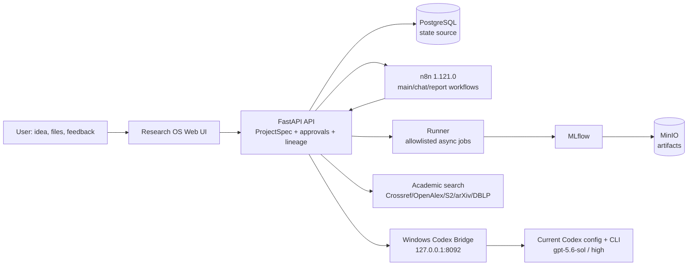

<!-- DOCS_SYNC_VERSION: 2026-07-29 -->
<!-- ACCEPTANCE_PROJECT: 8c40dc70-519a-4c87-99ac-d37003a56640 -->

<div align="center">

# Research OS

### Local-first, evidence-aware research automation from idea to auditable artifacts

[](docker-compose.yml)
[](n8n/workflows)
[](apps)
[](http://127.0.0.1:5000)

**[English](README.md) · [简体中文](README.zh-CN.md)**

</div>

> **Status: runnable and audited local MVP.** Research OS proves the orchestration, approval, evidence, lineage, runner, and artifact path. It does **not** yet claim production-grade autonomous literature review, official code reproduction, arbitrary GPU scheduling, or complete paper authorship. See [the requirements audit](docs/requirements-audit-2026-07-28.md) before using it for real scientific decisions.


## Why Research OS

Research projects usually lose context between a chat, a paper spreadsheet, an experiment folder, and a manuscript. Research OS keeps those pieces connected around a persistent `project_id` and versioned `ResearchIdea/ProjectSpec`:

- Start with a natural-language idea and a supervised clarification loop.
- Refuse incomplete, unsafe, or clearly infeasible ideas before project creation.
- Persist ideas, policies, approvals, checkpoints, tasks, experiments, evidence, and artifacts in PostgreSQL; chat is not the source of truth.
- Search Crossref, OpenAlex, Semantic Scholar, arXiv, and DBLP with DOI/BibTeX records and provider-error tracking.
- Distinguish `metadata-only` candidates from `fulltext-evidence` records with PDF hash, page/section locator, quote, and source URL.
- Require a proposal and explicit approval before expensive experiments, code/config/LaTeX changes, dependency installation, overwrite/delete, or external publication.
- Run a small allowlisted experiment set as a non-root, resource-limited Runner and record metrics in self-hosted MLflow with MinIO artifacts.
- Produce inspectable PNG/PDF/JSON/PLY outputs with download links and project lineage instead of returning only an LLM paragraph.
- Pause, resume from a checkpoint, cancel, revise an Idea, and generate daily/weekly reports from the same project conversation.

## Screenshots

These images are from the latest real acceptance project (`8c40dc70-519a-4c87-99ac-d37003a56640`). They contain no tokens or credentials.

| Overview | Literature evidence |
| --- | --- |
|  |  |

| Artifact gallery | Persistent policies and approval gates |
| --- | --- |
|  |  |

The screenshots intentionally show the evidence boundary: several DOI records are `metadata-only`, while only records with stored page quotes are marked `fulltext-evidence`. A broken or invalidated artifact remains visible as invalid rather than silently disappearing.

## Architecture



The API and Runner are the enforcement boundary. n8n coordinates bounded workflows but cannot read container environment variables, issue arbitrary SQL, or pass arbitrary shell commands to the Runner. The current MVP does not expose an unrestricted long-running n8n AI Agent loop; high-level capabilities are bounded API/workflow tools. The Windows Bridge reads the host Codex configuration and invokes an ephemeral read-only Codex process; `auth.json` is never mounted into Docker.

## Capability matrix

| Area | MVP status | What is real today |
| --- | --- | --- |
| Idea chat and clarification | **Implemented** | LLM extraction through Codex Bridge, deterministic fallback, strict schemas, missing-field questions, unsafe-idea block. |
| Project initialization | **Implemented** | UUID, Git workspace, directories, Idea v1, PostgreSQL records, checkpoints, n8n trigger. |
| Literature search | **Implemented (bounded)** | Crossref, OpenAlex, Semantic Scholar, arXiv, DBLP, DOI BibTeX; GitHub is a candidate source only. |
| Full-text evidence | **Implemented (MVP)** | Allowlisted HTTPS PDF download, PDF/quote SHA-256, page/section locator, quote and BibTeX persistence. |
| Human supervision | **Implemented (MVP)** | Proposal/approval/audit for experiments, Idea revisions, policies, and LaTeX; pause/resume/cancel gates. |
| Experiments | **Implemented (bounded)** | Three allowlisted Runner tasks, non-root execution, timeout/cancel, metrics, MLflow, PNG/PLY/PDF/log artifacts. |
| Lineage | **Implemented (MVP)** | Idea version, experiment, Git commit, data version, config, MLflow run, artifact and dependency metadata. |
| General research autonomy | **Partial / roadmap** | Official repository verification, general Python/C++/Conda/GPU jobs, semantic invalidation, external notifications, evidence-grounded Related Work, and full paper writing remain open. |

## Prerequisites

- Windows 10/11 with Docker Desktop 4.x or newer.
- Docker Desktop switched to **Linux containers** and the `desktop-linux` engine. This means Docker Desktop runs Linux images in its managed VM/WSL2 backend; you do not need to install a separate Linux distribution.
- Docker Compose v2 (`docker compose version`).
- At least 8 GB free memory; 12–16 GB is more comfortable when MLflow, n8n, PostgreSQL, MinIO, API, and Runner are all running.
- Python 3.12+ on the host if you want the Codex Bridge or local validation scripts.
- A local Codex CLI installation and a working `C:\Users\<you>\.codex\config.toml` when using the default Bridge path.

## Quick start on Windows

Open PowerShell in the repository root:

```powershell
Set-Location D:\n8n-ai-research-workflows
Copy-Item .env.example .env
```

Edit `.env` before the first start. Replace every `change-me`, `replace-with`, and `*-dev-*` value with a long local random value. A convenient generator is:

```powershell
python -c "import secrets; print(secrets.token_urlsafe(48))"
```

Use separate generated values for `POSTGRES_PASSWORD`, `MINIO_ROOT_PASSWORD`, `N8N_ENCRYPTION_KEY`, `N8N_LOCAL_OWNER_PASSWORD`, `RUNNER_SHARED_SECRET`, and `CODEX_BRIDGE_SECRET`. Do not commit `.env`.

### Start the host Codex Bridge

The Bridge must run on Windows because it reads the current Codex configuration. In a second PowerShell window, set the same secret as `.env` and start it:

```powershell
$env:CODEX_BRIDGE_SECRET = "<the-exact-value-from-.env>"
python scripts/codex_llm_bridge.py
```

Check that it reports `model=gpt-5.6-sol`, `reasoning=high`, and `auth_exposed=false`:

```powershell
Invoke-RestMethod http://127.0.0.1:8092/health
```

The Bridge reads `model`, `model_reasoning_effort`, and `model_provider` from the Codex config by default. It invokes `codex exec --ephemeral --sandbox read-only`; no Codex authentication file is mounted into any container.

### Start Compose

In the repository PowerShell window:

```powershell
docker compose up --build -d
docker compose ps
```

Wait until `postgres`, `api`, `runner`, `n8n`, `mlflow`, `minio`, and `minio-init` are healthy/completed. Open:

| Service | Local URL | Purpose |
| --- | --- | --- |
| Research OS | [127.0.0.1:8080](http://127.0.0.1:8080) | Idea chat and project dashboard |
| n8n auto-login | [127.0.0.1:8080/api/n8n/open](http://127.0.0.1:8080/api/n8n/open) | Local Cookie hand-off to n8n |
| n8n direct | [127.0.0.1:5678](http://127.0.0.1:5678) | Workflow editor and diagnostics |
| MLflow | [127.0.0.1:5000](http://127.0.0.1:5000) | Runs, metrics, parameters, artifacts |
| MinIO Console | [127.0.0.1:9001](http://127.0.0.1:9001) | Object storage administration |
| API docs | [127.0.0.1:8080/docs](http://127.0.0.1:8080/docs) | OpenAPI and bounded endpoints |

The Research OS sidebar opens n8n through `/api/n8n/open`. The API logs into the local n8n Owner with the server-side credentials in `.env`, forwards n8n's own HttpOnly Cookie, and redirects to `/home/workflows`. You do not type or remember an n8n password in normal use. This is convenience authentication for a single-user machine, not a security boundary: keep all ports bound to `127.0.0.1` and do not expose the auto-login route to a LAN, reverse proxy, or tunnel.

## First project walkthrough

1. Click **New research project** and write an idea such as: “Can calibrated uncertainty-based active learning beat random sampling for few-shot 3D point-cloud classification under the same labeling budget?”
2. Answer the clarification questions about domain, research question, hypothesis, novelty, data, compute, time/cost, target venue, success criteria, and compliance.
3. Review the generated `ProjectSpec`. Missing fields, unsafe requests, unclear ownership, or obvious resource risks keep the project in clarification and prevent creation.
4. Confirm the specification. Research OS creates a UUID, Git workspace, project directories, Idea v1, database state, checkpoints, and an n8n main-workflow task.
5. Inspect the **Literature** page. Treat `metadata-only` rows as discovery candidates. Only `fulltext-evidence` rows with a stable source, PDF hash, locator, and quote can support a factual claim.
6. Inspect the novelty/feasibility result and the experiment Proposal. Approve it only after checking seeds, budget, data version, expected artifacts, and risks.
7. Open the **Experiments** and **Artifacts** pages. Download metrics JSON, execution logs, PNG plots, point-cloud previews, PLY, and the compiled PDF; compare each artifact's lineage fields.
8. Use the project chat for explanations, suggestions, or a proposed change. An execution request becomes a structured Proposal and waits for approval; it is never silently applied.
9. Add durable rules such as “all experiments use at least five random seeds” through the **Policies** page. Approved rules are stored in PostgreSQL and enforced at plan generation, API submission, and Runner validation.
10. Pause, resume, cancel, revise the Idea, or request a partial rerun from the appropriate checkpoint. A cancelled project is terminal.

## Running the supplied acceptance examples

The acceptance script exercises the real Bridge, academic APIs, PostgreSQL state, n8n, Runner, MLflow, artifact lineage, policy enforcement, Idea v2, partial rerun, and LaTeX compilation:

```powershell
python scripts/acceptance_test.py
```

Useful probes:

| Input | Expected behavior |
| --- | --- |
| `AI` | Remains in clarification; it must not invent a complete specification. |
| An idea asking for unauthorized malware or harmful access | Feasibility is blocked and project confirmation returns a structured conflict. |
| The 3D active-learning idea above | Creates a project, searches papers, runs bounded experiments after approval, and emits inspectable artifacts. |

The latest complete acceptance record has a sanitized, versioned copy at [`acceptance-20260729-012750.json`](docs/evidence/acceptance-20260729-012750.json); the runtime original remains under ignored `artifacts/acceptance/`. It used `gpt-5.6-sol` with `reasoning_effort=high` through the Codex Bridge and verified: 8 paper records, 3 stored open-PDF evidence records, 5 experiments, 7 checkpoints, 101 dependencies, policy enforcement for five seeds, pause/cancel/resume gates, MLflow, PNG/PLY/PDF artifacts, Idea v2, partial rerun, and LaTeX compilation. The demo experiment is a system-integration check, not evidence that the scientific hypothesis is true.

## Configuration reference

`.env.example` is the safe, versioned template. The table below documents every value used by Compose or the host Bridge.

| Variable | Required | Description |
| --- | --- | --- |
| `POSTGRES_DB`, `POSTGRES_USER`, `POSTGRES_PASSWORD` | Yes | PostgreSQL database and credentials. Use a unique password; changing these after the volume exists requires a migration/restore plan. |
| `MINIO_ROOT_USER`, `MINIO_ROOT_PASSWORD` | Yes | MinIO administration credentials. MLflow uses them to store artifacts in `research-artifacts`. |
| `N8N_ENCRYPTION_KEY` | Yes | Stable n8n encryption key. Keep it across restarts; losing it can make stored n8n credentials unreadable. |
| `N8N_LOCAL_OWNER_EMAIL`, `N8N_LOCAL_OWNER_PASSWORD` | Yes for auto-login | Internal local Owner used only by `/api/n8n/open`. The password is server-side and never rendered into the UI. |
| `OPENAI_API_KEY`, `OPENAI_BASE_URL` | Optional | Direct OpenAI-compatible fallback. Leave blank when using the Codex Bridge. |
| `OPENAI_MODEL`, `OPENAI_REASONING_EFFORT` | Optional | Direct API settings; defaults are `gpt-5.6-sol` and `high`. The Bridge independently reads the host Codex config. |
| `CODEX_BRIDGE_URL`, `CODEX_BRIDGE_SECRET`, `CODEX_BRIDGE_TIMEOUT_SECONDS` | Recommended | Compose-to-host Bridge URL, shared local secret, and request timeout. |
| `GITHUB_TOKEN` | Optional | Raises GitHub API limits; repository results remain unverified candidates until cross-checked. |
| `SEMANTIC_SCHOLAR_API_KEY` | Optional | Optional Semantic Scholar quota credential. |
| `RUNNER_SHARED_SECRET`, `RUNNER_MAX_SECONDS` | Yes | API-to-Runner credential and maximum bounded task duration. |
| `REPORT_TIMEZONE` | Yes | n8n schedule and report timezone; default `Asia/Shanghai`. |

Compose-internal variables such as `DATABASE_URL`, `RUNNER_URL`, `MLFLOW_TRACKING_URI`, `PROJECTS_ROOT`, `ARTIFACTS_ROOT`, and fixed n8n webhook URLs are generated by `docker-compose.yml`; do not expose them as user-facing secrets.

## Storage and lineage

```text
projects/<project-slug>/       Git repository, configs, BibTeX, LaTeX, checkpoints
artifacts/                     Runner outputs, acceptance JSON, controlled logs
PostgreSQL                     projects, idea_versions, papers, evidence, tasks,
                               experiments, proposals, policies, feedback,
                               checkpoints, artifacts, dependencies, audits
MinIO volume                   MLflow artifact store and large experiment files
Docker volumes                 postgres-data, minio-data, n8n-data
```

Every generated artifact should carry or be queryable by `project_id`, `idea_version`, experiment/run ID, Git commit, data version, config, MLflow run ID, SHA-256, and validity/dependency status. If a result is invalidated, the UI keeps the record visible and marks it invalid instead of silently reusing it.

## Security model

- All published Compose ports bind to `127.0.0.1`; do not change them to `0.0.0.0` while keeping auto-login enabled.
- The Runner is non-root, read-only, capability-dropped, `no-new-privileges`, PID/CPU/memory limited, timeout/cancel aware, and restricted to enumerated task kinds.
- LLM output is accepted only as bounded JSON. It never becomes arbitrary shell, SQL, filesystem path, or unrestricted network access.
- n8n has `N8N_BLOCK_ENV_ACCESS_IN_NODE=true`; built-in workflows call fixed private Compose addresses and cannot read secrets from Code nodes.
- Expensive work, code/config/LaTeX changes, dependency installation, overwrite/delete, merge, and external publication require Proposal → diff/impact → explicit approval → isolated execution → verification → Git/audit recording.
- Academic sources obey HTTPS/domain allowlists, legal API usage, timeouts, provider errors, and rate limits. A title match is not an official repository; a DOI record is not full-text evidence.
- Do not commit `.env`, Codex `auth.json`, cookies, database dumps, Runner secrets, MinIO secrets, or Bridge logs containing sensitive input.

See [docs/security.md](docs/security.md) for the hardening checklist and the exact local auto-login trust boundary.

## Operations

```powershell
# Start/rebuild
docker compose up --build -d

# Status and logs
docker compose ps
docker compose logs --tail=100 api runner n8n

# Stop without deleting volumes
docker compose stop

# Stop and remove containers/network, keep named volumes
docker compose down

# Validate Compose and documentation contracts
docker compose config --quiet
python scripts/check_docs_sync.py
```

For a full handover, read [docs/operations.md](docs/operations.md). It covers n8n Owner reset, backup/restore, state gates, service recovery, and acceptance evidence. For architecture and tool boundaries, read [docs/architecture.md](docs/architecture.md) and [schemas/tool-contracts.json](schemas/tool-contracts.json).

### Backup outline

Back up the PostgreSQL database, `projects/`, `artifacts/`, and Docker volumes before upgrades. A local SQL dump can be created with:

```powershell
New-Item -ItemType Directory -Force artifacts\backups | Out-Null
docker compose exec -T postgres pg_dump -U research -d research_os > artifacts\backups\research_os.sql
```

The dump may contain hashes, metadata, or credential material. Keep it local and protected. Restore only into a stopped/isolated instance after verifying the target volume and credentials. MinIO and n8n data also require their named-volume backup; see [docs/operations.md](docs/operations.md).

## Validation and development

```powershell
# Fast checks
docker compose config --quiet
python scripts/check_docs_sync.py
python -m py_compile apps/api/app/main.py apps/runner/app/main.py scripts/codex_llm_bridge.py

# Container tests
docker compose exec -T api pytest -q

# Full end-to-end acceptance (real model/API calls)
python scripts/acceptance_test.py
```

The repository intentionally treats acceptance JSON and screenshots as evidence. A green unit test or an HTTP 200 endpoint alone is not a claim that the original research objective has been scientifically reproduced.

## Troubleshooting

| Symptom | Check |
| --- | --- |
| Docker says the Linux engine is unavailable | Docker Desktop → Settings/General → enable the WSL2 backend, switch to Linux containers, then retry `docker info`. |
| API is up but idea clarification is deterministic | Check `Invoke-RestMethod http://127.0.0.1:8092/health`, the Bridge secret match, and `docker compose logs api`. |
| n8n asks for a password | Open the Research OS sidebar link or `/api/n8n/open`; verify Owner values in `.env` match the n8n database. Do not disable user management. |
| n8n auto-login returns 503/401 | Check n8n is running, Owner password length is at least 12, `N8N_INTERNAL_URL` resolves to `http://n8n:5678`, and restart `api n8n`. |
| Webhook 404 | Confirm the three built-in workflows are Active and n8n was recreated after workflow JSON changes. |
| Search returns fewer papers | Inspect `provider_errors`; external APIs may rate-limit or return no DOI. Missing results are recorded, never fabricated. |
| Runner request rejected | Inspect the structured policy error and pending Proposal; paused/cancelled projects and insufficient seeds are enforced gates. |
| Artifact download is 404 | Check its `valid` state and the `artifacts/` path. Invalidated outputs remain metadata but should not be reused. |
| Windows file permissions look unusual | The API owns the writable project/artifact mounts; Runner mounts projects read-only and writes controlled outputs only. |

## Roadmap and honest limitations

The highest-value unfinished work is tracked in [`TODO.md`](TODO.md): evidence-backed Related Work and novelty analysis, official repository/license verification and controlled download, Idea-specific experiment planning, general Python/C++/Conda/GPU jobs, semantic dependency invalidation, persistent queues, external notifications, richer material parsing, interactive 3D viewing, and complete evidence-grounded LaTeX writing. RAGFlow/LlamaIndex and LangGraph are deliberately deferred until scale or workflow complexity justifies them.

Do not use the current synthetic classification/point-cloud tasks as a scientific result. Do not cite `metadata-only` rows as if they were page-verified claims. Do not expose the local auto-login endpoint beyond the private machine.

## Contributing and documentation contract

Read [`AGENTS.md`](AGENTS.md) before changing code or workflows. Every major change must update, in the same change set:

1. behavior/configuration and relevant `docs/` pages;
2. `.env.example` or other configuration examples;
3. `README.md` and `README.zh-CN.md` with the same facts and section order;
4. `TODO.md` status, completion criteria, and validation evidence;
5. the requirements audit when original-scope coverage changes.

Run `python scripts/check_docs_sync.py` before handoff. It checks the shared documentation marker, acceptance project facts, required screenshots, and key model/port statements in both README files.

After a major update passes all applicable checks, the repository maintenance contract requires a scoped Conventional Commit and a push of the current branch to the authorized `origin`. The automation must inspect the staged diff and exclude `.env`, authentication files, cookies, database dumps, secrets, temporary output, and unreviewed large artifacts; it must never force-push or rewrite remote history.

## License and source policy

This repository is an MVP scaffold for private/local research orchestration. Review the license of every external paper, dataset, model, and code repository before downloading, executing, or redistributing it. The system records source URLs and candidate metadata, but it does not grant permission to use third-party material.
