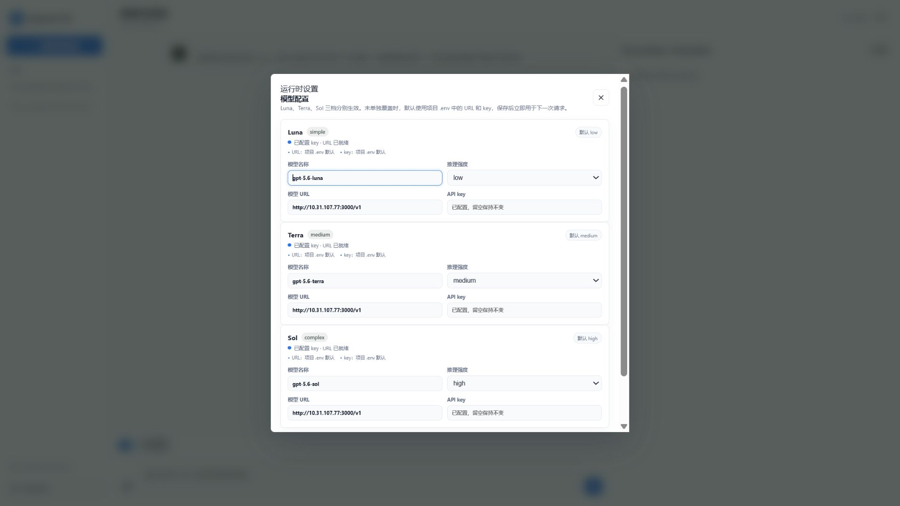
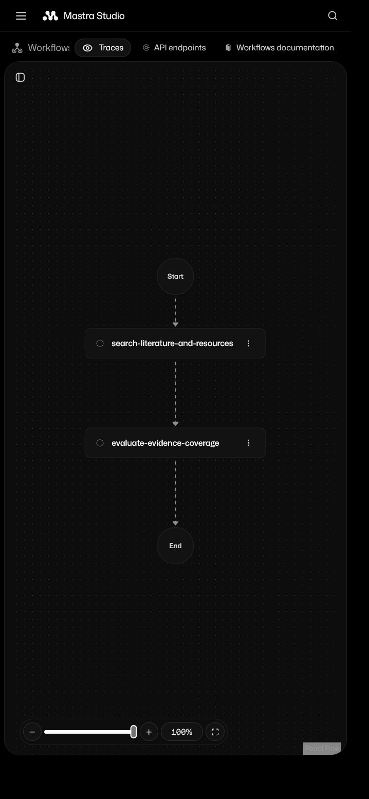

<!-- DOCS_SYNC_VERSION: 2026-08-01-19 -->

# Research OS

[简体中文](README.zh-CN.md)

Research OS is a local, auditable research-automation MVP. The application is implemented in TypeScript with Mastra Agents and Workflows. Scientific experiment workspaces may use any language; a scientific Python project receives its own `.venv`.

## Status

The full application stack now runs inside WSL2 (Ubuntu 22.04): the TypeScript API, embedded PostgreSQL-compatible state store, Mastra integration, persistent workflow queue, React Web UI, approval gates, native Linux experiment supervisor, artifact ledger, Windows Defender upload gate (through WSL interop), and Supermemory Local. Node.js 26.5.1 is managed by nvm inside WSL2 and all tests, builds, and real acceptance runs pass there; Windows browsers reach the services at `http://127.0.0.1:<port>` through mirrored networking. The default `runtime/research-os.pglite` is in active use (16 projects); `.env` keeps `RESEARCH_RUNTIME_DIR=runtime`. Previously corrupted directories are preserved separately for inspection and are never used automatically. GPU-host validation remains separate open work. Native Windows hosting is not supported: the whole stack runs inside WSL2 and Windows acts only as a browser client.

Model failures are final structured errors. The application never substitutes a local reply, another provider, or an unrelated experiment.

## Architecture

- `apps/server`: Hono API, PGlite state, queue, evidence, approvals, reports, repository verification/acquisition, artifact ledger, and native experiment supervisor.
- `apps/mastra`: Mastra Agents, Memory, Skills, bounded Tools, Workflows, schedules, and Studio graph.
- `apps/web`: React 19 + TypeScript component source and esbuild-generated static assets served by the API.
- `projects/<project-id>`: isolated Git workspaces. Scientific Python uses `projects/<project-id>/.venv`.
- `artifacts`: controlled uploads, evidence PDFs, experiment outputs, acceptance results, and backups.
- `runtime`: ignored local application state, model overrides, Mastra memory, logs, and PID data.

PGlite is the durable business state source. Mastra Memory is local and does not replace project, approval, artifact, or audit state.

## Requirements

- Windows 10/11 x64 with WSL2 (Ubuntu 22.04) and `networkingMode=mirrored` in `.wslconfig`
- nvm with Node.js `26.5.1` inside WSL2 (the repository default; `package.json` accepts Node.js `>=22.13`)
- Git inside WSL2
- Python 3 (with `python3-venv`) for scientific Python experiments
- Windows Defender on the Windows host (reached from WSL2 through the interop mount) for uploads
- A TeX distribution providing `latexmk` inside WSL2 for paper compilation

## Quick Start

```bash
nvm install 26.5.1
nvm use 26.5.1
npm ci
npm run build
npm start
```

The repository pins the development Node.js version in `.nvmrc`. Verify the active version with `nvm current` and `node --version`; do not use a separate portable Node.js directory. A fresh non-login WSL shell may still fall back to Ubuntu's system Node (12.x), so run `source ~/.nvm/nvm.sh` or `nvm use 26.5.1` before any command. There is exactly **one** repository copy: `D:\ResearchOS` is the same filesystem as `/mnt/d/ResearchOS` inside WSL2, so no sync step is needed. All services run from `/mnt/d/ResearchOS`. Note that `/mnt/d` (drvfs) has no inotify support, so edits made on the Windows side do not trigger `tsx watch` restarts; restart the affected service manually after code changes. Native Windows hosting is not supported and there is no Windows installer. The former ext4 runtime copy (`~/ResearchOS`) is kept only as a backup.

The default runtime database is available from the Windows browser at [http://127.0.0.1:8080](http://127.0.0.1:8080) (the service listens only on loopback inside WSL2). Mastra Studio and workflow graphs run at [http://127.0.0.1:4111](http://127.0.0.1:4111) and are linked from the lower-left navigation. Startup commands load `.env` automatically; `RESEARCH_RUNTIME_DIR` is an explicit, auditable runtime selection and corrupted directories are preserved separately.

Corrupted database directories are preserved separately and never used automatically. A new non-overwriting recovery candidate can still be generated and checked with `npm run db:restore-dump -- artifacts/backups/20260730T200648Z/postgres.sql runtime/restore-pglite-20260731`; after inspection it can be selected explicitly in `.env` with `RESEARCH_RUNTIME_DIR`, and `npm start` loads that setting automatically.

For unattended operation, `npm run ops:monitor -- once` performs bounded API and Mastra health checks and appends structured events to `runtime/ops/health-events.jsonl`; `npm run ops:monitor -- watch 3600` runs a one-hour bounded watch. An explicitly configured `RESEARCH_ALERT_WEBHOOK_URL` can receive transition/failure events. `npm run ops:recovery-drill -- <backup-id>` verifies the backup hash, safely lists and extracts the archive into a temporary directory, rejects links and traversal, checks required roots, and removes the drill directory without touching live data.

Development:

```bash
npm run dev
npm run typecheck
npm test
```

## Model Settings

Luna, Terra, and Sol are fully independent. Each tier has its own model, URL, key, and reasoning effort. The settings API returns only `key_configured`; it never returns a key. Runtime code reads project `.env` and `runtime/model-settings.json`, never Codex configuration or authentication files.

The project `.env` currently defaults all three tiers to the local OpenAI-compatible endpoint `http://127.0.0.1:3000/v1` (the model gateway runs on the Windows host and is reached from WSL2 through the mirrored loopback). Runtime settings may override each tier independently.

- Luna (`gpt-5.6-luna`): `RESEARCH_MODEL_SIMPLE`, `RESEARCH_MODEL_URL_SIMPLE`, `RESEARCH_MODEL_KEY_SIMPLE`, `RESEARCH_REASONING_SIMPLE`
- Terra (`gpt-5.6-terra`): `RESEARCH_MODEL_MEDIUM`, `RESEARCH_MODEL_URL_MEDIUM`, `RESEARCH_MODEL_KEY_MEDIUM`, `RESEARCH_REASONING_MEDIUM`
- Sol (`gpt-5.6-sol`): `RESEARCH_MODEL_COMPLEX`, `RESEARCH_MODEL_URL_COMPLEX`, `RESEARCH_MODEL_KEY_COMPLEX`, `RESEARCH_REASONING_COMPLEX`
- Shared request limit: `MODEL_REQUEST_TIMEOUT_SECONDS`

HTTPS endpoints are accepted. Plain HTTP is accepted only for loopback and RFC1918 private addresses, including local OpenAI-compatible services.

## Claim Review and Evidence

Page-level PDF passages remain evidence candidates until a human creates and decides a Claim Review. The Literature tab and `/api/projects/<project-id>/claim-reviews` endpoints enforce project-scoped evidence IDs, one terminal decision, evidence-status labels, and audit events. An accepted review records that a quote was reviewed; it does not turn metadata into full-text evidence or establish a scientific conclusion.

## Verification Evidence

The current local UI is a React + TypeScript component application with no native DOM/HTML implementation and was checked in a real browser. Desktop and mobile flows across the new-Idea composer, project overview, literature/material search, artifact gallery, model settings, project chat, and Mastra link were exercised; there is no horizontal overflow and no console error. The model-settings screenshot shows all three tiers, the configured `/v1` endpoint, reasoning effort, and only key status; no key material is displayed.






## Project Semantic Memory

Supermemory runs through the self-hosted Supermemory Local server at `http://127.0.0.1:6767` by default. Supermemory Local stores its encrypted database on this machine and provides the Memory API, hybrid semantic search, graph context, and document ingestion without the Supermemory cloud service. When the official self-hosted binary is installed, `npm run supermemory:start` launches it hidden with the configured model endpoint and key (from `.env`), writes logs under `runtime/`, and waits for the health endpoint; `npm run supermemory:stop` stops that recorded process. Localhost requests can use Supermemory Local's automatic local authentication; an explicit `SUPERMEMORY_API_KEY` remains supported and is required for non-loopback addresses. Every operation is scoped by an immutable project container tag. The API provides status, ingestion, project-scoped hybrid search, Graph Memory context, link inspection, and approval-gated forget/delete operations. PDF, image, and uploaded-material ingestion is limited to validated project Artifacts or Defender-scanned uploads; bounded PDF/text chunks retain the upload ID, SHA-256, page/text locator, and evidence status while the local Artifact keeps the original bytes.

Embeddings are configured through `SUPERMEMORY_EMBEDDING_PROVIDER`, `SUPERMEMORY_EMBEDDING_MODEL`, `SUPERMEMORY_EMBEDDING_DIMENSIONS`, `SUPERMEMORY_EMBEDDING_BASE_URL`, and the project-reserved `SUPERMEMORY_EMBEDDING_API_KEY` in `.env`. The default provider is `local` with the multilingual ONNX model `Xenova/bge-m3` (1024d). Remote embedding (OpenAI / OpenAI-compatible / Gemini) is implemented by the official `server-v0.0.5` build only; `server-v0.0.6` and `0.0.7-rc.2` regressed it to their bundled local ONNX worker (`Xenova/bge-base-en-v1.5`, 768d, English-only; verified by isolated boot + ingest against both binaries on 2026-08-01). The WSL2 runtime copy pins the `server-v0.0.5` linux-x64 binary; with `SUPERMEMORY_EMBEDDING_PROVIDER=openai` it runs `Qwen3-Embedding-8B` (1024d, `https://ai.gitee.com/v1`), and with the default `local` provider it runs `Xenova/bge-m3` (1024d, multilingual). `scripts/start-supermemory.ts` refuses to start a non-v0.0.5 binary when a remote provider is configured, and the API guard fails closed with `supermemory_embedding_unsupported` instead of silently using local vectors. Verified 2026-08-01: with a working `SUPERMEMORY_EMBEDDING_API_KEY`, ingest triggers real `POST /v1/embeddings` calls and upserts vectors successfully (1024d). The requested 2000d configuration remains blocked by the server's pgvector HNSW chunk-upsert ceiling (~1024d; isolated tests: 1536d and 2000d both fail with `Failed to upsert chunk embeddings` although the API returned correctly dimensioned vectors). The search-time query embedding timeout (hardcoded 800ms `interactive` profile in v0.0.5; no schema/config override) is lifted by a **user-approved byte-level patch** (2026-08-01): the constant is plaintext JavaScript in the binary (offset ~220680316), and replacing `sdk:800` with `sdk:20000` (same total length) keeps the binary bootable; verified with a 3s-delay embedding endpoint (search timing 3026ms, score 1) and in production against `ai.gitee.com` (search timing 4398ms, score 0.79). The patch does **not** lift the ~1024d HNSW ceiling. Original unpatched binary: `/home/karbo/bin/supermemory-server-linux-x64.v0.0.5-orig.bak` (sha256 `b2fccca3ff2b5607ce41028c759f375c4ecf5461adc9f3306f41c2757edaf375`); patched in use: sha256 `7d19ddadf484a0539dd813227c2e24ad0e191b8e5db291c2caf2c1ef63a2e7d6`. Why this patch exists: the Supermemory server source is closed (not in the public monorepo), no official build after v0.0.5 implements remote embedding, the API exposes no timeout override, and the ingestion/`/v3/search` path proved functional end to end — so the only way to keep remote semantic search against a >800ms endpoint (e.g. `ai.gitee.com` at 0.65-1.1s) was patching the binary. Switching model or dimension requires a fresh Supermemory data directory or full re-ingestion.

Embedding configuration is **per-project and fully isolated**. A project without an override uses the global `.env` defaults on the shared instance (`127.0.0.1:6767`). A project-level override (left-bottom settings → Embedding) is served by a **configuration pool**: projects whose provider/model/dimensions/base URL/key are exactly identical share one Supermemory instance (port allocated from 6770–6869) and one encrypted data directory under `runtime/supermemory/pools/<pool-key>/data`, while project isolation is still enforced by immutable Supermemory container tags. Different configurations get different pools, so projects can use different providers, models, and dimensions without vector-space contamination. Overrides live in `runtime/project-embedding-settings.json` (mode 0600, atomic write) and the pool registry in `runtime/embedding-pools.json`; the API never returns the key, only `key_configured`. Pool instances are started lazily on the first memory request and do not inherit stale WSL proxy variables (set `SUPERMEMORY_PROXY_URL` explicitly when a proxy is required). Switching model or dimension requires a fresh data directory: the API refuses with `embedding_requires_reset` (409) unless confirmed (`reset_data: true`), then the old directory is kept as a `.bak-<timestamp>` backup and the project's semantic memory must be re-ingested. Benchmark on 2026-08-01 (identical query and corpus, isolated instances): local `Xenova/bge-m3` 1024d embeds a short text in 30–72ms with a full search at 58–159ms; remote `Qwen3-Embedding-8B` (gitee) embeds in ~120–210ms with a full search at 286–653ms — the global default remains **local bge-m3**. End-to-end verification on the same day through the public API: two projects with identical local configuration share pool port 6770 (`shared_projects: 2`) while a remote-configuration project runs on its own pool port 6771; ingest → search round-trips succeed on both pools and a memory ingested under one project is not visible to the other project sharing the same pool.

Semantic results are candidates only and retain source, Artifact, locator, hash, and evidence-status metadata. The project material endpoint `/api/projects/<project-id>/materials/search` uses the same project-scoped Supermemory hybrid search; it does not substitute SQL keyword results, another provider, or an unrelated experiment when the local provider is unavailable. A missing local server, authentication failure, invalid response, or write failure returns a structured error.

A real Supermemory Local acceptance run (`npm run supermemory:acceptance`, evidence under `artifacts/acceptance/supermemory-local-*.json`) has verified text ingestion with searchable chunks, two-project isolation without cross-scope leakage, Graph Memory nodes, Super RAG document results, LLM-backed `forget` revocation (remote memory entities disappear after revocation), and delete revocation verified by remote absence. The run honestly records `partial` while two external blockers remain: PDF terminal processing requires a Gemini/Vertex key (PDF extraction falls back from Mistral OCR to Gemini and stays at `extracting` without one), and image ingestion requires the same Gemini/Vertex key, which the bundled `0.0.7-rc.2` builds (Windows and Linux) do not handle without crashing. An isolated retest on 2026-08-01 confirmed that configuring a working OpenAI-compatible LLM endpoint does not change PDF extraction: the extractor still hardcodes Mistral OCR → Gemini 2.5 Flash. The same applies to images even with a multimodal OpenAI-compatible backend (`gpt-5.6` verified to accept image input), because the binary's image-description step is hardcoded to the Gemini provider. These blockers are tracked in `TODO.md` and never downgraded to local fallbacks.

## Experiment Isolation

The model never supplies a command, executable, path, URL, environment, or network target. An approved run selects a fixed experiment type and a project-owned entry point and executes on the fixed Linux backend, which invokes the project interpreter through `python3 -m venv` plus `.venv/bin/python`. The legacy `windows` (`cmd.exe`) and `wsl2` launchers were removed together with native Windows hosting.

Each scientific Python project uses its own `.venv`; dependencies are never installed into the application runtime. The supervisor enforces a fixed project root, timeout, process-tree cancellation, bounded logs, finite numeric `metrics.json`, structured `checkpoint.json`, SHA-256 artifacts, and audit events. Native process isolation is weaker than a dedicated virtual machine and is documented as such.

## Repository Verification and Acquisition

The Literature tab accepts GitHub or GitLab HTTPS repository candidates linked to a paper. Verification records the provider metadata and citation files, requires a DOI or exact-title match, checks a known SPDX license, and pins the candidate to a 40-character commit. Download is never automatic: it creates a `dependency_install` Proposal and approval revalidates the snapshot before downloading.

The approved archive is bounded, checked for path traversal and link entries, stored as a SHA-256 Artifact, extracted beneath `projects/<project-id>/code/repositories/`, linked in the Artifact dependency ledger, and committed to the project Git workspace. These records document reproducible source acquisition; they do not by themselves prove that a repository is an official implementation or that its code is scientifically valid.

## Dependency Lineage and Checkpoint Recovery

Successful experiments register their Idea version, project Git commit, configuration fingerprint, referenced papers/evidence/repositories/uploads, generated Artifacts, and Checkpoint in a semantic dependency ledger. Project inspection reconciles upstream fingerprints; an approved Idea or code revision, a changed upstream record, a missing source, or an invalid Artifact recursively invalidates dependent experiments, Artifacts, and Checkpoints.

Checkpoint recovery is never a direct rerun. The API verifies the Checkpoint, source run status, current Idea version, Git baseline, Artifact paths, symlink status, file existence, and SHA-256 values, then creates an `experiment_rerun` Proposal. Only approval queues the exact recovered request; a failed or invalidated dependency returns a structured error and cannot be displayed as a successful run.

## Validation

```bash
npm run typecheck
npm test
npm run build
npm run idea-cases:check
npm run docs:check
npm run ops:status
npm run mastra:hitl:check
npm run acceptance
```

The code-level checks and real-model acceptance use the configured model and external academic APIs; model endpoint or key failures remain direct structured failures. Runtime checks pass against the rebuilt default database (16 projects); corrupted directories are preserved separately and never used automatically.

## Limitations

This is a local MVP, not a production security boundary or a scientific oracle. Metadata candidates are not full-text evidence. Page quotes still require claim-level review. Experiment outputs establish only what the experiment measured, not the truth of a research hypothesis. Native process controls do not provide virtual-machine isolation. GPU host validation and semantic claim mapping remain open work. Repository acquisition is limited to the verified, approval-gated archive path described above.
