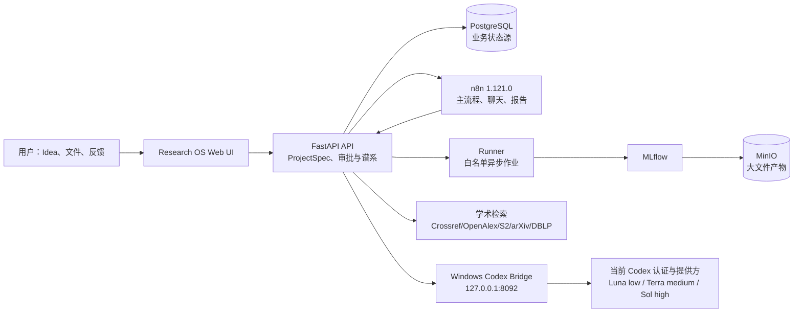

<!-- DOCS_SYNC_VERSION: 2026-07-29-6 -->
<!-- ACCEPTANCE_PROJECT: 8c40dc70-519a-4c87-99ac-d37003a56640 -->

<div align="center">

# Research OS

### 从研究 Idea 到可审计产物的本地优先、证据感知科研自动化系统

[](docker-compose.yml)
[](n8n/workflows)
[](apps)
[](http://127.0.0.1:5000)

**[English](README.md) · [简体中文](README.zh-CN.md)**

</div>

> **当前状态：可运行、经过真实验收的本地 MVP。** Research OS 已验证编排、审批、证据、谱系、Runner 与产物主链，但目前**不能**宣称已具备生产级自主文献综述、官方代码复现、任意 GPU 调度或完整论文自动写作能力。在将它用于真实科研判断前，请先阅读[原始需求审计](docs/requirements-audit-2026-07-28.md)。


## 为什么需要 Research OS

研究项目的上下文经常散落在聊天、论文表格、实验目录和稿件中。Research OS 围绕持久化 `project_id` 与版本化 `ResearchIdea/ProjectSpec` 把这些对象连接起来：

- 从自然语言 Idea 和自适应 AI 多轮澄清开始：自动识别明显上下文、公开假设，不使用固定问卷。默认开启的**全自动模式**尽量少问；关闭开关后进入**详细模式**，更全面但仍自适应地了解需求。
- 在创建项目之前拦截信息不足或明显不可行的 Idea。
- 将 Idea、策略、审批、检查点、任务、实验、证据和产物持久化到 PostgreSQL；聊天记录不是唯一状态源。
- 通过 Crossref、OpenAlex、Semantic Scholar、arXiv 和 DBLP 检索，保存 DOI/BibTeX 以及提供方错误。
- 明确区分 `metadata-only` 候选和带 PDF 哈希、页码/章节、原文 quote 与来源 URL 的 `fulltext-evidence`。
- 高成本实验、代码/配置/LaTeX 修改、安装依赖、覆盖/删除及对外发布必须先生成方案并得到明确审批。
- 以非 root、资源受限 Runner 执行少量白名单实验，通过自托管 MLflow 与 MinIO 记录指标和产物。
- 批准的实验进入 Runner 前必须保持项目工作树干净，创建不可变的 `run/<run_id>` tag，并在受控产物目录保存带哈希的源码、环境、数据、模型和配置快照。
- 生成可检查、可下载并带谱系的 PNG/PDF/JSON/PLY，而不是只返回一段 LLM 结论。
- 在同一项目对话中暂停、从检查点恢复、取消、修改 Idea，并生成日报/周报。

## 效果截图

以下截图来自最新真实验收项目（`8c40dc70-519a-4c87-99ac-d37003a56640`），不包含 token 或凭据。


上面的新项目对话展示了默认开启的全自动模式开关，并从 PyTorch、CUDA、CNN 和 MNIST 推断出深度学习/计算机视觉领域，指出该目标首先是工程基准而不能自动宣称科研创新，并选择了可配置的中等成本 `gpt-5.6-terra` 路由。关闭开关会进入详细模式，针对相关缺口扩大了解范围，但不会退回固定问卷。等待回复期间，界面会显示不确定进度条、已等待时间和当前分析提示，不会伪造精确完成百分比。

| 项目概览 | 文献与证据 |
| --- | --- |
|  |  |

| 产物画廊 | 持久化策略与审批闸门 |
| --- | --- |
|  |  |

截图有意展示证据边界：部分 DOI 记录只是 `metadata-only`，只有保存了页码原文的记录才标记为 `fulltext-evidence`。损坏或因 Idea 变化而失效的产物不会静默消失，而会继续显示并明确标为无效。

## 系统架构



API 与 Runner 是执行强制边界。n8n 负责编排受限工作流，但不能读取容器环境变量、执行任意 SQL，或把任意 Shell 命令交给 Runner。Idea 澄清采用受严格 Schema 约束的自适应对话 Agent：每轮整体更新草稿，但没有 Shell、文件系统、SQL 或网络工具。现阶段引入无限制 ReAct 循环只会增加成本和执行面。Windows Bridge 复用宿主机 Codex 的提供方与认证，并启动临时、只读沙箱中的 Codex 进程；`auth.json` 永远不会挂载进 Docker。

## 能力矩阵

| 范围 | MVP 状态 | 当前真实能力 |
| --- | --- | --- |
| Idea 对话与澄清 | **已实现（自适应 MVP）** | 全草稿 AI 分析、默认全自动/可选详细模式、假设/风险记录、Luna/Terra/Sol 成本路由、可见等待状态、严格 Schema、本地降级。 |
| 项目初始化 | **已实现** | UUID、Git 工作区、目录、Idea v1、PostgreSQL 状态、检查点和 n8n 触发。 |
| 文献检索 | **已实现（有限范围）** | Crossref、OpenAlex、Semantic Scholar、arXiv、DBLP、DOI BibTeX；GitHub 仅为候选来源。 |
| 全文证据 | **已实现（MVP）** | 白名单 HTTPS PDF、PDF/quote SHA-256、页码/章节、原文与 BibTeX 持久化。 |
| 人工监督 | **已实现（MVP）** | 实验、Idea 修订、策略和 LaTeX 的 Proposal/审批/审计，以及暂停/恢复/取消闸门。 |
| 实验执行 | **已实现（有限范围）** | 三个 Runner 白名单任务，非 root、超时/取消、指标、MLflow、PNG/PLY/PDF/日志产物，以及执行前可复核快照闸门。 |
| 产物谱系 | **已实现（MVP）** | Idea 版本、实验、不可变 run tag、源码 tar、ProjectSpec/策略/配置/环境/数据/模型/依赖清单、Git/数据/配置哈希、MLflow Run、产物与依赖元数据。正式镜像 digest 仍需配置，实时验收仍待执行。 |
| 通用科研自治 | **部分实现/路线图** | 官方仓库核验、通用 Python/C++/Conda/GPU、语义失效传播、外部通知、证据驱动 Related Work 与完整论文仍待实现。 |

## 前置条件

- Windows 10/11 与 Docker Desktop 4.x 或更新版本。
- Docker Desktop 切换到 **Linux containers** 和 `desktop-linux` engine。它表示 Docker Desktop 在自身管理的 VM/WSL2 后端中运行 Linux 镜像，不需要另外安装一个 Linux 系统。
- Docker Compose v2（运行 `docker compose version` 检查）。
- 至少 8 GB 可用内存；同时运行 MLflow、n8n、PostgreSQL、MinIO、API 和 Runner 时建议准备 12–16 GB。
- 使用 Codex Bridge 或本地校验脚本时，宿主机需要 Python 3.12+。
- 使用默认 Bridge 路径时，需要已安装可用的 Codex CLI，并存在 `C:\Users\<你的用户名>\.codex\config.toml`。

## Windows 快速开始

### 单 EXE 安装器状态

[`installer/windows`](installer/windows/README.md) 已包含在线引导安装器定义：把 Research OS、Compose/n8n 工作流和独立 Codex Bridge 打进一个 EXE；若缺少 Docker Desktop，只在用户勾选同意后从官方地址下载，并在提权执行前校验 Authenticode 签名。生成的 EXE 不进入 Git。该路径目前**还不是正式发布的一键安装包**：代码签名、Docker Desktop 再分发/许可复核及干净 Windows VM 验收仍属于 `P2-INSTALLER-029`。

下方手动方式仍是当前受支持的安装路径。

在仓库根目录打开 PowerShell：

```powershell
Set-Location D:\n8n-ai-research-workflows
Copy-Item .env.example .env
```

首次启动前编辑 `.env`，把所有包含 `change-me`、`replace-with` 和 `*-dev-*` 的值改成长随机值。可以用以下命令生成：

```powershell
python -c "import secrets; print(secrets.token_urlsafe(48))"
```

请分别为 `POSTGRES_PASSWORD`、`MINIO_ROOT_PASSWORD`、`N8N_ENCRYPTION_KEY`、`N8N_LOCAL_OWNER_PASSWORD`、`RUNNER_SHARED_SECRET` 和 `CODEX_BRIDGE_SECRET` 生成不同值。不要提交 `.env`。

### 启动宿主机 Codex Bridge

Bridge 必须运行在 Windows 宿主机上，才能复用当前 Codex 的认证与提供方配置。它只从未跟踪的本地 `.env` 读取允许的 Bridge/模型配置，健康端点不会输出 Secret。在另一个 PowerShell 窗口中启动：

```powershell
python scripts/codex_llm_bridge.py
```

检查响应是否显示三个配置路由和 `auth_exposed=false`：

```powershell
Invoke-RestMethod http://127.0.0.1:8092/health
```

默认路由为：简单轮次 `gpt-5.6-luna`/low，中等轮次 `gpt-5.6-terra`/medium，复杂轮次 `gpt-5.6-sol`/high。API 通过可配置的确定性阈值选择层级，模型不能自行升级到更昂贵层级。Bridge 仍从 Codex 配置读取提供方和认证，并调用 `codex exec --ephemeral --sandbox read-only`；不会把 Codex 认证文件挂载到任何容器。

### 构建并启动 Compose

回到仓库 PowerShell：

```powershell
# 首次检出，或修改了 Dockerfile、服务依赖、API/Runner 源码、MLflow 源码等镜像输入后。
docker compose up --build -d

# 镜像已经存在时的日常启动命令。
docker compose up -d
docker compose ps
```

只有镜像输入发生变化或镜像被删除时才使用 `--build`。修改运行时挂载的
`projects/`、`artifacts/` 和 `n8n/workflows/` 不需要构建镜像。修改 n8n
工作流后，只重新创建 n8n 容器以再次执行启动导入：

```powershell
docker compose up -d --force-recreate n8n
```

等待 `postgres`、`api`、`runner`、`n8n`、`mlflow`、`minio` 和 `minio-init` 进入健康/完成状态，然后打开：

| 服务 | 本地地址 | 用途 |
| --- | --- | --- |
| Research OS | [127.0.0.1:8080](http://127.0.0.1:8080) | Idea 对话与项目面板 |
| n8n 自动登录 | [127.0.0.1:8080/api/n8n/open](http://127.0.0.1:8080/api/n8n/open) | 把本地 n8n Cookie 交给浏览器 |
| n8n 直接地址 | [127.0.0.1:5678](http://127.0.0.1:5678) | 工作流编辑与排障 |
| MLflow | [127.0.0.1:5000](http://127.0.0.1:5000) | Run、指标、参数和产物 |
| MinIO Console | [127.0.0.1:9001](http://127.0.0.1:9001) | 对象存储管理 |
| API 文档 | [127.0.0.1:8080/docs](http://127.0.0.1:8080/docs) | OpenAPI 与受限接口 |

Research OS 侧边栏通过 `/api/n8n/open` 打开 n8n。API 使用 `.env` 中仅保存在服务端的本地 Owner 凭据登录 n8n，转发 n8n 自己签发的 HttpOnly Cookie，再跳转到 `/home/workflows`。正常使用时不需要输入或记忆 n8n 密码。这只是个人电脑上的便利登录，不是安全边界：所有端口必须保持 `127.0.0.1`，不要通过局域网、反向代理或隧道暴露自动登录入口。

## 第一个项目操作流程

1. 点击**新研究项目**并输入 Idea。**全自动模式**默认开启、尽量减少打断；希望规格生成前更全面地了解需求时，关闭开关进入**详细模式**。
2. 检查 AI 的理解、推断领域、假设和成组追问；纠正错误推断，两种模式都不会逐字段执行固定问卷。
3. 审核生成的 `ProjectSpec`。字段缺失、数据所有权不明或资源风险明显时，系统会保持澄清状态并禁止创建项目。
4. 确认规格后，系统创建 UUID、Git 工作区、项目目录、Idea v1、数据库状态、检查点和 n8n 主流程任务。
5. 检查**文献**页。把 `metadata-only` 当作检索候选；只有同时具有稳定来源、PDF 哈希、页码/章节与原文 quote 的 `fulltext-evidence` 才能支撑事实性结论。
6. 检查新颖性/可行性结果和实验 Proposal；核对随机种子、预算、数据版本、预期产物及风险后再批准。
7. 打开**实验**和**产物**页，下载指标 JSON、日志、PNG、点云预览、PLY 与编译 PDF，并核对每个产物的谱系。对具体 Run 查看 `/api/experiments/{run_id}/reproducibility` 并下载受控源码快照。
8. 在项目对话中要求解释、建议或提出变更。执行型请求会转换为结构化 Proposal 并等待批准，不会静默执行。
9. 在**策略**页添加“所有实验至少使用五个随机种子”等长期规则。批准后的策略保存在 PostgreSQL，并在计划、API 提交和 Runner 三处强制执行。
10. 可以暂停、恢复、取消、修改 Idea 或从适当检查点请求局部重跑。已取消项目是终止状态，不能恢复。

## 运行自带验收示例

所有研究 Idea 和项目对话测试输入都以公开 UTF-8 JSON 文本保存在 [`tests/idea-cases`](tests/idea-cases)，这里是唯一允许的来源；测试代码不得嵌入或注入额外 Idea。新增或检查用例后运行：

```powershell
python scripts/check_idea_case_sources.py
```

需要一次低成本真实检查时，`test_mnist_idea.py` 只读取 `mnist-cnn.json`、只执行一轮 API/模型调用，并把被 Git 忽略的结果写到 `artifacts/idea-tests/mnist-cnn-latest.json`：

```powershell
python scripts/test_mnist_idea.py
```

下面的完整验收会调用多个公开用例、真实模型、外部学术 API 和 Runner 作业，因此成本更高；只在确实需要该范围时运行。

最新全自动/详细模式变更目前只完成了上面所述的 `mnist-cnn` 定向真实验证。新的多用例端到端回归已明确登记为 `P0-REGRESSION-032`；在用户批准公开 case ID 和成本上限之前不得运行。下面的完整验收记录仍是该定向变更之前最近一次全系统基线。

验收脚本会实际检查 Bridge、学术 API、PostgreSQL、n8n、Runner、MLflow、产物谱系、策略执行、Idea v2、局部重跑和 LaTeX 编译：

```powershell
python scripts/acceptance_test.py
```

建议探针：

| 输入 | 预期行为 |
| --- | --- |
| `AI` | 保持澄清，不得臆造完整研究规格。 |
| PyTorch/CUDA CNN 在 MNIST 上达到 99% | 推断深度学习/计算机视觉，识别为工程基准，默认使用 Terra 层级，并询问研究定位、数据授权、算力和评估约束。 |
| 上述 3D 主动学习 Idea | 创建项目、检索论文，批准后执行受限实验并生成可检查产物。 |

最新完整验收记录的脱敏版本化副本为 [`acceptance-20260729-012750.json`](docs/evidence/acceptance-20260729-012750.json)，运行时原件仍保存在被忽略的 `artifacts/acceptance/`。该验收通过 Codex Bridge 使用 `gpt-5.6-sol` 和 `reasoning_effort=high`，验证了 8 条论文记录、3 条真实开放 PDF 原文证据、5 次实验、7 个检查点、101 条依赖、五随机种子策略、暂停/取消/恢复闸门、MLflow、PNG/PLY/PDF、Idea v2、局部重跑与 LaTeX 编译。合成 demo 只证明系统集成链可运行，不能证明研究假设成立。

## 配置参考

`.env.example` 是可版本化的安全模板。下表覆盖 Compose 或宿主机 Bridge 使用的全部用户配置：

| 变量 | 是否必需 | 说明 |
| --- | --- | --- |
| `POSTGRES_DB`、`POSTGRES_USER`、`POSTGRES_PASSWORD` | 是 | PostgreSQL 数据库和凭据。使用唯一密码；已有 volume 后修改需要迁移/恢复方案。 |
| `MINIO_ROOT_USER`、`MINIO_ROOT_PASSWORD` | 是 | MinIO 管理凭据，MLflow 使用它把产物保存到 `research-artifacts`。 |
| `N8N_ENCRYPTION_KEY` | 是 | 必须长期保持不变的 n8n 加密密钥；丢失后已存凭据可能无法解密。 |
| `N8N_LOCAL_OWNER_EMAIL`、`N8N_LOCAL_OWNER_PASSWORD` | 自动登录必需 | 仅供 `/api/n8n/open` 使用的本地 Owner，密码只在服务端使用，不渲染到页面。 |
| `OPENAI_API_KEY`、`OPENAI_BASE_URL` | 可选 | 直接 OpenAI 兼容 API 降级路径；使用 Codex Bridge 时留空。 |
| `CODEX_BRIDGE_URL`、`CODEX_BRIDGE_SECRET`、`CODEX_BRIDGE_TIMEOUT_SECONDS` | 推荐 | Compose 到宿主机的 Bridge URL、本地共享 Secret 和超时。 |
| `RESEARCH_MODEL_SIMPLE`、`RESEARCH_REASONING_SIMPLE` | 是 | 简单轮次路由，默认 `gpt-5.6-luna` 与 `low`。 |
| `RESEARCH_MODEL_MEDIUM`、`RESEARCH_REASONING_MEDIUM` | 是 | 中等轮次路由，默认 `gpt-5.6-terra` 与 `medium`。 |
| `RESEARCH_MODEL_COMPLEX`、`RESEARCH_REASONING_COMPLEX` | 是 | 复杂轮次路由，默认 `gpt-5.6-sol` 与 `high`。 |
| `RESEARCH_ROUTER_SIMPLE_MAX`、`RESEARCH_ROUTER_MEDIUM_MAX` | 是 | 确定性复杂度分数边界，默认 `2` 与 `7`。 |
| `GITHUB_TOKEN` | 可选 | 提高 GitHub API 配额；仓库结果在交叉验证前仍只是候选。 |
| `SEMANTIC_SCHOLAR_API_KEY` | 可选 | Semantic Scholar 的可选配额凭据。 |
| `RUNNER_SHARED_SECRET`、`RUNNER_MAX_SECONDS` | 是 | API 到 Runner 的凭据和受限任务最大执行时间。 |
| `RUNNER_IMAGE_DIGEST` | 发布必需；本地可用占位值 | 期望的不可变 Runner 镜像 digest，例如 `sha256:<64 位十六进制字符>`。本地开发的 `unavailable` 会被记录为未核验，不能作为发布身份。 |
| `RESEARCH_OS_COMMIT` | 发布必需；本地可自动探测 | 每次运行记录的 Research OS 完整 40 位 Git commit。容器部署应显式设置；宿主机 API 可自动探测仓库 commit。 |
| `REPORT_TIMEZONE` | 是 | n8n 定时与报告时区，默认 `Asia/Shanghai`。 |

`DATABASE_URL`、`RUNNER_URL`、`MLFLOW_TRACKING_URI`、`PROJECTS_ROOT`、`ARTIFACTS_ROOT` 与固定 n8n webhook URL 等内部变量由 `docker-compose.yml` 生成，不应作为用户侧 Secret 暴露。

## 存储与谱系

```text
projects/<project-slug>/       Git 仓库、配置、BibTeX、LaTeX、检查点
artifacts/                     Runner 产物、验收 JSON、受控日志
                               reproducibility/<project_id>/<run_id>/ 快照
PostgreSQL                     项目、Idea 版本、论文、证据、任务、实验、
                               Proposal、策略、反馈、检查点、产物、依赖与审计
MinIO volume                   MLflow 产物仓库与大型实验文件
Docker volumes                 postgres-data、minio-data、n8n-data
```

每个生成产物应携带或可查询到 `project_id`、`idea_version`、实验/Run ID、Git commit、数据版本、配置、MLflow Run ID、SHA-256 与有效性/依赖状态。结果失效时，UI 会保留记录并标记无效，而不是静默继续使用。

每次提交的 Run 还会有一个受控可复现包：带注释的 `run/<run_id>` tag、`source.tar`、ProjectSpec、策略、有效配置、环境报告、数据/模型清单、依赖锁文件哈希和顶层 `snapshot.json`。数据库保存 URI、大小、SHA-256、有效性与 `artifact_dependencies`；大文件和备份留在 Git 之外。Runner 执行前会再次检查 tag、干净工作树、快照哈希和镜像身份。要达到发布级声明，仍需配置 `RUNNER_IMAGE_DIGEST` 并完成完整实时验收。

## 安全模型

- 所有公开 Compose 端口仅绑定 `127.0.0.1`；启用自动登录时禁止改成 `0.0.0.0`。
- Runner 使用非 root、只读根文件系统、drop capabilities、`no-new-privileges`、PID/CPU/内存限制、超时/取消与枚举任务类型。
- LLM 输出只接受受限 JSON，永远不能直接变成任意 Shell、SQL、文件路径或无限制网络访问。
- n8n 设置 `N8N_BLOCK_ENV_ACCESS_IN_NODE=true`；内置工作流只访问固定 Compose 私有地址，Code 节点不能读取 Secret。
- 高成本工作、代码/配置/LaTeX、依赖安装、覆盖/删除、合并和对外发布必须经过 Proposal → diff/影响 → 明确批准 → 隔离执行 → 验证 → Git/审计。
- 学术来源遵守 HTTPS/域名白名单、合法 API、超时、错误记录和速率限制。标题相似不等于官方仓库，只有 DOI 元数据也不等于全文证据。
- 禁止提交 `.env`、Codex `auth.json`、Cookie、数据库备份、Runner/MinIO Secret 或含敏感输入的 Bridge 日志。

完整加固清单和本地自动登录信任边界见 [docs/security.md](docs/security.md)。

## 日常运维

```powershell
# 启动已有镜像和容器；这是日常使用的命令。
docker compose up -d

# 只有镜像输入发生变化时才重建受影响服务。
docker compose up -d --build api runner mlflow

# 修改了挂载的 n8n 工作流时重新创建 n8n 容器，不重建镜像。
docker compose up -d --force-recreate n8n

# 状态与日志
docker compose ps
docker compose logs --tail=100 api runner n8n

# 停止但保留容器和 volume
docker compose stop

# 删除容器和网络，保留命名 volume
docker compose down

# 校验 Compose 与文档同步契约
docker compose config --quiet
python scripts/check_docs_sync.py
```

完整交接说明见 [docs/operations.md](docs/operations.md)，其中包含 n8n Owner 重置、备份/恢复、项目状态闸门、服务恢复和验收证据。架构和工具边界见 [docs/architecture.md](docs/architecture.md) 与 [schemas/tool-contracts.json](schemas/tool-contracts.json)。

### 备份概要

升级前备份 PostgreSQL、`projects/`、`artifacts/` 与 Docker 命名 volume。本地 SQL 备份示例：

```powershell
New-Item -ItemType Directory -Force artifacts\backups | Out-Null
docker compose exec -T postgres pg_dump -U research -d research_os > artifacts\backups\research_os.sql
```

数据库备份可能包含哈希、元数据或凭据材料，必须保留在本地并妥善保护。只在已停止/隔离的实例中核对目标 volume 与凭据后恢复。MinIO 与 n8n 的命名 volume 也必须备份，详见 [docs/operations.md](docs/operations.md)。

## 验证与开发

```powershell
# 快速校验
docker compose config --quiet
python scripts/check_docs_sync.py
python -m py_compile apps/api/app/main.py apps/runner/app/main.py scripts/codex_llm_bridge.py

# 容器测试
docker compose exec -T api pytest -q

# 完整端到端验收（调用真实模型/API）
python scripts/acceptance_test.py
```

本仓库把验收 JSON 与页面截图作为证据。单元测试通过或端点返回 HTTP 200，并不等于原始科研目标已经被科学复现。

## 常见问题排查

| 现象 | 检查项 |
| --- | --- |
| Docker 提示 Linux engine 不可用 | Docker Desktop → Settings/General → 启用 WSL2 backend，切换到 Linux containers，然后运行 `docker info`。 |
| API 已启动，但 Idea 澄清显示本地降级 | 检查 `Invoke-RestMethod http://127.0.0.1:8092/health`、Bridge Secret/模型白名单是否一致、Codex CLI 是否可访问，以及 `docker compose logs api`；响应元数据会明确显示 `fallback_used=true`。 |
| n8n 要求输入密码 | 从 Research OS 侧边栏或 `/api/n8n/open` 打开；确认 `.env` Owner 与 n8n 数据库一致。不要关闭用户管理。 |
| n8n 自动登录返回 503/401 | 确认 n8n 正常、Owner 密码至少 12 位、`N8N_INTERNAL_URL` 为 `http://n8n:5678`，然后重启 `api n8n`。 |
| webhook 返回 404 | 确认三个内置工作流均为 Active；修改工作流 JSON 后需要重新创建 n8n 容器。 |
| 检索论文数量较少 | 检查 `provider_errors`；外部 API 可能限流或不返回 DOI，系统只记录缺失，绝不伪造结果。 |
| Runner 请求被拒绝 | 查看结构化策略错误与待审批 Proposal；暂停/取消状态和随机种子不足都是强制闸门。 |
| Runner 请求被快照闸门拒绝 | 查看 `project_worktree_dirty`、`git_policy_violation`、`project_source_missing` 或 `snapshot_manifest_missing` 等结构化错误；提交源代码/配置、移除被禁止的大文件，并保持项目 Git 工作树干净后重试。 |
| 产物下载 404 | 检查 `valid` 状态与 `artifacts/` 路径。失效产物会保留元数据，但不得继续使用。 |
| Windows 文件权限看起来异常 | API 拥有可写项目/产物挂载；Runner 以只读方式挂载项目，只能写受控产物。 |

## 路线图与真实边界

最重要的未完成项记录在 [`TODO.md`](TODO.md)：需审批的多用例澄清回归、聊天超时/键盘测试、证据驱动 Related Work/新颖性分析、官方仓库和许可证验证及受控下载、Idea 专属实验规划、通用 Python/C++/Conda/GPU、语义级依赖失效、持久队列、外部通知、更完整的材料解析、交互式 3D 查看器、完整证据驱动 LaTeX 写作，以及单 EXE 安装器的签名与干净 VM 验收。RAGFlow/LlamaIndex 与 LangGraph 会等到数据规模或流程复杂度确实需要时再引入。

不要把当前合成分类/点云任务当作科学结果，不要把 `metadata-only` 当作页码已核验引用，也不要把本地自动登录入口暴露到个人电脑之外。

## 贡献与文档同步契约

修改代码或工作流前先阅读 [`AGENTS.md`](AGENTS.md)。每次重大更新必须在同一个变更集中同步更新：

1. 实际行为/配置与相关 `docs/` 页面；
2. `.env.example` 或其他配置示例；
3. `README.md` 与 `README.zh-CN.md`，保持事实与章节顺序一致；
4. `TODO.md` 的状态、完成标准与验证证据；
5. 当原始需求覆盖变化时更新需求审计。

交付前运行 `python scripts/check_docs_sync.py`。该脚本会检查共享文档版本标记、验收项目事实、必要截图，以及两份 README 中的关键模型与端口描述。

重大更新通过全部适用检查后，项目维护契约要求自动创建范围明确的 Conventional Commit，并把当前分支推送到已授权的 `origin`。自动化必须复核暂存 diff，并排除 `.env`、认证文件、Cookie、数据库备份、Secret、临时输出和未经审查的大型产物；禁止 force push 或改写远程历史。

## 许可证与来源政策

本仓库是面向私有/本地科研编排的 MVP 脚手架。下载、执行或再分发任何外部论文、数据集、模型与代码前，必须单独核查许可证。系统可以记录来源 URL 和候选元数据，但不会自动授予第三方材料使用权。
