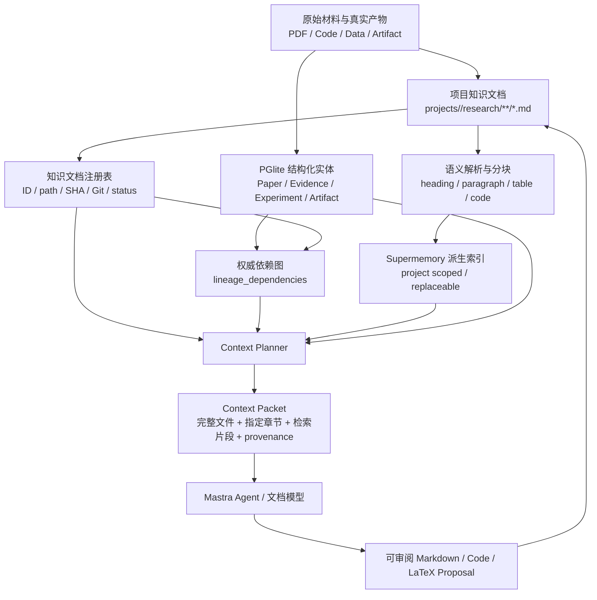

# Research OS Memory v2：以 Markdown 为知识源的科研记忆系统

> 文档状态：Memory v2 实施中（Phase 7 验证完成，外部模型阻塞待解除）
> 对应 TODO：设计 `P1-MEMORY-DESIGN-149`；实施 `P1-MEMORY-V2-150`
> 创建日期：2026-08-07（Asia/Shanghai）
> 适用代码副本：`/mnt/d/researchos`（WSL2 内开发，Windows 侧为 `D:\ResearchOS`）
> 优先级说明：本文细化 Memory v2 的后续实施合同，不覆盖 `TODO.md` 中仍在进行的 P0 工作

> 2026-08-07 实施记录：用户明确要求开始完整实现，并要求进度即时写回本文档。当前进入 Phase 0，先固化 schema、真实语料 fixture 和当前 Supermemory Local 行为证据；尚未完成的 Phase 不得提前标为 `[x]`。
>
> 2026-08-07 Phase 0/1 开工记录：现状复核确认旧 `material-indexer.ts` 会折叠 Markdown 结构、`memory_links.source_id` 只能表达 UUID，且上传材料存在两套摄取实现。首批改动限定为严格知识文档契约、无敏感 fixture、AST 语义解析、PGlite 注册表/版本/索引代次基础和新项目最小目录；在定向测试通过前，`MEMORY-V2-001/002/010/011/012` 保持未完成或进行中，Supermemory 真实 spike 单独记录，禁止以本地 parser 测试冒充外部服务验收。
>
> 2026-08-07 Phase 2 开工记录：将把知识文档索引实现为按文档 hash 生成的可替换 generation。新 generation 未完整写入前不改变本地 active 指针；检索先按 PGlite allowlist 过滤，再访问 Supermemory；旧远端删除失败只进入可审计重试状态，不影响当前版本的隔离。上传材料去重/摄取会在同一 indexing service 收敛，外部 Supermemory 行为仍必须用真实 Local 服务单独验收。
>
> 2026-08-07 Phase 1/2 本地验收记录：知识注册、AST parser、API read/reconcile、mtime/size 快速轮询信号、代次激活/替换、远端删除失败隔离和上传材料单一 indexing service 共 22 个定向测试通过；服务端和全仓库 typecheck 通过。真实 Supermemory Local spike（证据：`artifacts/acceptance/memory-v2-supermemory-spike-mshuv9yo-d6799d.json`）于 2026-08-07 Asia/Shanghai 完成：服务 HTTP 200；整文件 1 个文档与 AST 5 个 chunks 均 `done`、检索命中且保留 locator；同一 source key 修订后远端保留 2 个 active 文档，确认本地 build 不自动替换；7 个测试文档全部 delete 清理成功。`MEMORY-V2-023` 仍等待 embedding 配置变化触发全量重索引，不能把已有删除重试冒充完整完成。
>
> 2026-08-07 Phase 3 开工记录：Context Planner 将按项目和 workspace scope 生成严格 `ContextPlan`/`ContextPacket`，优先读取明确的当前 Markdown/章节，再用 active-generation Supermemory 搜索未知候选；上下文只携带当前文件内容和来源 manifest，不信任远端返回的旧正文。预算、排除原因、检索 query 和文档 hash 写入 PGlite `context_manifests`，未索引/跨项目/远端失败均保留结构化 blocked 状态，不静默改用另一项目或空数组。
>
> 2026-08-07 Phase 3 进度记录：已补入 `0020-memory-v2-context`、项目删除清理、严格 Context Packet 来源类型与项目范围 manifest API；planner 已实现页面 recipe、明确文件优先、长文档章节预算、workspace metadata filter、受控本地关键词检索与 active-generation Supermemory 组合、当前 scope 最近消息和 pending Proposal。项目聊天已开始改用该 packet，并停止让 Mastra 的旧自动检索绕过本地 generation allowlist。当前正在补定向测试和 Mastra 契约验收，`MEMORY-V2-030` 至 `034` 在验证完成前仍保持 `[~]`。
>
> 2026-08-07 Phase 3 UI 进度记录：项目聊天的新回复与恢复消息均保留 `context_manifest_id`；“参考来源”按需读取项目范围 manifest，展示实际使用的文档/实体、版本 hash、locator、token 预算、排除原因和知识文档非原始证据提示，不读取或复制正文。四语言、浅暗主题、键盘 disclosure 和窄屏样式已接线，前后端 typecheck 通过；真实浏览器验收完成前 `MEMORY-V2-034` 保持进行中，同时开始 Phase 4 后端工作。
>
> 2026-08-07 Phase 4 完成记录：`0021-memory-v2-impact` 在现有 `lineage_dependencies` 上增加可选 `impact_policy`，新增的 report/item 表只保存传播状态而不是第二张依赖图。`knowledge_document` fingerprint、front matter 与 Paper/Experiment/Evidence/Artifact 绑定、五类影响、循环检测、20 层/500 节点默认上限、Impact Report 和幂等 Proposal API 已实现；旧无策略边保持原有严格失效语义，`rerun_required` 不修改成功实验及历史指标。影响/文档 15 条定向测试、Context Planner 与索引回归测试通过，进入 Phase 5。
>
> 2026-08-07 Phase 5 开工记录：科研文档生成统一复用现有受限 Patch、审批与项目 Git 链路，新增专用 `knowledge_document_patch` Proposal；模型只生成 Markdown 正文和开放核验项，front matter、目标路径、实体绑定、来源快照及并发 hash 由服务端严格构造。批准事务不直接等待远端 Supermemory，而是在本地写入、Git commit、reconcile 和影响传播完成后排队单文档索引；同一文档只允许一个 pending write Proposal。当前先实施 `MEMORY-V2-050`。
>
> 2026-08-07 Phase 5 完成记录：新增项目范围 `POST /knowledge/proposals` 与 Mastra `knowledge-document-draft` Agent，统一覆盖 Idea、逐篇 Paper summary、related-work synthesis、experiment plan、不可覆盖的逐 run result、experiment synthesis 和五章 writing brief。模型只生成正文；服务端严格生成 front matter、Evidence/Artifact locator、provider provenance、真实 metrics 表、Context Manifest、完整 diff、Git/SHA 并发门禁和 `automatic_execution:false`。稳定 Idea 讨论只在 `overview/idea` 明确形成结论时创建 Proposal；论文 AI 单章修订强制读取对应的确认 writing brief，并只消费 confirmed 且非 stale/blocked 的知识文档，最终仍走 LaTeX Proposal/Git/编译门禁。服务端与 Mastra typecheck 通过；知识 Proposal、聊天、Context Planner、论文接线共 13 条定向测试通过。
>
> 2026-08-07 Phase 6 接线记录：手工 Markdown 编辑已具备项目范围 diff Proposal、审批、Git 基线和 SHA 并发门禁；知识影响与项目隔离依赖图 API 已具备。当前把文档阅读/源码编辑/索引健康嵌入现有科研页面，把 Impact Sheet 嵌入“待审批与决策”，并提供项目范围知识图弹窗；不新增顶层 Memory 标签，也不允许前端直接写文件或自动执行下游变更。真实浏览器、四语言、两主题和移动端验收完成前，`MEMORY-V2-034/060/061/062/063` 均保持 `[~]`。
>
> 2026-08-07 Phase 6 静态验收记录：现有科研页面已接入当前 scope/全部文档筛选、Markdown 阅读/源码、状态/来源/hash/Git/索引代次/显式依赖、受 SHA 约束的手工 diff Proposal，以及按页面语义限定的 Idea、Paper summary、related synthesis、实验 plan/run/synthesis 和 writing brief 生成入口；审批页已接入 Impact Sheet，项目级知识图只投影文档和 lineage 实体。Web typecheck/build、UI i18n/theme/Markdown 静态检查全部通过，知识 Proposal/隔离定向测试 7/7 通过；正在进行真实浏览器验收。
>
> 2026-08-07 Phase 6 浏览器进度记录：Windows Chrome 已真实验收 1365px 浅色中文、1365px 暗色英文和 390px 暗色繁中，覆盖知识工作区、可审阅 diff、知识图键盘选择及非空 Impact Sheet；三组场景均无页面横向溢出、console/page error，检查中发现的内部枚举泄漏已改为四语言用户文案。尚需补齐 320/768/1024/1440px、西班牙语和“参考来源”真实回复；配置的 `gpt-5.6-luna` 网关当前返回 502 `Upstream access forbidden`，因此依赖真实助手回复的 `MEMORY-V2-034/063` 在端点恢复前属于外部阻塞，不能伪造通过。
>
> 2026-08-07 Phase 7 缺陷记录：真实失败关闭验收发现 `conversation.agent_turn` 的显式工作流重试会重复执行 `projectChatTurn`，一次模型失败留下三条相同用户消息和三个 Context Manifest。根因是业务对话轮次没有稳定身份，消息/Manifest/Proposal 只使用每次执行新建的 UUID；不能靠关闭重试掩盖进程恢复重放。新增 `MEMORY-V2-076`，以贯穿 API 事件、工作流任务、消息、Manifest 和 Proposal 的稳定 `turn_id` 实现端到端幂等。
>
> 2026-08-07 `MEMORY-V2-076` 完成记录：API 现为每次发送生成稳定 `request_id/turn_id`，工作流 correlation/idempotency、PGlite `conversation_turns`、消息唯一键、Context Manifest 固定 ID 和 Proposal `origin_turn_id` 已贯通；助手消息先以界面不可见的 pending 状态持久化，Supermemory 成功后才原子变为 complete。公开 `/api/chat`、默认 workflow 与真实 task worker 的故障重放集成测试证明：Proposal 创建后助手语义写入中断并重放时，不重复调用模型，只保留 1 个 event、turn、node run、task、Manifest、Proposal、用户消息和助手消息；同一 ID 携带不同聊天输入会以 `chat_turn_identity_conflict` 返回 409，严格身份校验只作用于聊天入口，不改变通用 workflow event 的既有幂等契约。服务端 typecheck 与聊天重放、Context Packet、workflow runtime、worker 错误恢复共 15 条测试通过。
>
> 2026-08-07 Phase 7 迁移记录：新增项目范围 Memory v2 迁移预览与单候选 Proposal API。`idea.json`、Paper/Evidence、Experiment/Artifact 只确定性映射为 `draft` Markdown，不调用模型，不猜测缺失方法/结论；来源不一致或疑似密钥字段会 blocked。每次只创建一个 Proposal，确保批准前审阅的 Git 基线不会因另一项先提交而失效。3 条定向测试验证预览不写文件、重复请求幂等、批准 Idea 后 `idea.json` 字节保持不变，以及 Paper/Evidence locator、Experiment metrics、Artifact SHA 与依赖均来自真实行。
>
> 2026-08-07 `MEMORY-V2-072` 开工记录：旧索引清理采用“只读 rebuild plan + 显式按 plan hash 执行”，不在诊断时修改本地或远端状态。计划必须识别同一文档多个 active generation、进行中代次、代次/文档指针或 SHA 不一致、旧 generation 残留远端条目，以及未被 `knowledge_index_entries` 引用的 `knowledge_document_chunk` memory link；多 active、进行中写入或跨项目关联属于冲突并失败关闭。执行仅在计划未变化、无冲突且全部远端删除成功后把受影响当前文档排入重索引，任何部分删除失败都不排队；数据库同时增加“每项目每文档最多一个 active generation”的部分唯一约束。
>
> 2026-08-07 `MEMORY-V2-072` 完成记录：新增项目范围只读 rebuild plan 与按 `plan_hash` 执行 API；计划覆盖多 active、pending generation/link、跨项目或复用 link、失配/过时代次、远端删除残留和孤立 chunk link。执行过程中任一远端删除失败、文档 hash 变化或出现并发 pending generation 都不会排队重建；成功后只重建缺少有效当前代次的文档，健康代次不重复摄取。PGlite 已用部分唯一索引强制每项目每文档最多一个 active generation，重索引任务 key 纳入 embedding fingerprint 且终态任务可原位安全重排队。8 条索引生命周期定向测试和服务端 typecheck 通过。
>
> 2026-08-07 `MEMORY-V2-073` 容量基线记录：隔离临时项目真实生成 100 篇 Paper summary、200 个 Experiment plan、每个实验 2 个 run result（共 702 份知识 Markdown）；对账、局部修改、BM25 召回和 Context budget 正确性通过，5/5 文献查询与 5/5 实验查询命中，未把全部文档装入上下文（上限 12 文档、8000 token、1800 output reserve）。当前基线暴露性能缺口：702 份首次/未变更对账约 98/91 秒，局部修改对账约 89 秒，Planner p95 约 6.3 秒；`MEMORY-V2-073` 在批量 lineage 与候选文档读取优化、重新测量前保持 `[~]`，不得标为完成。

> 2026-08-07 `MEMORY-V2-073` 优化进度：容量复测暴露批量 lineage SQL 的参数分片错误（每条边实际 8 个参数但旧代码按 9 个切片，触发 `bind message supplies 3600 parameters, but prepared statement requires 3200`）。该路径已改为每 400 条边使用单个 `jsonb_to_recordset` 参数，不再拼接或重编号占位符；Markdown 解析缓存同时统一为 `project_id + relative_path + SHA-256`，reconcile 首次解析即写入有界缓存，后续未变化对账可复用。当前等待 typecheck、定向测试和 702 文档容量复测，任务保持 `[~]`。

> 2026-08-07 `MEMORY-V2-073` 定向验证：服务端 typecheck 通过；知识文档、影响传播、Context Planner 和知识文档 Proposal 共 27/27 条测试通过。JSONB lineage upsert 与项目/路径/SHA 解析缓存未破坏现有注册、改名、缺失、外部编辑、依赖传播、预算和审批语义；正在运行隔离的 702 文档容量复测，任务保持 `[~]`。

> 2026-08-07 `MEMORY-V2-073` 完成记录：隔离容量验收最终通过。702 份知识文档（100 篇 Paper summary、200 个 Experiment plan、400 个 run result，另含 Idea 与 benchmark protocol）首次/未变化/局部修改对账分别为 25.1/25.8/24.7 秒，较基线约 98/91/89 秒显著下降；Planner p95 3.9 秒（基线约 6.3 秒）。5/5 文献查询与 5/5 实验查询命中，局部修改后只召回新内容；宽查询严格限制为 12 份文档、672 included tokens、8000 token 总预算和 1800 output reserve。该脚本明确只验收本地 BM25 大容量路径，不调用文档模型，也不把未运行的远端 Supermemory 语义召回伪造成通过；远端路径继续由真实 Supermemory acceptance 覆盖。

> 2026-08-07 `MEMORY-V2-074` 开工记录：现有测试已分别覆盖项目 container 隔离、active allowlist、旧代次删除失败和 embedding reset/reindex，但尚缺一组明确检查失败后数据库状态的组合验收。正在补齐同一 generation 部分 chunk 摄取失败不得激活、跨项目 memory link 不得删除或排队、Supermemory 未启用不得创建代次、rebuild 远端删除失败不得排队，以及 embedding 清理失败不得切换配置的失败注入测试；任何一项失败都保持本任务 `[~]`。

> 2026-08-07 `MEMORY-V2-074` 索引矩阵进度：服务端 typecheck 与 11/11 条索引生命周期测试通过。验证了 Supermemory 未启用时不创建 generation/link；部分 chunk 摄取失败时 generation=`failed`、document 无 active pointer、active allowlist 不暴露部分结果且同代次可重试；跨项目 memory link 使 rebuild plan blocked，既不远端删除也不排队；任一远端删除失败时 rebuild 不排队，显式重试后才完成；embedding 清理失败时项目配置不切换、任务数不变，旧 active pointer 已撤销，完整清理后才保存新配置并排队当前文档。正在运行配套 container 隔离、项目级 embedding、Context Planner 与知识图测试，任务保持 `[~]`。

> 2026-08-07 `MEMORY-V2-074` 完成记录：失败关闭核心矩阵 11/11 通过，配套 Supermemory contract、项目级 embedding、Context Planner 和知识 Proposal/图隔离 29/29 通过，服务端 typecheck 通过。验收覆盖项目 container 隔离与跨项目 link 拒绝、Supermemory 禁用/缺少配置、部分 generation 摄取失败、active allowlist、旧远端删除失败与显式重试、embedding 切换清理门禁、跨项目/旧语义候选过滤；失败后不伪造 active generation、不切换配置、不排队下游任务，也不把另一项目或旧代次内容装入 Context Packet。

> 2026-08-07 Phase 7 全量验证启动：剩余任务为 `MEMORY-V2-034/060/061/062/063/075`。开始执行完整 typecheck、测试、build、docs/UI/i18n/language/navigation、Supermemory acceptance、workflow v2 与真实浏览器多尺寸/多语言/双主题验收；任何失败先修复并记录，外部模型端点仍不可用时如实标记阻塞，不伪造通过。

> 2026-08-07 Phase 7 静态验证：`npm run typecheck` 通过；服务端 62 个测试文件、283 条测试全部通过（含 Memory v2 索引、Context Planner、知识 Proposal、聊天重放、影响传播、失败关闭与容量回归）。下一步继续 build、docs/UI/i18n/language/navigation 与真实浏览器验收。

> 2026-08-07 Phase 7 构建与静态检查：`npm run build`（Web/Server/Mastra Studio）、`docs:check`、`language-boundary:check`、`navigation:check`、`ui:check` 与 `idea-cases:check` 全部通过。下一步运行 Supermemory acceptance、workflow v2 与真实浏览器验收。

> 2026-08-07 Phase 7 验收修复：首次 `supermemory:acceptance` 失败，根因是固定复用 `runtime/acceptance-supermemory` 的旧 PGlite（2026-08-02 创建，projects.id 仍为 UUID），新 schema 的 `workflow_definitions.project_id` 外键无法建立。已改为每次运行使用 `runtime/acceptance-supermemory-<timestamp>` 全新隔离目录并在 finally 清理，不再让旧库污染迁移。

> 2026-08-07 Phase 7 运行时验收：`supermemory:acceptance` 核心路径通过（服务可达、文本摄取与检索、双项目隔离、Graph、Super RAG、远端 delete 与消失验证），整体如实返回 `partial`：`forget` 因配置模型端点无法抽取 memory 实体、PDF 终态和图片摄取因外部模型/Gemini 阻塞，均按既有约束记录而不伪造通过。`workflow:v2:check` 通过（governance node succeeded、Proposal rejected、audit binding、args fingerprint 命中）。

> 2026-08-07 Phase 7 项目级模型修复记录：真实聊天链路 502 的根因是提示注入检测器固定用全局 `configuredModel(tier)`，没有携带项目 ID，即使主模型已使用项目级模型，检测器仍先请求全局 `gpt-5.6-luna`。已让 `supervisionRequestSchema` 携带可选 `project_id`，Mastra 意图分类从 `body.project_id || memory_resource` 解析项目并传给 `requestContext`，各 Agent 与 guardrail 按项目级模型设置解析。服务端和 Mastra typecheck、`chat-context.test.ts` 通过；验收项目 `memory-visual-u7x1` 配置项目级 `grok-4.5` 后，真实 `/api/chat` 返回中文回复、`context_manifest_id`、`context_status: complete` 与 `model: grok-4.5`。该配置只写在该项目 `.researchos/model-settings.json`，不是全局默认；全局 `.env` 默认模型已恢复为 `gpt-5.6-*`，不把本地可用模型冒充为默认配置。

> 2026-08-07 Phase 7 浏览器验收记录：新增可复现脚本 `scripts/memory-v2-browser-check.mjs`，用 Windows Chrome 真实验收 48 组（320/390/768/1024/1365/1440px × zh-CN/zh-TW/en/es × light/dark）知识工作区；所有组合均无横向溢出、`lang/theme` 正确、知识文档阅读/源码/详情/参考来源入口正常。另验证 Idea 页生成控件、知识图 SVG/键盘 Enter 选择与详情、Impact Sheet 非空及从审批页打开知识图、四语言“参考来源”键盘展开并显示实际 manifest 来源/预算/排除原因/证据边界；脚本记录的 runtime/console/page error 为空。截图保存于 `runtime/memory-v2-browser/`。

> 2026-08-07 Phase 7 最终验证记录：`npm run typecheck`、服务端 62 文件 283 条测试、`npm run build`、`docs:check`、`language-boundary:check`、`navigation:check`、`ui:check`、`idea-cases:check` 与 `workflow:v2:check` 全部通过。浏览器验收脚本修复了两个脚本侧问题：总览页不属于生成控件标签（Idea/文献/实验/论文才显示），以及键盘 Enter 需要完整 `keyDown` 事件；迁移测试 `beforeAll` 超时由默认 10s 提高为 30s（单文件实测约 19s，完整链路复测 283/283 通过）。`MEMORY-V2-075` 的验证链已全部执行，但 `supermemory:acceptance` 仍因外部模型端点（`forget` 实体抽取、PDF 终态、Gemini 图片）返回 partial，且全局默认 `gpt-5.6-*` 网关仍不可用、真实聊天只通过验收项目 `memory-visual-u7x1` 的项目级 `grok-4.5` 验证，因此本任务保持 `[!]`，不把外部阻塞冒充为默认配置可正常聊天。

> 2026-08-07 Phase 7 acceptance 模型覆盖复测：临时以 `RESEARCH_MODEL_MEDIUM=grok-4.5` 重启 Supermemory 后真实运行 `supermemory:acceptance`，结果仍为 `partial`（证据：`artifacts/acceptance/supermemory-local-20260807043842.json`）。其中一条文本的 forget 成功撤销 2 个 memory 实体，另一条没有抽取到实体；PDF 处理先走 Mistral OCR（超时）再回退 Gemini 2.5 Flash，返回 403 `unregistered callers`；图片所有提取器失败。结论是阻塞来自 Supermemory 服务端的 PDF/图片外部提取依赖（Mistral/Gemini key）和抽取稳定性，更换 OpenAI 兼容模型不能解除。复测后已恢复默认 `RESEARCH_MODEL_MEDIUM` 运行。另对全局三档模型做了直连接口探测：`gpt-5.6-luna` 返回 `Service temporarily unavailable`，`gpt-5.6-terra` 与 `gpt-5.6-sol` 可正常返回 `completed`。

> 2026-08-07 轻量档模型切换记录：用户确认 `gpt-5.6-luna` 是上游服务器禁用后，已把全局轻量档 `RESEARCH_MODEL_SIMPLE` 从 `gpt-5.6-luna` 切换为 `deepseek-v4-flash`（URL 与 key 沿用本地网关配置），并同步 `.env.example` 与中英文 README。直连 `/responses` 复测返回 HTTP 200、`status: completed`；`gpt-5.6-terra`、`gpt-5.6-sol` 此前已确认可用。`MEMORY-V2-075` 仍保持 `[!]`，因为 Supermemory PDF/图片外部提取和 `forget` 抽取稳定性仍由 Supermemory 服务端闭源二进制决定，不因轻量档模型切换而解除。

> 2026-08-07 `RESEARCH_MODEL_MEDIUM=deepseek-v4-flash` 覆盖复测：临时以 deepseek 作为 Supermemory LLM 抽取模型重启并真实运行 `supermemory:acceptance`，结果仍为 `partial`（证据：`artifacts/acceptance/supermemory-local-20260807070220.json`）。文本 A 成功抽取 1 个实体并 forget 撤销，文本 B 仍未抽取到实体；PDF 停在 `extracting`，图片远程状态 `failed`。复测后已恢复默认 `RESEARCH_MODEL_MEDIUM` 并重启 Supermemory。结论与 grok 覆盖复测一致：阻塞来自 Supermemory 服务端闭源二进制的 PDF/图片外部提取依赖和实体抽取稳定性，Research OS 代码无法绕过。

## 1. 决策摘要

Research OS 应采用下面的组合，而不是在“只看完整文件”和“只做 RAG”之间二选一：

1. **项目内 Markdown 是可编辑的科研知识源。** Idea、逐篇文献总结、实验计划、实验结果综合、论文写作提纲等长期知识，以项目 Git 中的 Markdown 文件为准。
2. **原始材料和真实产物仍是证据源。** PDF、数据、代码、配置、日志、图片、模型权重和实验输出继续由 Paper、Evidence、Git、Artifact 与实验运行记录管理；Markdown 只能总结和引用它们，不能取代它们。
3. **PGlite 是状态和依赖账本。** 它保存文档 ID、路径、SHA-256、Git commit、状态、依赖边、当前索引代次、审批和审计，不复制保存整篇 Markdown 正文。
4. **Supermemory 是可重建的派生索引。** 它负责语义检索、混合检索和会话记忆，不是 Markdown 的唯一副本，也不是科研依赖图的权威来源。
5. **分块仍然需要，但必须改为结构化语义分块。** 不再把 Markdown 压成一行后固定按 6000 字符切割；应按标题、段落、列表、表格和代码块组织，并绑定稳定文档 ID、版本 hash 和行号/标题定位。
6. **上下文按任务即时组装。** 已知要看的文件优先直接读取完整文件或指定章节；不知道材料在哪里时先检索候选，再读取候选的完整 Markdown。绝不把 100 篇论文和 200 个实验结果全部塞入一次模型上下文。
7. **修改通过依赖图传播“影响”，而不是自动重写一切。** Idea 改动后，相关实验计划、方法说明和论文段落可以标为待复核；历史实验测量不会凭空消失，但它是否仍支持当前 Idea、是否仍具可比性必须重新判断。

因此，Memory v2 不是放弃 RAG，而是把 RAG 从“记忆本体”降为“查找和装配知识的索引层”。

## 2. 用户意图的完整解释

用户希望一个科研项目最终能够以人类可阅读、可直接修改、可备份、可 Git 版本化的文件集合表达，而不依赖一个不可见、难以修订的向量数据库。

这个文件集合至少应覆盖五个互相影响、但不应被实现成简单串行流程的科研区域：

1. **Idea 与方法讨论**：持续澄清研究问题、创新候选、方法设计、假设、边界和开放问题，最后形成一份当前有效的 Idea Markdown。
2. **相关工作调研**：每篇文献形成一份独立 Markdown，记录它的创新、方法、数据集、指标、结果、局限、代码和与本项目的关系；另外形成跨论文综合，而不是只保留一堆互不关联的摘要。
3. **前人工作复现**：在公平协议下规划复现，记录代码来源、固定 commit、数据、配置、seed、指标和运行结果。
4. **本方法实现与实验**：记录每个实验为什么做、验证什么、使用什么配置、得到什么结果，以及结果如何改变后续 Idea 或实验计划。
5. **论文撰写**：写作不是最后一次性开始；引言、相关工作、方法、实验和结论可以持续消费已经确认的 Markdown 与真实证据，并在上游变化时知道哪些内容需要复核。

用户真正需要的不是“文档很多时如何搜索”这一项孤立能力，而是以下组合能力：

- 文档可读、可编辑、可比较 diff、可恢复旧版本。
- 每个知识结论能追溯到原始 PDF、Evidence、实验运行或用户决定。
- 文档之间存在显式依赖；上游改变后，下游能得到准确的影响提示。
- 大规模知识不会全部进入上下文，但模型仍能找到真正相关的完整信息。
- 对话中的阶段性结论能转成可审阅的 Markdown diff，而不是永远埋在聊天历史里。
- 向量索引损坏、重建或更换 embedding 模型时，知识本身不会丢失。

## 3. 概念与职责边界

| 概念 | Memory v2 中的含义 | 是否是事实源 |
| --- | --- | --- |
| 原始材料 | PDF、网页快照、BibTeX、代码仓库、数据集、图片和上传文件 | 是，但证据强度取决于来源与 locator |
| 受控 Artifact | 实验输出、图表、日志、模型、编译 PDF 等带 SHA-256 的真实产物 | 是 |
| 知识文档 | 项目内 `research/**/*.md`，由人或 AI 总结、规划和综合 | 是可编辑知识源，但不是原始证据 |
| 结构化账本 | PGlite 中的项目实体、状态、hash、依赖、审批和审计 | 是状态源，不保存大段语义正文 |
| 检索索引 | Supermemory 中由知识文档和材料派生出的 chunks/embeddings | 否，可删除并重建 |
| 工作记忆 | 当前任务目标、最近消息、未决问题、上下文清单 | 否，是短期运行状态 |
| Context Packet | 某一次模型调用实际收到的文档、章节、检索片段和来源清单 | 否，但必须可审计 |
| 依赖图 | “哪份知识/结果依赖哪一个版本的上游”的显式图 | 是，由 PGlite lineage 管理 |
| Supermemory Graph | Supermemory 自动抽取的 updates/extends/derives 语义关系 | 否，不得替代科研 lineage |

必须坚持两个区别：

- **“这段文字与另一段文字语义相关”不等于“它在科研流程上依赖另一段文字”。** 前者可以由 Supermemory 推断，后者必须由 Research OS 明确记录。
- **“模型总结了一篇论文”不等于“论文原文证明了这个结论”。** 文献 Markdown 必须保留读取范围和 locator；没有全文证据时只能标为 metadata/abstract 级总结。

## 4. 当前实现审计

### 4.1 当前已经具备的基础

- [`apps/mastra/src/mastra/supermemory.ts`](./apps/mastra/src/mastra/supermemory.ts) 会从真实用户消息生成最多 2000 字符的检索查询，按项目 container 和可选 `workspace_scope` 查询 Supermemory，并把最多 8 条结果注入当前模型调用。
- [`apps/server/src/chat-service.ts`](./apps/server/src/chat-service.ts) 会把项目对话消息按 `workspace_area/workspace_tab` 写入项目范围的 Supermemory。
- [`apps/server/src/impact-service.ts`](./apps/server/src/impact-service.ts) 已有 `lineage_dependencies`、上游 fingerprint 和级联失效机制，可覆盖 IdeaVersion、Paper、Evidence、复现、实验、Artifact、Checkpoint、Git commit、数据和配置。
- 项目已经有独立 Git、`idea.json`、`paper/`、`workflow.ts`、实验和 Artifact 管理基础。
- Supermemory 已按项目 slug/container 隔离，并有本地 `memory_links` 审计关联。

这些能力应继续复用，不需要再造第二套数据库、第二个向量库或另一套 Agent Memory。

### 4.2 当前不满足新想法的部分

1. [`apps/server/src/material-indexer.ts`](./apps/server/src/material-indexer.ts) 会先把空白折叠成一行，再按最多 6000 字符、500 字符重叠、最多 200 块切割。Markdown 标题层级、段落边界、列表结构、代码块和精确行号会丢失。
2. [`apps/server/src/supermemory-service.ts`](./apps/server/src/supermemory-service.ts) 只按 `project_id + source_type + source_id + content_sha256` 判定完全相同内容的幂等。文件内容改变后会创建新的 active link，但同一来源的旧内容不会自动退役。
3. `memory_links.source_id` 当前是 UUID，不能直接表达 `idea:current`、`paper:pointnet-2017` 等稳定、可读的知识文档 ID。
4. 当前项目目录没有统一的 `research/` 知识结构；Idea 主要是 `idea.json`，论文是 `paper/main.tex`，文献和实验知识分散在数据库、聊天、Artifact 与运行状态中。
5. 当前检索直接返回相似片段，没有先定位“哪几份文档”，再按任务读取完整文档或章节的分层装配。
6. 现有 lineage 没有 `knowledge_document` 节点，也没有“待复核、需重生成、需重跑、只通知”这些不同影响语义。
7. 上传材料索引逻辑在 task worker 与 workflow capability 中存在两份近似实现，Memory v2 落地时应收敛到一个服务边界，避免替换语义再次分叉。

### 4.3 当前方案的准确结论

当前 Research OS 对大规模语义内容的主路径确实接近项目隔离的 RAG，加上结构化 PGlite 状态和部分 lineage。它不是错误的起点，但尚未形成“文件是知识源、索引可重建、修改可传播”的完整知识工程系统。

## 5. 目标架构



### 5.1 五层模型

1. **Evidence Layer**：原始 PDF、网页来源、代码 commit、数据、实验运行和 Artifact。
2. **Knowledge Layer**：人和 AI 都能直接阅读与修改的 Markdown 知识文档。
3. **Ledger Layer**：PGlite 保存文档身份、状态、版本指纹、依赖、审批和审计。
4. **Index Layer**：Supermemory 保存可重建的语义索引与会话记忆。
5. **Context Layer**：每次模型调用按任务、预算和权限即时组装的 Context Packet。

任何一层都不能越权代替另一层：

- Supermemory 搜到的片段不能绕过 Evidence/ClaimReview 门禁。
- PGlite 不应为了方便而保存所有 Markdown 正文。
- Markdown 中写出的指标不能替代实验数据库和 Artifact。
- 对话总结不能自动成为确认后的 Idea 或论文事实。

## 6. 项目目录合同

推荐的项目知识目录如下。目录中的 ID 是示例，不要求一次创建所有空文件；只有实际产生内容时才创建。

```text
projects/<project-slug>/
├── research/
│   ├── idea/
│   │   ├── current.md
│   │   └── decisions/
│   │       └── <decision-id>.md
│   ├── related-work/
│   │   ├── synthesis.md
│   │   └── papers/
│   │       └── <paper-key>.md
│   ├── experiments/
│   │   ├── benchmark-protocol.md
│   │   ├── reproductions/
│   │   │   └── <experiment-id>/
│   │   │       ├── plan.md
│   │   │       ├── synthesis.md
│   │   │       └── runs/<run-id>/result.md
│   │   └── method/
│   │       └── <experiment-id>/
│   │           ├── plan.md
│   │           ├── synthesis.md
│   │           └── runs/<run-id>/result.md
│   ├── writing/
│   │   ├── outline.md
│   │   ├── claim-map.md
│   │   └── section-briefs/
│   │       ├── introduction.md
│   │       ├── related-work.md
│   │       ├── method.md
│   │       ├── experiments.md
│   │       └── conclusion.md
│   └── reports/
│       └── <report-id>.md
├── experiment/
├── artifacts/
├── paper/
│   ├── main.tex
│   └── ...
├── idea.json
└── workflow.ts
```

### 6.1 为什么这样拆分

- `idea/current.md` 始终代表当前有效的研究理解；历史由 Git 和 decision note 保存，不在一个文件里无限追加旧版本。
- 每篇论文一份 Markdown，便于单独修改、复核、重索引和引用。
- `related-work/synthesis.md` 负责跨论文比较、研究现状和空白候选，避免论文摘要之间没有综合关系。
- `benchmark-protocol.md` 独立保存公平比较规则；复现和本方法实验都依赖它。
- 每个实验的 `plan.md` 与运行结果分开。每次真实 run 的 `result.md` 不覆盖旧 run；`synthesis.md` 汇总多个 run 的统计和结论。
- `writing/` 保存论文写作所需的提纲、claim map 和章节简报；最终论文源码仍以现有 `paper/main.tex` 为准，避免同时把 Markdown 正文和 LaTeX 正文都称为唯一稿件。
- 图片、曲线、CSV、模型和日志不复制进 `research/`；Markdown 通过受控 Artifact ID 和相对路径引用它们。

### 6.2 不应创建的目录或文件

- 不创建一个包含所有知识正文的巨大 `memory.md`。
- 不为每一个聊天回合创建 Markdown。
- 不把 embedding、向量、Supermemory 内部 ID 或模型 key 写进项目 Git。
- 不把 PDF 全文复制到文献总结 Markdown 中。
- 不把实验原始日志完整粘贴到结果 Markdown；只放解释、关键表格和 Artifact 引用。
- 不创建需要人手同步的第二份全量 manifest 文件；权威注册表在 PGlite，项目文件和 Git 可独立恢复它。

## 7. Markdown 文档契约

### 7.1 Front matter 最小 schema

每份受管知识文档使用严格 YAML front matter。示例：

```yaml
---
schema: researchos/knowledge-document@1
project_id: pointcloud-classification-0000
id: paper:pointnet-2017
kind: paper_summary
title: PointNet
status: confirmed
depends_on:
  - id: source:paper-record-id
    relation: summarizes
    impact: review_required
workspace_scopes:
  - related-work:literature
  - paper:related-work
---
```

必填字段：

| 字段 | 规则 |
| --- | --- |
| `schema` | 固定版本，未知 major 版本失败关闭 |
| `project_id` | 必须与所在 `projects/<slug>` 一致 |
| `id` | 项目内唯一、路径变化后仍稳定；禁止随机长 UUID 作为用户可见 ID |
| `kind` | 严格枚举，如 `idea`、`paper_summary`、`experiment_plan`、`run_result`、`experiment_synthesis`、`writing_brief` |
| `title` | 人类可读标题 |
| `status` | 作者确认状态，不与系统计算的 stale/index 状态混用 |

可选字段：

- `depends_on`：显式依赖和影响策略。
- `workspace_scopes`：允许在哪些项目页面和任务中被检索。
- `paper_id`、`experiment_id`、`run_id`、`artifact_ids`、`evidence_ids`：与结构化实体绑定。
- `read_scope`：文献总结基于 metadata、abstract、部分章节还是全文。

以下字段由系统计算并保存在 PGlite，不要求模型或用户手写进 Markdown：

- 当前 SHA-256、文件大小、Git commit、dirty 状态。
- 创建/更新时间、解析器版本、chunk 清单、索引代次。
- `current/stale/blocked/indexing/index_failed` 等系统健康状态。
- 影响传播结果和未处理 Proposal。

这样可以避免每次保存正文时为了更新时间或 hash 再次改写文件，减少无意义 Git diff。

### 7.2 作者状态与系统健康状态必须分离

作者状态：

- `draft`：仍在讨论，不能直接进入论文事实。
- `reviewed`：已被用户或指定流程审阅，但未必达到证据门禁。
- `confirmed`：可以作为项目当前知识使用，仍需遵守 evidence status。
- `superseded`：被另一文档替代，保留历史。
- `archived`：不参与默认上下文，仅可按历史查询。

系统健康状态：

- `current`：依赖指纹、文件 hash 和索引均与当前版本一致。
- `stale`：上游改变，需要复核，但正文仍可查看。
- `blocked`：缺少必要证据、依赖或审批，不能进入受控下游。
- `indexing`：新版本索引正在构建。
- `index_stale`：正文已改变，但新索引尚未替换完成。
- `index_failed`：索引失败；不得把旧向量结果伪装成当前正文。

### 7.3 Idea 文档建议结构

```markdown
# 当前 Idea

## Research question
## Motivation
## Core hypothesis
## Proposed method
## Innovation candidates
## Assumptions
## Scope and non-goals
## Evaluation strategy
## Risks and duplicate-work risk
## Open questions
## Confirmed decisions
```

`Innovation candidates` 必须保持候选语义，不能因为写入 Markdown 就升级成已证实创新。

### 7.4 单篇文献文档建议结构

```markdown
# Paper title

## Bibliographic identity
## Read scope and evidence status
## Short summary
## Research question
## Claimed contributions
## Method
## Datasets and protocol
## Metrics and reported results
## Limitations and threats to validity
## Code and reproducibility
## Relation to our Idea
## Candidate claims usable in our paper
## Evidence locators
## Open verification items
```

必须区分：

- 作者在论文中声称的贡献。
- Research OS 根据材料做出的总结。
- 用户已经确认的理解。
- 只有摘要可读时的暂定信息。
- 带页码/章节和原文 quote 的 Evidence。

### 7.5 实验计划文档建议结构

```markdown
# Experiment plan

## Question being tested
## Why this experiment is needed
## Upstream Idea / Paper dependencies
## Dataset and split
## Fair-comparison protocol
## Method and baseline
## Fixed code commit and environment
## Config and random seeds
## Metrics and statistical analysis
## Expected artifacts
## Success / failure criteria
## Cost, safety and approval requirements
## Open decisions
```

### 7.6 单次运行结果文档建议结构

```markdown
# Run result

## Run identity and status
## Immutable provenance
## Metrics
## Artifact references
## Deviations from plan
## Failures and anomalies
## Interpretation
## What this run does not prove
## Follow-up candidates
```

结果正文只能解释真实结构化指标和 Artifact；数值必须从运行记录生成，不能由模型重抄后成为新的数字事实源。

## 8. 版本管理与编辑语义

### 8.1 Git 与 PGlite 各自负责什么

- Git 保存 Markdown、代码、配置和 LaTeX 的内容历史、diff、commit 和恢复能力。
- PGlite 保存“当前哪个版本是 active”“它依赖哪些上游 hash”“索引是否完成”“哪些下游受影响”和审计事件。
- Supermemory 只保存当前可检索的派生内容，历史版本不应默认参与检索。

### 8.2 AI 修改知识文档

AI 不得直接覆盖文档。标准流程：

1. 读取当前文档 hash 和允许的上下文。
2. 生成受限 diff Proposal，记录使用的 source IDs 与 source hashes。
3. 用户审阅、修改、批准或拒绝。
4. 批准后用 optimistic concurrency 检查当前 hash 未变化。
5. 原子写入文件并提交项目 Git。
6. 更新知识注册表、依赖图并排队新索引。
7. 生成下游影响清单；任何下游自动修改仍需单独 Proposal。

### 8.3 用户直接修改文件

用户可以在编辑器中直接修改项目 Markdown。由于仓库位于 `/mnt/d`，不能依赖 inotify：

- Research OS 自己的编辑器/API 保存后应立即触发 hash reconciliation。
- 外部编辑器修改通过项目范围的轻量轮询发现：先比较 mtime/size，再只对变化文件计算 SHA-256。
- 检测到外部修改时记录 `knowledge.external_edit_detected`，把下游影响和 Git dirty 状态展示给用户。
- 系统不能未经用户批准自动提交或自动重写所有下游文件。

### 8.4 并发和冲突

- 保存 API 必须携带 `expected_sha256`；不一致返回 409 `knowledge_document_changed`。
- 同一文档只允许一个 active write Proposal。
- 索引任务按 `project_id + document_id + content_sha256` 去重。
- 文件重命名保持 front matter `id` 不变；路径变化不是新知识文档。
- 恢复旧 Git 内容会创建一个新的当前 revision，并重新执行依赖与索引流程，不直接复活旧索引状态。

## 9. 依赖图与“牵一发而动全身”

### 9.1 复用现有 lineage，而不是再造一张孤立图

建议给现有 `LineageNodeType` 增加 `knowledge_document`，并为文档注册表实现 fingerprint。依赖边继续写入 `lineage_dependencies`，但增加明确的 `impact_policy`，避免所有变化都被粗暴解释为“下游无效”。

建议的影响策略：

| 策略 | 上游变化后的行为 | 典型场景 |
| --- | --- | --- |
| `notify` | 只提示关联变化，不改变下游可用性 | 背景文献新增措辞 |
| `review_required` | 下游标为 stale，人工/Agent 复核后可恢复 | Idea 改动影响实验解释 |
| `regenerate_required` | 派生总结/写作简报必须重新生成 | 论文综合依赖的文献摘要发生实质变化 |
| `evidence_blocked` | 失去必要 Evidence 后阻止进入论文事实 | claim 对应的 Evidence 被撤销 |
| `rerun_required` | 新结论必须使用新 run；旧 run 保留历史 | 代码 commit、数据版本、配置或公平协议改变 |

### 9.2 不能把所有变化都当成同一种失效

以下区别非常重要：

- **Idea 改变**：旧实验结果仍是当时配置下发生过的历史测量，但它可能不再回答当前问题，因此标记“解释/相关性待复核”，不删除结果。
- **文献总结改变**：复现代码和已完成 run 不自动消失，但复现计划、相关工作综合和论文引用可能需要复核。
- **公平比较协议改变**：旧 run 仍保留，但不能与新协议结果混为同一组公平比较；需要新 run 或明确标为不可比。
- **代码、数据、配置或 seed 集改变**：必须创建新 run。不能原地改写旧 `result.md` 让它看起来像新配置的结果。
- **Artifact 被判定无效或丢失**：依赖它的结果综合和论文章节必须 blocked，不能只显示 stale 提醒。

### 9.3 推荐依赖示例

```text
idea:current
  ├─review_required─> experiment:method-ablation/plan
  ├─review_required─> writing:method-brief
  └─review_required─> writing:introduction-brief

related-work:paper-pointnet
  ├─review_required─> reproduction:pointnet/plan
  └─regenerate_required─> related-work:synthesis

experiment:benchmark-protocol
  ├─rerun_required─> reproduction:pointnet/run-set
  └─rerun_required─> experiment:our-method/run-set

run:our-method-seed-01
  └─regenerate_required─> experiment:our-method/synthesis

experiment:our-method/synthesis
  ├─regenerate_required─> writing:experiments-brief
  └─review_required─> writing:conclusion-brief
```

### 9.4 影响传播的输出

每次变更后，系统应生成结构化 Impact Report：

- 改变的文档 ID、旧/新 SHA-256、Git commit。
- 直接和间接受影响的节点。
- 每个节点的影响策略与原因路径。
- 已自动完成的确定性动作，例如重建索引。
- 需要用户审批的动作，例如重新生成综合、修改实验计划、重跑实验、修订论文。
- 仍可查看但已过时的历史结果。

系统不应看到一条依赖边就自动启动高成本实验或重写论文。

## 10. 分块与索引策略

### 10.1 是否继续分 chunk

**继续，但不继续当前固定字符切块。**

原因：

- 100 篇论文总结与 200 个实验文档的总量远大于单次上下文，必须有可检索的子文档单位。
- 一个长 Markdown 中可能只有某一节与当前问题相关，按章节检索比每次读取全文更省上下文。
- embedding 模型和检索服务都有输入长度、延迟和成本边界。
- 精确 locator、依赖和证据状态需要落在具体章节或段落上。

但 chunk 只是派生索引单位，不是用户编辑单位。用户编辑完整 Markdown，系统重新解析受影响文件。

### 10.2 语义分块规则

Markdown 必须用 AST/parser 解析，不使用正则拼接：

1. 保留 YAML front matter，但不把大段机器字段重复塞入每个 chunk 正文。
2. 以标题层级形成 section tree，记录 `H1 > H2 > H3` breadcrumb。
3. 段落、列表、表格、blockquote 和 fenced code block 尽量保持原子性。
4. 小文件在 token 上限内时作为一个完整 chunk，不为“必须分块”而切碎。
5. 大 section 先按段落边界切分；只有单个段落仍超限时才做 token-aware 次级切分。
6. 重叠只用于跨边界语义衔接，建议以 80–150 tokens 为初始区间，不再固定重叠 500 字符；最终值需用真实中英文语料评测。
7. 初始目标可以是 800–1200 tokens/chunk、硬上限约 1400 tokens，但必须根据当前 embedding 模型的真实 tokenizer 和限制校准，而不是写死为所有模型通用值。
8. chunk 保留原始换行，不把 Markdown 压成一行。

每个 chunk metadata 至少包含：

```text
project_id
document_id
document_kind
document_sha256
index_generation
chunk_key
heading_path
line_start / line_end
workspace_scopes
author_status / system_health
paper_id / experiment_id / run_id（适用时）
evidence_status
```

### 10.3 文档级 + 章节级的两阶段检索

推荐建立两种派生条目：

- **Document descriptor**：标题、kind、标题目录、显式 short summary、实体关联，用于先找到相关文件。
- **Section chunk**：具体章节内容，用于定位文件内相关部分。

小文件可以只有一个 whole-document entry；大文件拥有一个 descriptor 和多个 section chunks。

检索流程不是直接把 top-8 chunks 全部交给模型，而是：

1. 按项目、workspace、kind、状态和权限过滤。
2. 混合检索 document descriptors，得到候选文档。
3. 对候选文档做语义/关键词 rerank。
4. 根据任务选择读取完整文档、指定章节或 section chunks。
5. 去重相邻重叠内容并生成 Context Packet。

### 10.4 Supermemory 的使用边界

- 科研 Markdown 和长参考材料默认使用 `taskType: "superrag"`，它们是可检索资料，不应让自动 fact extraction 把未经确认的科学候选变成用户事实。
- 会话连续性、用户偏好和明确的短期工作状态可以使用 memory path，但不得作为论文证据。
- `searchMode: "hybrid"` 可同时找会话记忆和文档；Context Planner 必须区分结果类型和证据等级。
- Supermemory 官方资料说明 Markdown 可按标题层级智能分块，但当前本地固定 build 的实际输出、locator 和替换能力仍需真实验收。首期应做一个 spike：比较“整份 Markdown 交给 Supermemory”与“Research OS 本地 AST 分块后摄取”的准确率、可审计性和替换行为。
- 在无法证明本地 build 能返回稳定 section locator 前，默认采用 Research OS 的 TypeScript AST 分块，Supermemory 只负责 embedding/search。
- Supermemory Graph 的 `updates/extends/derives` 适合语义关联，不得承担实验重跑、证据失效或论文依赖的权威判断。

### 10.5 文件修改后的索引替换

不能尝试在向量库里“原地修改某几个向量”。正确单位是**按文档版本生成新 index generation**：

1. 读取并校验新 Markdown，计算文档 SHA-256。
2. 如果 hash 未变化，幂等结束。
3. 创建 `pending` index generation，解析全部当前 chunks。
4. 使用 `document_id + document_sha256 + chunk_key` 生成确定性 custom ID，上传新 chunks。
5. 全部上传成功后，在 PGlite 事务中把新 generation 标为 active、旧 generation 标为 superseded。
6. 所有检索结果必须通过本地 active-generation allowlist；旧 remote chunk 即使暂时仍存在，也不能进入模型上下文。
7. 异步删除旧 remote documents，并用 reconciliation task 重试；删除失败必须可见，不能影响本地 active 判断。
8. 新 generation 未完整成功时，旧 generation 不冒充新正文；文档标记 `index_stale/index_failed`，已知文件任务可直接读取当前 Markdown，开放式语义检索则明确失败或降级为受控文件目录/BM25，不能偷偷返回旧向量结果。

由于外部 Supermemory 与本地 PGlite 不能做真正的跨系统原子事务，active-generation allowlist 是防止旧 chunk 泄漏到上下文的关键。

## 11. 上下文管理策略

### 11.1 主流 agent harness 的共同做法

当前主流 agent harness 并不是每一轮都把整个工作区塞进 prompt，也不是只把所有知识交给一个向量数据库。更常见的是组合以下机制：

- 文件/数据库作为可持久化外部状态。
- 最近消息和短小 working memory 保持当前目标、约束和未决问题。
- 对长历史做摘要、压缩或 checkpoint，而不是永久保留全部原文在活跃上下文。
- 通过搜索、目录图、repo map、BM25、向量检索或工具调用即时找到相关文件。
- 找到候选文件后，再读取完整文件或精确片段。
- 按 token budget 选择最相关材料，并为模型输出预留空间。

代码 agent 往往更依赖文件树、符号图、`rg`/LSP 和按需读文件，因为代码有明确路径与引用结构；面向数百篇论文和实验记录的科研 agent 仍需要语义/混合检索。Research OS 最适合采用两者结合的“文件优先、检索导航、按需展开”模式。

由于 Research OS 的 Mastra Agent 不能获得任意文件路径或 Shell 工具，不能简单照搬 coding agent 的任意 `cat/rg`。应由受控 TypeScript Context Planner 在 allowlisted `projects/<slug>/research/` 范围内执行读取和检索，再把带 provenance 的 Context Packet 提供给 Agent。

### 11.2 Context Packet 的组成

一次模型调用的上下文至少分为：

1. **Task contract**：当前 workspace、用户问题、允许执行的动作和输出 schema。
2. **Required core**：当前 Idea、选中的实验计划、选中的文献或章节等任务必需文件。
3. **Structured state**：项目/实验/Paper/Evidence/Artifact 的必要字段，不是整份 project JSON。
4. **Retrieved support**：经过范围过滤和 rerank 的候选文档/章节。
5. **Recent conversation**：当前 scope 的最近消息和必要摘要。
6. **Provenance manifest**：每份材料的 ID、hash、locator、状态和读取范围。

Context Planner 必须按模型真实上下文窗口计算预算。推荐的初始比例只是策略，不是固定常量：

- 25% 左右给 required core。
- 25%–35% 给直接选中的完整文件或章节。
- 15%–25% 给检索支持材料。
- 10%–15% 给最近对话和工作状态。
- 至少 25%–35% 预留给模型推理、工具结果和输出。

如果 required core 已超预算，应先按标题/章节缩小或要求用户选择范围，不能静默截断文件尾部。

### 11.3 不同页面的上下文配方

| 当前页面/任务 | 必须直接读取 | 检索补充 |
| --- | --- | --- |
| 项目总览 | Idea 当前版、最近确认 decision、结构化进度 | 最近相关报告和活动摘要 |
| Idea 讨论 | `idea/current.md` 完整内容、开放问题 | 相关论文总结、实验综合、相似创新候选 |
| 文献列表/单篇论文 | 当前选中论文 Markdown 完整内容、Paper/Evidence | 主题相近论文和 synthesis 章节 |
| 研究综合 | `related-work/synthesis.md`、明确选中的论文 | 在全部 paper descriptors 中检索后读取少量完整 paper notes |
| 复现实验计划 | 选中论文、benchmark protocol、当前 plan | 相似复现、代码与限制信息 |
| 本方法实验计划 | Idea、benchmark protocol、当前 plan | 强相关论文、历史实验 synthesis |
| 结果解释 | 当前 plan、run result、真实 metrics/Artifact | 同协议 baseline、相关 run synthesis |
| 引言写作 | Idea、introduction brief、claim map | 已确认相关工作和真实结果摘要 |
| 相关工作写作 | related-work brief、synthesis | 被选择引用的完整 paper notes 与 Evidence |
| 方法写作 | Idea/method brief、确认的方法/代码版本 | 必要的设计依据和消融计划 |
| 实验章节写作 | experiments brief、benchmark protocol、有效 experiment synthesis | 真实 run/Artifact 的必要 locator |
| 结论写作 | conclusion brief、已确认 claims、有效实验综合 | 局限、失败实验和开放问题 |

### 11.4 对话怎样转成长期知识

聊天记录适合保留过程，但不应成为项目最终知识的唯一位置：

1. 对话继续按 `workspace_area/workspace_tab` 隔离和检索。
2. 当一轮讨论形成稳定结论时，Agent 生成目标 Markdown 的 diff Proposal，例如更新 `idea/current.md` 或创建实验 `plan.md`。
3. Proposal 明确列出从对话中提取的决定、仍未确定的内容和引用的外部证据。
4. 用户批准后才写入项目 Git；未批准内容仍只属于对话候选。
5. 新会话恢复时优先读取当前 Markdown 和 open decisions，不必重放所有历史聊天。

这会显著减少“模型在历史聊天中说过，但后来没人知道哪一句仍有效”的问题。

## 12. 大规模项目的具体运行示例

假设项目中有：

- 1 份 `idea/current.md`。
- 100 份 `related-work/papers/*.md`。
- 1 份跨论文 `synthesis.md`。
- 200 个实验，每个有 plan、若干 run result 和 synthesis。
- 5 份论文 section brief、1 份 claim map 和最终 LaTeX。

### 12.1 用户问“我们的相关工作章节应该如何组织”

系统不读取全部 100 篇论文：

1. 直接读取 Idea、`related-work/synthesis.md`、related-work section brief 和 claim map。
2. 在 100 份 paper descriptor 中按研究主题、方法和当前 claim 做 hybrid search。
3. 先选出约 12–20 份候选，再根据 confirmed/read scope/Evidence 覆盖和语义相关性 rerank。
4. 读取最相关的约 6–10 份完整 paper Markdown；如果单篇很长，只读取相关章节和 Evidence locator。
5. 组装 Context Packet，明确哪些来源只读了摘要、哪些已核对全文。
6. 输出章节结构或受审阅的 LaTeX/brief diff，而不是直接把检索片段拼成论文。

候选数量应按模型窗口和真实 token 统计动态调整，上述数字是验收场景的初始目标，不是永久写死的业务限制。

### 12.2 用户问“为什么我们的模型这次比 baseline 差”

系统不读取全部 200 个实验：

1. 直接读取当前实验 plan、对应 run result、真实 metrics、Artifact 和 benchmark protocol。
2. 按相同数据集、指标、代码版本、配置族和实验目的检索相关 experiment synthesis。
3. 只展开可比较的 baseline runs；协议不一致的结果明确排除或标注不可比。
4. 读取 Idea 中与该实验相关的方法假设。
5. 生成诊断候选和下一步实验 Proposal，不把相关性解释成已证实根因。

### 12.3 Idea 被修改

1. `idea/current.md` 产生新 SHA 和 Git commit。
2. Context Planner 立即使用新正文；旧 index generation 不再允许进入上下文。
3. 依赖图把相关实验 plan、方法 brief、引言 brief 标为 `review_required`。
4. 已完成 run result 保留历史；其 synthesis 标为“对当前 Idea 的解释待复核”。
5. 用户可以批准生成多个独立 Proposal：修改实验计划、增加新实验、重写方法 brief、调整论文 claims。
6. 高成本实验不会因为一次文字编辑自动启动。

## 13. 建议的数据模型

以下是概念合同，字段名在实现前仍需以严格 Zod 和 migration 复核。

### 13.1 `knowledge_documents`

保存：

- `project_id`
- `document_id`（项目内语义 ID）
- `relative_path`
- `kind`
- `schema_version`
- `author_status`
- `system_health`
- `current_sha256`
- `current_git_commit`
- `active_index_generation`
- `metadata`（只放结构化关联，不放正文）
- `created_at`、`updated_at`

唯一约束：

- `(project_id, document_id)` 唯一。
- `(project_id, relative_path)` 唯一。

### 13.2 `knowledge_document_revisions`

保存每次观察到的内容版本：document ID、SHA-256、Git commit、文件大小、front matter snapshot、parser version、创建来源和时间。正文仍由 Git 文件保存，不复制进 SQL。

### 13.3 `knowledge_index_generations`

保存每个文档版本的索引代次、chunk 数、状态、Supermemory 配置 fingerprint、开始/完成时间和失败码。

### 13.4 `knowledge_index_entries`

保存 chunk key、heading path、行号、content SHA、remote document ID、local active/revoked 状态。它是 `memory_links` 的文档化扩展，实施时应选择：

- 扩展 `memory_links` 支持字符串 `document_id/index_generation/chunk_key`；或
- 建立专用表并让 `memory_links` 只保留通用远端关联。

不应继续把所有新知识文档挤进只能接受 UUID `source_id` 的旧契约。

### 13.5 Context 审计

每次关键 Agent/论文/实验规划调用保存 `context_manifest`：

- 调用目的和 workspace scope。
- 使用的 document IDs、SHA-256、heading/line locator。
- 使用的结构化实体和 Artifact IDs。
- 检索 query、过滤范围、候选数和最终选择数。
- token budget 与截断/排除原因。
- 模型配置 ID 和调用时间。

manifest 不保存密钥，也不必重复保存全部正文。

## 14. UI 与交互规划

Memory v2 首期不应先做一个炫目的知识图而没有可靠数据。界面顺序应是：

1. 在现有 Idea、文献、实验和论文页面展示对应知识文档，不新增脱离科研流程的顶层标签。
2. 提供 Markdown 阅读/编辑、Git diff、状态、来源、hash、依赖和索引健康信息。
3. 上游变化后显示明确 Impact Sheet：哪些内容仅提示、哪些待复核、哪些 blocked、哪些需要重跑。
4. 在项目级 Supermemory 入口中显示当前 scope、active generation 和来源，不展示已 superseded chunk。
5. 最后再提供依赖图：节点按 Idea、论文、实验、Artifact、写作简报分层，边显示 impact policy。

所有界面继续遵循 Apple 设计合同：磨砂玻璃分层、克制圆角、语义状态色、平滑但不拖沓的 diff/impact 动效、浅暗主题、键盘可达和移动端无重叠。不得把每个 chunk 画成用户需要理解的图节点；用户主要看到文档和科研实体，chunk 只出现在诊断详情中。

## 15. 实施计划

### Phase 0：合同和真实语料 fixture

- [x] `MEMORY-V2-001` 固化知识文档 kind、front matter Zod schema、目录 allowlist、稳定 ID 和作者/系统状态枚举；同步 JSON Schema、AGENTS、架构与安全文档。`knowledge-document-contracts.ts`、`docs/schemas/knowledge-document-front-matter.schema.json`、`AGENTS.md`、`docs/architecture.md` 和 `docs/security.md` 已同步；严格 schema 会拒绝未知字段、UUID 形式文档 ID、路径不匹配和项目不匹配。[Apple 设计验收不适用：本项无 UI]
- [x] `MEMORY-V2-002` 建立不含敏感内容的中英文真实形状 fixture：Idea、论文总结、长表格、代码块、实验 plan/result/synthesis、局部修改和文件重命名。fixture 与 17 个定向测试覆盖中文/英文、表格、代码、超预算分割、hash 幂等、重复 ID、符号链接、外部修改和改名。[Apple 设计验收不适用：本项无 UI]
- [x] `MEMORY-V2-003` 用当前 Supermemory Local build 做整文件 Markdown 与本地 AST chunk 对比 spike，记录 locator、替换、检索准确率、延迟和失败行为，决定最终 adapter；不得只引用云端文档推断本地行为。真实本机结果：整文件摄取 4.47s、检索命中 118ms；AST 5 chunks 摄取 18.64s、检索命中 99ms；两种方式均为 `done` 且 locator 可见；同 source key 修订保留两个 active remote 文档，因此最终采用 Research OS AST chunks + 本地 generation allowlist，Supermemory 不承担替换真相。[Apple 设计验收不适用：本项为后台 spike]

### Phase 1：文档注册表与解析器

- [x] `MEMORY-V2-010` 增加 `knowledge_documents`、revision/index generation/entry 数据模型和迁移；SQL 只保存结构化元数据，不复制正文。新增迁移 `0019-memory-v2` 与删除项目时的逆向清理，17 个定向测试通过。[Apple 设计验收不适用：本项无 UI]
- [x] `MEMORY-V2-011` 实现受控项目路径解析、symlink 拒绝、front matter 严格校验、AST 解析、token-aware semantic chunks 和精确行号/heading locator。使用 `unified`/`remark-parse`/`remark-frontmatter`/`yaml`/`gpt-tokenizer`，保留原始 Markdown block、标题路径、行号和 hash；同一输入 chunk ID 稳定。[Apple 设计验收不适用：本项无 UI]
- [x] `MEMORY-V2-012` 实现项目创建时的 `research/` 最小初始化；不要生成大量空模板文件。新项目只创建 `research/.gitkeep`，不生成空知识文档；项目 Git 初始提交包含该目录占位。[Apple 设计验收不适用：本项无 UI]
- [x] `MEMORY-V2-013` 实现 UI/API 保存后的立即 reconcile，以及适配 `/mnt/d` 的 mtime/size/hash 轮询外部编辑检测。新增项目范围知识文档 list/read/reconcile/index/search API；watcher 使用 mtime/size 快速路径，并按周期强制 hash 对账，适配 `/mnt/d` 无 inotify 的事实。[Apple 设计验收不适用：本项仅 API/后台]

### Phase 2：索引代次与替换语义

- [x] `MEMORY-V2-020` 把上传材料与知识文档摄取收敛到唯一 indexing service，移除 task-worker/capability 的重复逻辑。`indexing-service.ts` 现在是上传材料与 Markdown 知识索引的唯一摄取入口，task worker 与 workflow capability 不再各自复制实现。
- [x] `MEMORY-V2-021` 实现 deterministic chunk ID、pending/active/superseded generation 和同 hash 幂等。generation 绑定文档 SHA、AST chunk key、embedding fingerprint，失败代次可重试且不冒充 active。
- [x] `MEMORY-V2-022` 修改同一文档时完整退役旧 generation；检索必须经过本地 active allowlist，远端删除失败时不得泄漏旧内容。22 个定向测试覆盖新旧代次、远端删除失败和 stale search result 过滤。
- [x] `MEMORY-V2-023` 实现旧 remote entry reconciliation、删除重试、项目删除清理、embedding 配置变化后的全量重索引。配置切换会先在旧实例退役 active/superseded/failed 远端条目并清空本地 active 指针；删除失败阻止切换且可重试，成功后排队 allowlisted `knowledge_reindex` 任务按当前 Markdown 重建。项目删除级联清理、真实 Local delete、5 条 generation 测试和 10 条 embedding 配置测试通过。[Apple 设计验收不适用：本项为后台索引生命周期]
- [x] `MEMORY-V2-024` 区分 `memory` 与 `superrag` 摄取路径：科研知识默认 superrag，会话/偏好保持 memory；两类结果在上下文中保留不同证据等级。知识 Markdown 与上传材料走 `superrag`，现有聊天/偏好路径仍走 `memory`，搜索结果标记 derived knowledge candidate 与 active generation verified。

### Phase 3：Context Planner

- [x] `MEMORY-V2-030` 定义 `ContextPlan`/`ContextPacket` 严格契约、模型 token budget、输出预留和 provenance manifest。`context-planner-contracts.ts` 固化 source/document/entity locator、搜索状态和预算；`context_manifests` 只保存计划与来源引用，不保存正文；定向 planner/chat 测试通过。[Apple 设计验收不适用：本项为后台契约]
- [x] `MEMORY-V2-031` 实现“明确文件直接读、未知材料先检索、候选文档再展开”的分层选择器，支持 BM25/semantic/hybrid 和 metadata filters。planner 先按项目/workspace/kind 过滤，再优先读取明确文件，未知材料使用显式 BM25、semantic 或 hybrid；远端候选再次校验项目、当前 SHA 和 active generation，旧结果不进入 packet。[Apple 设计验收不适用：本项为后台检索]
- [x] `MEMORY-V2-032` 为项目总览、Idea、文献、复现、本方法实验和论文五章分别实现 context recipe，不再让所有页面共享同一 top-8 模板。recipe 已覆盖 overview、related work、reproduction、method experiment 与论文五章，并使用不同的核心 kind、检索 kind、文档数量和 token/output 预算。[Apple 设计验收不适用：本项为后台策略]
- [x] `MEMORY-V2-033` 把项目聊天的长期恢复改为“当前知识文档 + scope 最近消息 + open decisions”，并保留当前 workspace 隔离。项目聊天通过 `buildContextPacket` 读取当前文档、pending Proposal 和当前 session scope 的最近消息，回复/消息 metadata 保留 manifest；旧 Mastra 自动 semantic injection 已从项目聊天路径移除。[Apple 设计验收不适用：本项为 API/Agent 接线]
- [x] `MEMORY-V2-034` 记录每次关键调用的 context manifest；项目聊天回复和恢复消息 metadata 均关联 `context_manifest_id`，项目范围 GET API 只返回 plan/source refs/hash/locator，不保存正文、不暴露 key，跨项目读取返回 404；“参考来源”入口已按需展示文档/实体、版本 hash、locator、token 预算、排除原因和证据边界，并通过真实 Chrome 四语言键盘展开、48 组尺寸/主题无溢出验收。

### Phase 4：依赖和影响传播

- [x] `MEMORY-V2-040` 扩展现有 lineage 支持 `knowledge_document` fingerprint 和可选 `impact_policy`，不建立与业务谱系互不相通的第二张图。`0021-memory-v2-impact` 只增加影响报告/处理状态账本；旧边和知识文档边仍统一位于 `lineage_dependencies`。
- [x] `MEMORY-V2-041` 实现 notify/review/regenerate/evidence-blocked/rerun 五类传播规则及循环检测、深度/节点上限和审计。默认上限为 20 层/500 节点，报告记录 cycle/truncated/policy counts；旧无策略边继续保持原有严格失效语义。
- [x] `MEMORY-V2-042` Idea、Paper summary、benchmark protocol、experiment plan/run/synthesis、Artifact 和 writing brief 建立真实依赖边。front matter 显式依赖及 Paper/Experiment/Evidence/Artifact 绑定同步到同一 lineage 图；缺失目标记录 unresolved，`evidence_blocked` 缺失会阻止文档，其余按 stale/index 状态保留待复核。
- [x] `MEMORY-V2-043` 实现 Impact Report 与幂等 Proposal 生成；只自动进行索引代次替换，不自动重跑实验或批量重写下游。定向测试验证 `rerun_required` 保留成功实验和原指标，Proposal payload 明确 `automatic_execution:false`。

### Phase 5：科研文档生成与写作接线

- [x] `MEMORY-V2-050` Idea 对话在 `项目概述 / Idea 讨论` 形成明确稳定结论时生成 `research/idea/current.md` 完整 diff Proposal；同一文档只允许一个 pending 写 Proposal，批准后校验 Git 基线和文件 SHA、项目 Git commit、reconcile、lineage 影响传播并排队单文档索引。探索性或矛盾对话不会自动固化。
- [x] `MEMORY-V2-051` 每篇 Paper 使用稳定可读文档 ID 生成独立 summary Proposal；服务端保留 read scope、provider provenance 指纹、Paper/Evidence 绑定、Evidence locator、用户批准后的 confirmed 状态和开放核验项。`partial/full_text` 没有 locator Evidence 时失败关闭。
- [x] `MEMORY-V2-052` related-work synthesis 只接受当前项目中用户确认且已有 confirmed summary 的论文；front matter 依赖逐篇 summary，正文固定保留候选声明规则，gap/cluster/novelty/优越性不会因 Proposal 获批变成科学结论。
- [x] `MEMORY-V2-053` experiment plan、每次 run result 和 synthesis 已接入真实 Experiment、有效 Artifact、metrics 与配置指纹；权威指标表由服务端确定性生成，模型伪造来源外数值会被拒绝，每个 run 结果文档创建后不可用新配置原地覆盖，且知识 Proposal 永不自动启动实验。
- [x] `MEMORY-V2-054` 五章 writing brief 使用 Context Planner 生成；论文 AI 单章修订明确请求对应 `writing:<section>`，只允许 confirmed 且非 stale/blocked/index_failed 的知识文档进入 Context Packet，并把 manifest/source refs 写入现有 LaTeX `code_patch` Proposal。初始 CVPR 骨架保持确定性、无额外模型开销；最终变更、Git 和批准后编译门禁保持不变。

### Phase 6：界面与可视化

- [x] `MEMORY-V2-060` 在现有科研页面内提供 Markdown 阅读/编辑、diff、来源、状态和索引健康，不新增重复顶层 Memory 页面。当前 scope/全部文档筛选、阅读/源码、手工 diff Proposal、生成控件、Git/SHA/索引/依赖详情均已接线；保存强制审批、Git 与并发 SHA 门禁，并通过真实 Chrome 多尺寸/四语言/双主题 Apple 设计验收。 [Apple 设计验收]
- [x] `MEMORY-V2-061` 实现 Impact Sheet 和 stale/blocked/rerun 状态，用户可逐项创建/审批下游 Proposal。已嵌入“待审批与决策”并复用现有 impact report/item API，不自动执行下游变更或实验；真实 Chrome 验收确认非空 Impact Sheet 与图入口正常。 [Apple 设计验收]
- [x] `MEMORY-V2-062` 实现项目范围知识/依赖图；图节点是科研文档和实体，不是海量 chunk，支持键盘、移动端和来源详情。项目隔离 lineage 投影、双列 SVG、键盘选择、横向窄屏查看与来源详情已接线，隔离测试通过；真实 Chrome 键盘 Enter 选择与详情验收通过。 [Apple 设计验收]
- [x] `MEMORY-V2-063` 在项目对话回复上提供“参考来源”入口，显示本次 context manifest 与文档版本。功能已与 `MEMORY-V2-034` 共用项目范围 manifest disclosure，并通过真实 Chrome 四语言键盘展开、来源/预算/排除原因与证据边界验收。 [Apple 设计验收]

### Phase 7：迁移与验收

- [x] `MEMORY-V2-070` 把当前 `idea.json` 映射为首个 Idea Markdown Proposal；迁移预览不写文件，Proposal 状态固定为 `draft`，批准后只创建 `research/idea/current.md`，不删除、不改写 `idea.json`，现有 Idea 读取链路保持不变。来源文件与最新 `idea_versions` 不一致时 blocked。
- [x] `MEMORY-V2-071` 为已有 Paper、Evidence、Experiment、Artifact 生成文档候选和依赖候选；Paper descriptor 只复制注册元数据、abstract 和带 locator Evidence，实验 plan/run 只复制结构化 config/metrics 与有效 Artifact SHA。所有候选均为待审批 `draft`，无模型调用、fixture 注入或确认状态升级；定向测试通过。
- [x] `MEMORY-V2-072` 完成旧 active memory links 清理/重建计划，验证同一来源只保留一个 active generation。只读 plan、按哈希执行、冲突/孤立 link 检测、远端删除门禁、可重排队任务和数据库部分唯一约束均已实现；8 条定向测试通过。
- [x] `MEMORY-V2-073` 完成 100 篇论文、200 个实验、多 run 和局部修改的容量/召回/延迟/上下文预算验收。702 份文档三次对账为 25.1/25.8/24.7 秒，Planner p95 3.9 秒，文献与实验查询均 5/5 命中，局部修改无旧内容，宽查询最多 12 文档且满足 8000/1800 token 预算；本项只验收显式 BM25，不伪造未运行的远端语义召回。
- [x] `MEMORY-V2-074` 完成项目隔离、跨项目拒绝、Supermemory 不可用、索引部分失败、远端删除失败和 embedding 变更的失败关闭验收。核心索引矩阵 11/11、配套隔离/配置/Context/知识图 29/29 与服务端 typecheck 均通过；失败状态不会泄漏 active pointer、错误切换配置、排队任务或跨项目内容。
- [!] `MEMORY-V2-075` 运行完整 typecheck、测试、build、docs/UI/i18n/language/navigation、Supermemory acceptance、workflow v2 和真实浏览器验收；外部阻塞如实记录。验证链已执行完毕（283 条测试、48 组浏览器矩阵、全部静态检查通过），且已用临时 `grok-4.5` 覆盖模型复测 acceptance，仍因 Supermemory PDF/图片外部提取（Mistral OCR 超时、Gemini 403、图片无提取器）和抽取稳定性保持 `partial`。全局轻量档已按用户确认从不可用的 `gpt-5.6-luna` 切换为 `deepseek-v4-flash` 并直连复测可用（terra/sol 已直连验证可用）。剩余解除条件：提供可用的 Gemini/Mistral key（或可用的 PDF/图片提取配置）、让 `forget` 对全部文本都能抽到实体；解除前不得标为完成。
- [x] `MEMORY-V2-076` 修复项目对话工作流重放的副作用幂等：稳定 `turn_id`、消息/Manifest/Proposal 唯一键、pending 助手提交和聊天输入哈希冲突门禁均已实现。公开 `/api/chat` + 默认 workflow + 真实 task worker 的故障重放集成测试，以及 Context Packet、通用 workflow runtime 和 worker 错误恢复回归共 15 条测试通过；同一轮任务重试只复用一个 event、turn、node run、task、用户消息、Context Manifest、助手消息和下游 Proposal，模型不重复调用。模型上游错误仍返回结构化失败，不通过关闭恢复机制、伪造回复或静默 fallback 掩盖问题。

## 16. 验收标准

Memory v2 只有同时满足以下条件才算完成：

### 16.1 正确性

- 修改一份论文 Markdown 后，检索不再返回旧版本内容。
- 文件改名但 ID 不变时，依赖和历史保持不变。
- 修改 Idea 后，受影响下游按策略显示 stale/review，不删除历史实验事实。
- 修改代码 commit、数据版本、配置或 benchmark protocol 后，新结论必须来自新 run。
- 撤销 Evidence 后，依赖 claim 和论文章节 blocked。
- Supermemory 索引全部删除后，可以从项目 Git、PGlite 结构化状态和 Artifact 完整重建。

### 16.2 上下文质量

- 100 篇论文场景不把全部摘要放入上下文。
- 200 个实验场景只选择协议和语义相关的实验。
- 已知选中文档时能直接读取完整内容，不依赖“碰巧被向量检索到”。
- 长文件不会因静默字符截断丢失结尾；超预算时有明确 section selection。
- 每次关键回答都能展示实际使用的文档 ID、hash 和 locator。

### 16.3 科研诚信

- Markdown 总结不会被当作 PDF 原文 Evidence。
- metadata/abstract/partial/full-text read scope 始终可见。
- 模型产生的创新、gap、原因和结果解释保持候选状态，直到用户确认且证据门禁满足。
- 数值来自真实 Experiment/Artifact，不由模型凭空填入。
- 历史 result 文档保留原始 provenance，不因上游变化被偷偷重写。

### 16.4 可靠性与隔离

- 所有读、写、索引、搜索和依赖操作都强制 `project_id` scope。
- active generation 过滤由本地账本执行，不能只相信 prompt 或远端默认行为。
- 索引失败、鉴权失败、超时、无效 response 和删除失败都返回结构化状态。
- 不使用旧向量、另一 provider、空数组或本地规则回复伪造成成功。
- PGlite 不保存整篇 Markdown 语义副本，密钥不进入 Git、日志或 context manifest。

### 16.5 用户体验

- 用户主要操作完整 Markdown 和科研实体，不需要理解 chunk/embedding 内部细节。
- stale 与 blocked 的原因、依赖路径和可执行下一步清楚可见。
- AI 建议修改显示为 diff；用户可以逐项批准，不被迫接受全量连锁重写。
- 浅色、暗色、桌面、窄屏和移动端均无重叠；图和 diff 支持键盘与 reduced motion。

## 17. 明确非目标

- 不追求把所有科研知识变成一个自动推断、自动保持真理的知识图谱。
- 不把 Supermemory Graph 推断当成科研依赖或科学结论。
- 不承诺 LLM 输出可字节级复现；记录的是输入材料、模型配置、hash 和过程，用于调查差异。
- 不在每次文档修改后自动重跑全部实验。
- 不允许 Agent 获得任意文件系统、Shell、SQL 或网络能力。
- 不为了避免 RAG 而每轮扫描和读取整个项目文件夹。
- 不为了使用 RAG 而把用户可编辑的完整 Markdown 降格为不可见 chunks。

## 18. 风险与需要在实施阶段验证的决策

1. **本地 Supermemory build 的 Markdown 智能分块能力**：云端官方文档说明按标题层级分块，但必须实测当前固定本地 build，不能直接假设一致。
2. **远端文档 metadata 是否可更新**：如果不能更新 active generation，需要坚持本地 allowlist + oversampling/post-filter，并验证召回不会被旧 remote entries 挤占。
3. **Markdown parser 与 tokenizer**：应优先使用成熟 TypeScript AST/parser 和当前 embedding 模型兼容 tokenizer；实现前检查现有依赖，避免手写解析。
4. **外部编辑轮询成本**：需要用 1000+ 文档实测 mtime/size 快速路径和 hash 频率，不能每 2 秒全量读取所有文件。
5. **文档粒度**：本文推荐 plan/run/synthesis 分开；若真实使用发现小实验文件过碎，可以在不改变 ID/依赖语义的前提下提供合并视图，而不是把所有实验重新塞回一份大文件。
6. **论文正文双源风险**：Memory v2 的 writing Markdown 是 brief/context，不与 `paper/main.tex` 争夺最终稿事实源；未来若要改成 Markdown-first manuscript，必须另立迁移任务。
7. **自动生成 summary 的成本和漂移**：summary 是 Proposal，必须记录输入 source hashes；上游变化后标记 stale，不能无限后台自动重写。

## 19. 参考依据

以下资料用于确认“文件/状态/检索/working memory 分层”与“按需上下文”是合理方向；实现时仍以当前安装版本和真实验收为准：

- [Anthropic: Effective context engineering for AI agents](https://www.anthropic.com/engineering/effective-context-engineering-for-ai-agents)
- [Aider: Repository map](https://aider.chat/docs/repomap.html)
- [Mastra: Working Memory](https://mastra.ai/docs/memory/working-memory)
- [Mastra: Semantic Recall](https://mastra.ai/docs/memory/semantic-recall)
- [Mastra: Workspace Search and Indexing](https://mastra.ai/docs/workspace/search)
- [Supermemory: SuperRAG](https://supermemory.ai/docs/concepts/super-rag)
- [Supermemory: Graph Memory](https://supermemory.ai/docs/concepts/graph-memory)
- ARS-Codex `academic-pipeline` 的阶段交付、审计和 artifact reproducibility 设计，用于补充科研阶段间 handoff、材料 hash 与“配置记录不等于确定性重放”的边界。

## 20. 最终结论

用户提出的“以 Markdown 文件作为 memory 管理”方向是正确的，但需要避免把它简化成“以后不用 chunk，Agent 每次自己看文件”。

最终方案应当是：

```text
Markdown/Artifact 是长期知识与证据
        +
PGlite 是版本、状态、依赖和审计
        +
Supermemory 是可重建的语义索引与会话记忆
        +
Context Planner 按任务读取完整文件/章节并控制预算
```

这套方案既保留 Markdown 的可读、可改、可 Git 管理，也保留 RAG 在大规模语料中的检索价值；更重要的是，它让“修改一处后哪些地方需要复核”成为可解释、可审批的科研依赖流程，而不是一次不可控的自动连锁重写。
