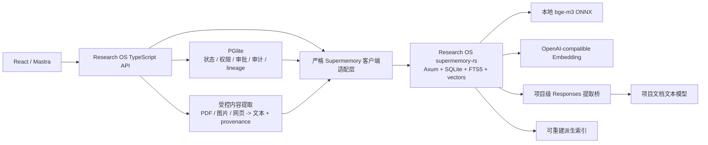

# Research OS：以 `supermemory-rs` 替换官方 `supermemory-server` 的实施计划

最后更新：2026-08-07（Asia/Shanghai）

主任务：`P0-SUPERMEMORY-RS-160`

状态只使用：`[ ]` 待处理、`[~]` 进行中、`[x]` 已完成且已验证、`[!]` 外部阻塞。

本文档是这次替换工作的实施合同和验收清单。它描述的是计划与已核对事实，不代表 Rust 服务已经接入、数据已经迁移或官方二进制已经退役。任务状态、范围、风险、阻塞和验证结果必须在开发过程中即时写回本文档；只有代码、迁移、测试、运维、文档和真实适用验证全部完成，才能把总任务标为 `[x]`。

## 1. 已确认决策

- [x] `SMRS-DECISION-001` 不再把闭源官方 `supermemory-server` 二进制作为 Research OS 的长期语义记忆服务。
- [x] `SMRS-DECISION-002` 选择 MIT 许可的 [`eersnington/supermemory-rs`](https://github.com/eersnington/supermemory-rs) 作为源码基座，并进行 Research OS 定向二次开发。
- [x] `SMRS-DECISION-003` 2026-08-07 核对的上游基线为 commit `468e4750abf1151ab7cbac0142e2a584ce074f78`；正式引入时必须再次记录实际采用的 commit、许可证和内容哈希。
- [x] `SMRS-DECISION-004` Rust 服务只替换语义索引、混合检索、memory entity/关系和相关后台任务；PGlite 继续是 Research OS 的业务状态、权限、审批、审计和 lineage 权威源，项目 Git/Artifact 继续保存原始材料与科研产物。
- [x] `SMRS-DECISION-005` 不复制官方二进制内部的 PDF/图片硬编码模型路径。PDF、图片、网页和其他多模态材料先由 Research OS 的受控提取层生成带来源和 SHA-256 的文本，再交给 Rust 服务索引。
- [x] `SMRS-DECISION-006` 不追求第一阶段实现官方 v0.0.6 的全部公开端点；先实现 Research OS 实际依赖并通过契约测试的接口。未覆盖端点必须返回明确的 404/501，禁止宣称完整 drop-in replacement。

## 2. 为什么要替换

当前官方二进制造成的限制不是普通配置问题：

1. 服务端源码不在官方公开仓库中，关键行为只能通过黑盒、打包产物和字节补丁推断。
2. PDF 提取固定依赖 Mistral/Gemini，图片描述固定依赖 Gemini，不能按 Research OS 的项目级模型配置自由替换。
3. 不同 build 对远程 Embedding 的支持发生回退；当前只能固定使用 v0.0.5，并维护人工字节补丁解除 800ms 查询超时。
4. `forget` 依赖 LLM 是否成功抽取 memory entity，源文档存在但没有 entity 时无法稳定撤销。
5. 向量维度、超时、处理流程和错误语义受闭源实现约束，难以审计，也无法为 Research OS 的 Memory v2 做可靠演进。

替换后的目标不是“自己重新造一个无限扩张的记忆平台”，而是获得一套源码可读、行为可测、配置可控、可按项目隔离且能被 Research OS 完整审计的本地语义索引服务。

## 3. 上游基线审计

### 3.1 已具备能力

截至核对基线，`supermemory-rs` 已具备：

- Rust + Tokio + Axum 服务运行时；默认只监听 `127.0.0.1:6767`。
- SQLite、FTS5、文档/分块向量、memory entity、`updates/extends/derives` 关系和后台任务状态。
- 文本摄取、异步索引、文档状态查询、V3/V4 搜索、profile、profile buckets 和单个 memory forget。
- container tag、metadata、custom ID、task type、API key、loopback 认证和部分旧数据导入。
- JavaScript/Python SDK smoke、v0.0.6 黑盒 fixture/parity 框架、LoCoMo 与性能实验基础。
- MIT 许可证，可以合法 fork、修改、分发，但必须保留许可证与版权声明。

### 3.2 当前缺口

截至核对基线，真实 Router 只注册了以下主要接口：

```text
POST   /v3/documents
GET    /v3/documents/:id
POST   /v3/search
POST   /v4/search
POST   /v4/profile
POST   /v4/profile/buckets
DELETE /v4/memories/
GET    /health
GET    /v4/openapi
GET    /v4/reference
```

上游明确承认尚未完成文件/URL 提取、temporal query parsing、provider query rewrite、相邻 chunk context、batch forgetting、direct memory mutation 和部分 profile 行为。对 Research OS 而言还缺少：

- `/v3/documents` 的 list/delete/bulk delete、稳定分页和完整 metadata filter 契约。
- `/v4/memories/list`，当前 `forget` 前无法按源文档确定 memory entity。
- `/v4/conversations`，当前 Mastra output processor 会调用该端点。
- PDF、图片和 multipart 上传；上游数据库虽有 `file_blobs/content_sources` 表，但 HTTP 与提取链尚未实现。
- 已验证的多语言 `Xenova/bge-m3` 1024 维路径；上游默认文档只验证 `bge-base-en-v1.5`。
- OpenAI-compatible 远程 Embedding、项目级配置池、代理、严格维度检查和可配置超时。
- Research OS 所需的确定性“按源文档撤销”、active-generation 配合、项目 slug 强校验和结构化审计字段。

因此，不能直接把现有 `SUPERMEMORY_SERVER_BIN` 改指向上游 Rust 可执行文件后上线。

## 4. Research OS 当前依赖面

| Research OS 行为 | 当前调用 | Rust 基线 | 目标处理方式 |
| --- | --- | --- | --- |
| 文本摄取 | `client.add` / `POST /v3/documents` | 已有基础 | 补齐严格 schema、项目 scope、幂等和状态契约 |
| 处理状态 | `GET /v3/documents/:id` | 已有基础 | 验证状态机、错误码和 revision 语义 |
| 混合检索 | `POST /v4/search` | 已有基础 | 补齐 metadata filter、include/context、稳定排序和预算 |
| 文档检索 | `searchMode=documents` | 已有基础 | 与 Memory v2 descriptor/section chunk 对齐 |
| memory 检索 | `searchMode=memories/hybrid` | 已有基础 | 验证 entity、relation、source document 映射 |
| Graph Memory | 搜索结果中的 parents/children/related | 部分具备 | 以真实 relation 表投影，禁止虚构边 |
| memory 列表 | `POST /v4/memories/list` | 缺失 | 实现 Research OS 所需分页与 document ID 过滤 |
| forget | `DELETE /v4/memories` | 部分具备 | 保留 entity forget，新增按文档确定性 revoke |
| delete | `documents.delete` | 缺失 | 实现单文档删除和容器范围清理 |
| acceptance 清理 | documents list + bulk delete | 缺失 | 实现受 scope 限制的 list/bulk delete |
| Mastra 对话写入 | `POST /v4/conversations` | 缺失 | 收敛为 PGlite 消息落账后逐消息确定性摄取，不保留重复写链路 |
| PDF/图片摄取 | `documents.uploadFile` | 缺失 | 移至 Research OS 受控提取层，Rust 只接收提取后的文本和 provenance |
| 项目级 Embedding | 6767 + 6770–6869 配置池 | 缺失 | 新增 local/OpenAI-compatible backend 和配置池运行合同 |

## 5. 目标边界

### 5.1 必须实现

- Research OS 实际依赖的文本摄取、状态、搜索、memory list/relation、确定性撤销和容器清理。
- 本地多语言 bge-m3 与远程 OpenAI-compatible Embedding；两者都严格校验模型和维度，不允许静默切换。
- 每项目不可变语义 slug、container tag、本地请求身份和 metadata 的一致性校验。
- 项目级 Embedding 配置池：同配置共享实例，不同配置使用不同端口和数据目录。
- Memory v2 的 generation、active allowlist、重建、清理和失败关闭语义。
- 可审计日志、健康/就绪状态、任务失败详情、备份恢复和真实验收。
- 显式迁移、显式切换、显式回滚；运行时不允许自动回退到官方二进制。

### 5.2 明确不做

- 不把 Rust SQLite 变成 Research OS 的业务数据库。
- 不把自动 memory relation 当成科研 lineage 或证据。
- 不在 Rust 服务里重复实现 Proposal、用户审批、Artifact 权限、项目 Git 或报告来源快照。
- 不为兼容官方产品而实现 OAuth、云端账号、浏览器插件、无项目全局 memory 或当前应用没有调用的完整平台 API。
- 不迁移旧向量；模型、维度或实现变化时从权威源重新生成。
- 不让 Rust 服务直接读取 `projects/` 的任意路径，也不允许模型输出成为文件路径、SQL、命令或网络目标。
- 不使用 Docker 或其他容器引擎作为运行前提。

## 6. 语言与仓库治理

现有 `AGENTS.md` 的“业务应用、数据库迁移、运维脚本和测试只使用 TypeScript”与本决策存在冲突。实施前必须做一次窄范围修订：

- `apps/server`、`apps/mastra`、`apps/web`、PGlite 业务迁移、跨系统运维和端到端验收继续只使用 TypeScript。
- 只允许 `services/supermemory-rs/` 使用 Rust；该目录包含 Rust 服务源码、它自己的 SQLite migration、Rust unit/integration test 和 benchmark。
- 跨 Research OS 边界的契约、迁移编排、启动/停止、备份、验收和故障注入仍由 TypeScript 完成。
- Python 规则保持不变，不得把 Python 引入记忆服务。

源码治理采用单仓库、无 submodule 的方式：

```text
services/supermemory-rs/
├── Cargo.toml
├── Cargo.lock
├── rust-toolchain.toml
├── LICENSE
├── UPSTREAM.md
├── crates/
├── migrations/
├── compat/
└── docs/
```

- 首次使用 `git subtree` 把已确认上游 commit 引入 `services/supermemory-rs/`，保证普通 clone 能得到完整源码。
- `UPSTREAM.md` 记录上游 URL、基线 commit、导入日期、许可证、Research OS patch 分类和后续同步方法。
- 不直接修改 `/tmp` 克隆，不依赖用户 home 下的源码副本，不把编译产物提交 Git。
- 所有依赖固定在 `Cargo.lock`；CI/本地执行 `cargo fmt`、`clippy -D warnings`、`cargo test --locked`、`cargo audit` 和 `cargo deny`。
- 上游同步必须先生成差异报告并重新跑兼容/迁移验收，不能直接覆盖 Research OS patch。

## 7. 目标架构



### 7.1 权威数据归属

| 数据 | 权威位置 | Rust 是否保存 |
| --- | --- | --- |
| 项目、权限、审批、审计 | Research OS PGlite | 只保存检索所需 scope，不作权威源 |
| Markdown 知识文档 | `projects/<slug>/research/**/*.md` + Git | 保存派生 chunk/embedding |
| 原始 PDF/图片/代码/实验产物 | 受控 Artifact + SHA-256 | 不保存权威副本；首期不保存二进制 |
| 对话消息 | PGlite messages | 保存可检索的派生文本/memory entity |
| 科研依赖 | PGlite lineage | 不由 memory relation 替代 |
| 语义 relation/profile | Rust SQLite | 派生数据，可重建、不可当科研事实 |
| backend document ID | PGlite binding + Rust SQLite | 两边保存映射，PGlite决定当前有效版本 |

## 8. 运行与配置设计

### 8.1 进程和目录

```text
127.0.0.1:6767                      全局默认 Rust 实例
127.0.0.1:6770-6869                 项目 Embedding 配置池实例
runtime/supermemory-rs/global/      全局 SQLite/WAL/日志/状态
runtime/supermemory-rs/pools/<key>/ 每个配置池的独立 SQLite/WAL/日志/状态
runtime/supermemory-rs/models/      本地模型资产（不进入 Git）
runtime/supermemory-rs/bin/         经校验的 release 二进制（不进入 Git）
```

`scripts/start-supermemory.ts` 继续作为唯一运维入口，但改为构建/定位 Rust 二进制、生成最小环境、启动、健康检查和记录 PID。不得要求用户手动下载闭源可执行文件。

### 8.2 配置合同

计划采用以下明确配置；最终字段必须同步 `.env.example` 和严格 Zod schema：

| 配置 | 作用 |
| --- | --- |
| `SUPERMEMORY_IMPLEMENTATION=rust` | 明确当前实现；迁移完成后移除 `official` 选项 |
| `SUPERMEMORY_BASE_URL` | 全局 Rust 实例地址，默认 `http://127.0.0.1:6767` |
| `SUPERMEMORY_RS_BIND` | 必须是 loopback，默认 `127.0.0.1:6767` |
| `SUPERMEMORY_RS_DATABASE` | 当前实例 SQLite 文件路径 |
| `SUPERMEMORY_EMBEDDING_PROVIDER` | `local` 或 `openai` |
| `SUPERMEMORY_EMBEDDING_MODEL` | 精确模型 ID |
| `SUPERMEMORY_EMBEDDING_DIMENSIONS` | 正整数且与实际返回严格一致 |
| `SUPERMEMORY_EMBEDDING_BASE_URL` | 远程 Embedding base URL，只允许 HTTPS 或回环/私网 HTTP |
| `SUPERMEMORY_EMBEDDING_API_KEY` | 仅进程环境，不写日志、不通过读取 API 返回 |
| `SUPERMEMORY_EMBEDDING_TIMEOUT_MS` | 可配置请求超时，不再存在不可修改的 800ms 常量 |
| `SUPERMEMORY_PROXY_URL` | 仅启用 Embedding 代理的配置池注入 |
| `SUPERMEMORY_RS_MODEL_DIR` | 本地 ONNX/tokenizer 模型目录 |
| `SUPERMEMORY_RS_ORT_LIBRARY` | ONNX Runtime 动态库路径 |
| `SUPERMEMORY_RS_SERVICE_TOKEN_FILE` | 0600 本地服务凭证文件 |

项目级设置仍由 Research OS 保存和解析。Rust 进程不读取项目 `.researchos/model-settings.json`，避免越权读取 key；实例只接收当前配置池需要的最小 Embedding 环境。

### 8.3 本地认证和项目 scope

- 数据接口即使在 loopback 也要求 Research OS 运行时 token；只有 `/health`、`/ready` 和静态 API reference 可以匿名读取。
- 每个数据请求携带经过校验的项目 slug；Rust 必须验证请求项目、container tag `research-os-project-<slug>` 和 metadata `project_id` 三者完全一致。
- container tag 不允许客户端任意拼接多个项目；管理型 bulk 操作只能使用受限 operator token。
- 查询必须在读取候选之前应用项目/container filter，不能先全库检索再由 TypeScript 过滤。
- 日志只记录 hash、计数、耗时、状态和错误码，不记录 key、完整正文、完整模型回复或原始文件。

## 9. Rust 二次开发设计

### 9.1 Embedding 抽象

新增统一的异步 `EmbeddingBackend`，至少实现：

1. `LocalOnnxBackend`：支持 `Xenova/bge-m3`，默认 1024 维，多语言，批量限制和 token 上限可配置。
2. `OpenAiCompatibleBackend`：请求 `<base_url>/embeddings`，支持代理、超时、Bearer key、批量输入和严格响应 schema。

共同约束：

- 启动时用固定探针验证模型、维度和归一化；失败则 readiness 失败，不能切到另一个 backend。
- 每条向量保存 `provider/model/dimensions/revision`；数据库检测到向量空间不一致时拒绝启动并要求新目录/重建。
- 远程响应的向量数、维度、finite number 和顺序必须全部校验；NaN、Infinity、空向量或维度不符直接失败。
- 查询和索引使用同一 backend；远程超时返回结构化错误，不改用本地模型。
- 保留 exact cosine/dot-product 参考路径。只有容量 benchmark 证明必要时才增加 ANN/HNSW，并用 reference path 验证召回偏差。

### 9.2 文档、chunk 和 generation

- 文档摄取必须支持 `customId` 幂等、内容 SHA-256、revision 和确定性状态机。
- Research OS 自己完成 Markdown AST 分块时，Rust 不再次破坏标题、locator 和 chunk key；支持“预分块文档”请求或逐 chunk 摄取。
- 每个结果返回稳定 document ID、chunk ID、metadata、相似度和 source document 映射。
- Rust 不决定哪一代索引有效。TypeScript Context Planner 继续用 PGlite active-generation allowlist 过滤；旧 generation 即使删除重试尚未完成，也不能进入上下文。
- 删除旧 generation 必须幂等；失败保留 reconciliation task 和可见错误。

### 9.3 PDF、图片和网页提取

首期不实现通用 multipart 提取平台，改为明确职责拆分：

1. TypeScript 检查项目归属、Artifact 有效性、路径 containment、大小、MIME 和 SHA-256。
2. 可提取文本的 PDF 使用受控本地解析器；扫描 PDF/图片只调用该项目配置的 vision 模型。
3. 网页文本只来自已有合法 provider/下载服务，不允许 Rust 根据模型输出访问 URL。
4. 提取结果保存为带 `source_artifact_id`、原始 SHA-256、提取器/模型、时间、页码/区域和状态的派生文本 Artifact 或知识文档。
5. 只有提取成功且 provenance 完整的文本进入 Rust；失败返回 `content_extraction_*`，不写空文档、不调用备用模型。

这样可以彻底移除官方二进制中的 Mistral/Gemini 固定依赖，并使图片模型、代理和 key 真正遵循项目设置。

### 9.4 对话记忆

- PGlite messages 保持对话权威源。
- 移除 Mastra output processor 对 `/v4/conversations` 的第二条重复写链路；消息持久化成功后，由一个 TypeScript outbox 以 `session/message/workspace_scope` 确定性 custom ID 摄取。
- 重放 outbox 不得重复生成 memory；同一消息内容变化时创建新 revision，并退役旧 revision。
- 工作区 `area/tab` 继续写入 metadata，并在 Rust 搜索阶段作为严格 filter。
- 对话删除/项目删除必须同步产生撤销任务；不能只删 PGlite 行而留下可搜索文本。

### 9.5 memory extraction 和 Responses

- `taskType=superrag` 的科研文档只做文档检索，默认不做 LLM fact extraction，避免把候选科学表述变成用户事实。
- `taskType=memory` 的对话连续性可运行 memory extraction；Rust 通过 loopback-only Research OS extraction bridge 调用项目的文档文本模型。
- Rust 不持有项目模型 key。bridge 根据经过认证的项目 slug 读取项目设置，并向上游发送 Responses API 请求。
- 结构化提取必须使用严格 JSON Schema；只有此类请求在真实 input message 中加入 `Return a JSON object that conforms to the requested JSON Schema.`。普通文本请求禁止注入 JSON 字样。
- 上游失败、schema 不符、超时或项目模型未配置时，文档索引可以保持 `done_without_memory_extraction`，但 memory entity 状态必须明确为 failed/blocked，不能伪造 entity。
- `updates/extends/derives` 只作为语义候选关系显示，必须标注非科研证据。

### 9.6 确定性撤销和删除

在官方兼容端点之外增加 Research OS 命名空间的扩展接口：

```text
POST   /researchos/v1/documents/:id/revoke
DELETE /researchos/v1/documents/:id
POST   /researchos/v1/containers/:tag/purge
GET    /researchos/v1/jobs/:id
GET    /researchos/v1/status
```

- `revoke` 使源文档、chunks 和 embeddings 立即退出所有搜索，并处理仅由该文档支持的 memory entity；不依赖重新调用 LLM。
- `delete` 在 revoke 生效后物理删除派生数据；共享 memory 有其他 source 时只移除当前 source edge，不错误删除共享 entity。
- `purge` 只能清理 token 授权的单一项目 container，返回计划数量和真实删除数量，支持 dry run。
- 所有操作幂等，返回明确 `already_revoked/already_deleted/source_shared/still_processing` 等状态。
- Research OS 的用户 Proposal、审批与 audit 仍在 TypeScript/PGlite 完成；Rust 接口本身不能绕过审批直接暴露到浏览器。

### 9.7 搜索、Graph 和结果契约

- 支持 `memories/documents/hybrid`，并对 limit、threshold、filter、include 和上下文预算做严格上限。
- 混合检索先在同项目内产生 lexical/vector candidates，再做可复现融合；score 方向、归一化和 tie-break 必须固定并测试。
- Graph 只投影数据库真实保存的 memory relation；parents/children/related 的 ID、relation 和 source document 必须可追溯。
- 搜索结果必须保留 `project_id/container/document_id/chunk_id/content_sha256/source metadata/model/dimensions`，供本地 binding 和 evidence gate 校验。
- 任何缺少项目 scope、无效 metadata、跨项目 relation 或未知 generation 的结果都由客户端失败关闭，不能注入模型上下文。

### 9.8 健康、错误和可观测性

- `/health` 只表示进程存活；`/ready` 必须同时验证 SQLite、migration、writer、embedding backend 和后台队列。
- 错误响应统一为 `{ error: { code, message, stage, retryable, request_id } }`，不返回堆栈和敏感配置。
- 每个摄取任务有 durable job、attempt、available_at、last_error_code、last_error_stage 和时间戳。
- 暴露有界指标：队列深度、处理耗时、搜索耗时、Embedding 耗时、失败数、数据库大小、RSS 和 active project/container 数。
- 日志 JSONL 写入实例目录并轮转；Research OS ops monitor 读取 health/ready 和聚合指标，不抓正文。
- writer 或 migration 的致命错误使 readiness 失败并停止消费新任务；不得在损坏数据库上假装健康。

## 10. PGlite 接线与迁移账本

影子运行需要同时记录官方和 Rust 的远端 ID，不能继续让 `memory_links.supermemory_id` 表示两个不同 backend。计划新增通用绑定表：

```text
semantic_index_bindings
  id
  memory_link_id
  backend_kind              official | rust
  backend_instance_key
  remote_document_id
  remote_revision
  content_sha256
  status                    pending | active | revoked | deleted | failed
  error_code
  indexed_at
  revoked_at
  deleted_at
```

约束：

- 唯一键至少覆盖 `memory_link_id + backend_kind + backend_instance_key + content_sha256`。
- `memory_links` 继续表示业务来源和审批状态；binding 表只表示派生后端状态。
- 迁移期保留旧 `supermemory_id` 只读兼容，所有新写同时写 binding；切换稳定后用显式 migration 移除旧字段/代码。
- binding 的 active 不等于 generation active；Context Planner 必须同时通过 binding、generation allowlist、项目 scope 和来源有效性。
- Rust SQLite 不由 PGlite transaction 直接写入；跨系统失败用 outbox/reconciliation 收敛。

## 11. 数据迁移策略

Supermemory 是派生索引，因此迁移原则是“从权威源重建”，不是复制旧向量或盲目导入闭源内部数据库。

### 11.1 迁移前清单

- 停止删除旧官方数据，做数据目录只读快照、SHA-256 manifest 和恢复检查。
- 导出当前项目、memory links、active knowledge generations、消息、受控 Artifact 和 embedding pool 配置清单；不导出 key 到报告。
- 为每个 active link 判断是否能从 Markdown、PGlite 消息、受控 Artifact 或派生提取文本重建。
- 不可重建条目记录 `memory_reingest_source_missing`，不得从搜索结果摘要反向伪造原文。

### 11.2 影子模式

迁移期间引入显式模式：

```text
official  官方实例作为唯一读写服务
shadow    官方实例服务用户；同一受控输入额外写 Rust，Rust 结果只做比对
rust      Rust 实例作为唯一读写服务
```

- `shadow` 不是 fallback。Rust 结果绝不替代官方结果进入模型上下文；失败必须进入迁移审计和健康状态。
- 对相同 query 同时记录结果 ID、source、top-k overlap、rank correlation、延迟和跨项目泄漏检查，不记录完整敏感正文。
- 影子写使用同一个 content SHA/custom ID；重试必须幂等。
- 正式切换后删除自动选择 backend 的代码路径；只保留显式 operator rollback 工具直到观察期结束。

### 11.3 重建和切换

1. 在 6768 启动 Rust global 实例，配置池使用独立测试端口和全新目录。
2. 先重建 Memory v2 的 active knowledge generations，再重建项目对话和其他允许的 active memory links。
3. 每个项目生成迁移报告：计划、成功、失败、跳过、缺源、hash、binding 和隔离探针。
4. 对 702 文档容量语料、中文/英文/混合文本和至少两个项目完成影子检索比较。
5. 暂停新的索引写入，等待 outbox/worker 清空，执行最后增量重建。
6. 显式把 `SUPERMEMORY_IMPLEMENTATION` 切为 `rust`，将 Rust global 实例绑定 6767，重启 API/Mastra 后运行完整验收。
7. 官方实例保持停止但数据只读保留，不允许两个服务同时占用同一端口或数据目录。

### 11.4 回滚

- 回滚只能由 operator 显式执行，不能在请求失败时自动发生。
- 切换前保留官方数据快照、配置快照、PGlite 备份和切换 manifest。
- 在观察期内如果出现跨项目泄漏、不可恢复数据损坏、持续搜索错误或严重性能回退，停止写入、保存 Rust 数据与日志、恢复明确的官方快照并从切换点之后的权威源重新摄取。
- 不把 Rust SQLite 直接转换回官方数据库，不复制向量。
- 回滚本身必须产生 audit event 和验收报告。

## 12. 分阶段实施任务

### Phase 0：合同、语言例外和基线冻结

- [ ] `SMRS-P0-001` 更新 `AGENTS.md`，只为 `services/supermemory-rs`、Rust migration 和 Rust 自测增加窄范围例外；其余应用与端到端边界仍为 TypeScript。
- [ ] `SMRS-P0-002` 生成 Research OS 当前 Supermemory 调用清单和请求/响应 fixture，覆盖 add、status、search、filters、memory list、forget、delete、Graph 和 conversation。
- [ ] `SMRS-P0-003` 固定官方当前行为的可公开黑盒 fixture；删除 key、正文和项目隐私，仅保留结构、状态和规范化字段。
- [ ] `SMRS-P0-004` 定义 Rust API、错误 schema、项目 scope header、服务 token 和 Research OS 扩展端点的 Zod/JSON Schema。
- [ ] `SMRS-P0-005` 把本计划涉及的新环境变量、目录、端口、备份和失败语义加入文档草案，但尚未实现的内容必须标记 planned。

退出门槛：每一个当前调用都有“保留、改造或删除”的唯一结论；不存在未登记的 SDK 调用。

### Phase 1：引入源码并建立可重复构建

- [ ] `SMRS-P1-001` 通过 `git subtree` 引入再次核对后的上游 commit，保留 MIT LICENSE，创建 `UPSTREAM.md`。
- [ ] `SMRS-P1-002` 固定 Rust toolchain（不低于上游要求的 1.88）、Cargo.lock、ONNX Runtime 获取与 SHA-256 校验流程。
- [ ] `SMRS-P1-003` 添加 `npm run supermemory:rs:build/check/test`，由 TypeScript/Node 脚本调用 `cargo --manifest-path services/supermemory-rs/Cargo.toml`。
- [ ] `SMRS-P1-004` 在 WSL2 `/mnt/d/ResearchOS` 完成 debug/release 构建，验证无 Docker、只监听 loopback、普通 clone 可重复构建。
- [ ] `SMRS-P1-005` 建立依赖许可证、`cargo audit`、`cargo deny` 和 release 二进制哈希报告。

退出门槛：干净 checkout 可按文档构建并启动 `/health`，编译产物和模型资产均不进入 Git。

### Phase 2：Research OS 必需 API 与存储语义

- [ ] `SMRS-P2-001` 补齐 document list/delete/bulk delete、memory list、严格分页、metadata filter 和 source document 映射。
- [ ] `SMRS-P2-002` 实现 Research OS service token、项目 slug/container/metadata 三重校验和管理 token 隔离。
- [ ] `SMRS-P2-003` 补齐确定性 request ID、结构化错误、status/revision/job 状态机和幂等测试。
- [ ] `SMRS-P2-004` 实现 `/researchos/v1` revoke/purge/status/jobs 扩展端点和 shared-source memory 处理。
- [ ] `SMRS-P2-005` 对当前 npm `supermemory` SDK 运行契约测试；只保证已登记调用，不伪造全 API 兼容。

退出门槛：TypeScript 契约套件对 Rust 服务通过，所有跨项目/越权/未知字段测试失败关闭。

### Phase 3：多语言和远程 Embedding

- [ ] `SMRS-P3-001` 抽象 `EmbeddingBackend`，保留 exact reference search。
- [ ] `SMRS-P3-002` 完成本地 `Xenova/bge-m3` 1024 维加载、tokenize/pooling/normalize、中文/英文/混合语义测试。
- [ ] `SMRS-P3-003` 完成 OpenAI-compatible Embedding、代理、超时、批量、维度和 invalid-number 校验。
- [ ] `SMRS-P3-004` 数据库记录向量空间 fingerprint；配置不一致时拒绝启动并要求全新数据目录。
- [ ] `SMRS-P3-005` 接入现有 6767/6770–6869 配置池分配、共享、重启、reset_data 和项目删除逻辑。
- [ ] `SMRS-P3-006` 运行本地/远程真实连接与故障注入，确认没有 backend fallback。

退出门槛：同配置项目共享池且不串数据；不同配置使用不同目录；中文召回和远程维度测试真实通过。

### Phase 4：内容提取、对话、memory 和 Graph

- [ ] `SMRS-P4-001` 新建 TypeScript 受控内容提取服务，收敛 PDF/图片/网页摄取；保存提取 provenance 和结构化失败。
- [ ] `SMRS-P4-002` 把 `documents.uploadFile` 调用改为“受控提取文本 -> Rust 文本摄取”，删除对官方硬编码 Mistral/Gemini 的依赖。
- [ ] `SMRS-P4-003` 建立 PGlite conversation outbox，删除 Mastra `/v4/conversations` 重复写路径，完成重放/幂等/撤销。
- [ ] `SMRS-P4-004` 接入项目级 Responses extraction bridge，严格区分 `superrag` 和 `memory`，验证 JSON Schema 输入规则。
- [ ] `SMRS-P4-005` 验证 memory entity、updates/extends/derives、forget/revoke/delete 和 Graph 投影的 source provenance。
- [ ] `SMRS-P4-006` 更新 Memory v2 Context Planner，使 Rust 结果仍经过 active-generation、workspace scope、权限和 evidence gate。

退出门槛：PDF/图片不再触发固定 provider；对话不重复写；Graph 无虚构边；撤销不依赖 LLM 是否抽取 entity。

### Phase 5：Research OS 客户端、运维和备份

- [ ] `SMRS-P5-001` 增加 `semantic_index_bindings` 和 outbox/reconciliation migration，保留旧 ID 审计但停止新增单后端假设。
- [ ] `SMRS-P5-002` 改造 `supermemory-service.ts`、Mastra processor 和 indexing service，所有请求走统一严格客户端适配层。
- [ ] `SMRS-P5-003` 改造 start/stop/status/monitor/backup/recovery 脚本，支持 global 与共享配置池 Rust 实例。
- [ ] `SMRS-P5-004` 实现 SQLite WAL 一致性备份、`PRAGMA integrity_check`、manifest SHA-256 和单独目录恢复演练。
- [ ] `SMRS-P5-005` 验证崩溃恢复、重复启动、陈旧 PID、端口占用、worker 中断、磁盘满、损坏数据库和模型缺失。

退出门槛：服务可由现有 npm 运维入口可靠管理，备份恢复不覆盖 live 数据，所有失败结构化且可审计。

### Phase 6：影子重建与等价性验收

- [ ] `SMRS-P6-001` 对官方数据做只读快照，生成可重建/缺源清单和切换 manifest。
- [ ] `SMRS-P6-002` 在独立端口/目录运行 Rust，按项目和 active generation 重建，不复制旧向量。
- [ ] `SMRS-P6-003` 运行 shadow 双写/双查比较；Rust 结果只进入报告，不进入模型上下文。
- [ ] `SMRS-P6-004` 验证两个以上项目、同池/异池、workspace scope、删除项目和 container purge 均无泄漏。
- [ ] `SMRS-P6-005` 用 702 文档基准和更大合成语料测索引时间、warm/cold search、RSS、数据库大小、重启恢复和召回。
- [ ] `SMRS-P6-006` 逐项关闭差异；无法等价的行为必须给出经批准的新合同，不能用归一化脚本掩盖。

退出门槛：零跨项目泄漏、零未知 active binding、零静默 fallback；所有未迁移项有明确原因和处置。

### Phase 7：显式切换和观察期

- [ ] `SMRS-P7-001` 在维护窗口冻结索引写入、清空队列、完成最后增量重建并验证备份。
- [ ] `SMRS-P7-002` 把 6767 和配置池切换到 Rust，重启 API/Mastra，运行全量验收。
- [ ] `SMRS-P7-003` 真实浏览器验证项目对话、知识检索、Graph、Impact、PDF/图片材料和项目删除流程。
- [ ] `SMRS-P7-004` 完成不少于 7 个连续使用日或经用户明确缩短的观察期；每天记录错误、延迟、队列、RSS 和数据一致性。
- [ ] `SMRS-P7-005` 完成一次显式回滚演练后重新切回 Rust；演练不能使用真实项目的唯一副本。

退出门槛：Rust 是唯一运行中的语义服务，观察期无 P0/P1 缺陷，回滚路径真实可用。

### Phase 8：退役官方二进制和文档收口

- [ ] `SMRS-P8-001` 停止并归档官方实例和只读数据快照，记录保留期；未经确认不直接删除备份。
- [ ] `SMRS-P8-002` 删除 `SUPERMEMORY_SERVER_BIN`、v0.0.5 build 检查、字节补丁逻辑、旧 bridge 兼容分支和过时错误文案。
- [ ] `SMRS-P8-003` 清理 active 代码中的官方二进制哈希、800ms 补丁、Mistral/Gemini 固定阻塞和旧版本说明；历史审计材料保留。
- [ ] `SMRS-P8-004` 同步 `AGENTS.md`、README 双语、`.env.example`、architecture、operations、security、Memory v2 和主 TODO。
- [ ] `SMRS-P8-005` 运行完整验证并创建 Conventional Commit；只暂存本任务文件，敏感文件和运行数据库不得进入 Git。

退出门槛：正常构建、启动、测试和运行路径不再需要官方 `supermemory-server` 二进制，文档不再把旧限制描述为当前架构。

## 13. 测试与验收矩阵

### 13.1 Rust 内部验证

```text
cargo fmt --all --check
cargo clippy --workspace --all-targets --locked -- -D warnings
cargo test --workspace --locked
cargo audit
cargo deny check
```

必须覆盖：schema 拒绝、migration、job 状态机、幂等、FTS、vector、融合排序、filters、container scope、auth、delete/revoke、shared source、损坏恢复、Embedding 错误和并发。

### 13.2 TypeScript 契约验证

- 对每个当前 SDK 调用保存请求/响应 fixture，并直接请求真实 Rust 服务。
- Zod 解析全部 Rust 响应；未知/缺失字段不能被 `as` 强转掩盖。
- 模拟 401/403/404/409/413/415/422/429/500/502/503/504 和断连，确认上层错误码稳定。
- 验证 shadow 响应永远不会进入 Mastra context。
- 验证模型失败不产生 memory entity、助手回复、旧缓存结果或另一 provider 的结果。

### 13.3 必跑 Research OS 验证

```text
npm run typecheck
npm test
npm run build
npm run docs:check
npm run language-boundary:check
npm run supermemory:rs:check
npm run supermemory:rs:test
npm run supermemory:parity
npm run supermemory:acceptance
npm run memory:v2:capacity
npx tsx scripts/acceptance-test.ts
npx tsx scripts/ops-guard.ts status
```

新增命令只有在对应脚本真实存在后才可执行；在此之前不得把列表当作已通过证据。

### 13.4 安全与隔离验收

- Project A 的文本、memory、chunk、Graph node、conversation 和 delete 结果在 Project B 中均不可见。
- 伪造项目 header、container tag、metadata project_id、workspace scope 任一不一致都被拒绝。
- 普通项目 token 不能 list/purge 其他 container；浏览器不能直接获得 service/operator token。
- key、代理凭证、完整正文和模型原始响应不出现在 API、日志、审计报告或 Git diff。
- 服务只能监听 `127.0.0.1`/`::1`，非 loopback bind 必须拒绝启动。

### 13.5 质量和性能验收

不预先伪造一个脱离机器的绝对性能数字。Phase 1 先记录官方 v0.0.5 和 Rust 基线，随后使用以下硬门槛：

- 702 文档 Memory v2 语料必须全部可索引，无跨项目结果，无未知 generation。
- warm search p95、索引吞吐和峰值 RSS 相对已记录官方基线不得回退超过 25%，除非有书面原因和用户批准。
- 同一 query 重复执行的排序必须稳定；中文、英文和中英混合查询都要有人工标注的 top-k 召回样本。
- 进程重启后不丢 active binding、不重复生成 entity、不遗留永久 running job。
- 远程 Embedding 延迟超过配置超时时返回 timeout；本地 backend 不被偷偷启用。
- 容量扩大到至少 10 倍当前 702 文档 chunk 数时不 OOM；如果 exact vector search 超出预算，再以独立任务评估 ANN，而不是先牺牲可验证性。

## 14. 风险和应对

| 风险 | 影响 | 应对 |
| --- | --- | --- |
| 上游仍是早期实现 | API/语义缺口较多 | 锁 commit、只承诺实际调用面、契约 fixture 驱动开发 |
| bge-m3 ONNX 与上游默认模型结构不同 | pooling/维度/召回错误 | 独立 backend、已知向量 fixture、多语言人工样本、严格维度指纹 |
| SQLite exact vector search 随规模变慢 | 大项目查询延迟 | 先做 702/10x benchmark；必要时加 ANN，但保留 exact reference |
| LLM extraction 仍可能不稳定 | memory entity/Graph 缺失 | 科研文档默认 superrag；撤销按源文档确定性执行；失败不影响原文索引状态 |
| shadow 双写产生两份远端 ID | 审计混乱 | `semantic_index_bindings` 显式记录 backend，不复用单一 `supermemory_id` |
| 文件提取迁到 TypeScript 后职责变多 | 实现范围扩大 | 复用现有 Artifact/vision/PDF 管线，先实现实际 MIME，不造通用上传平台 |
| Rust 破坏现有 TypeScript 边界 | 维护成本上升 | Rust 只在 `services/supermemory-rs`；跨系统合同和运维保持 TypeScript |
| 上游同步覆盖自定义行为 | 回归/安全风险 | subtree + UPSTREAM.md + patch 分类 + 全量 parity 后才同步 |
| 回滚后新增索引缺失 | 观察期数据不一致 | 所有索引可从权威源重建，切换 manifest 记录 cutoff，不复制向量 |
| 误把语义关系当科研事实 | 科研诚信风险 | UI/API 标注 semantic candidate，PGlite lineage/evidence gate 保持权威 |

## 15. 需要同步修改的仓库区域

实施期间至少会涉及以下区域；这不是要求一次性全部修改，而是防止遗漏：

```text
services/supermemory-rs/**
apps/server/src/supermemory-service.ts
apps/server/src/supermemory-instance.ts
apps/server/src/supermemory-env.ts
apps/server/src/indexing-service.ts
apps/server/src/project-embedding-settings.ts
apps/server/src/model-gateway-bridge.ts
apps/server/src/database.ts
apps/mastra/src/mastra/supermemory.ts
scripts/start-supermemory.ts
scripts/supermemory-acceptance.ts
scripts/ops-guard.ts
scripts/ops-monitor.ts
package.json
.env.example
AGENTS.md
README.md
README.zh-CN.md
TODO.md
TODO-memory.md
docs/architecture.md
docs/operations.md
docs/security.md
```

任何实际修改都要先根据当时工作树重新确认；不得覆盖用户尚未提交的更改。

## 16. 最终完成定义

只有同时满足以下条件，`P0-SUPERMEMORY-RS-160` 才能标为 `[x]`：

1. Research OS 默认和唯一运行路径使用仓库内可审计的 Rust 源码构建服务。
2. 官方闭源二进制、人工字节补丁和固定 build 检查不再参与正常启动、配置池或验收。
3. 文本、PDF、图片、对话、Memory v2、Graph、forget/revoke/delete、项目删除和重建均走通真实链路。
4. 本地 bge-m3 和远程 OpenAI-compatible Embedding 均真实通过，配置不同的项目不混用向量空间。
5. 项目、workspace、generation、binding 和来源验证均失败关闭，跨项目泄漏测试为零。
6. 模型/Embedding/提取失败不产生 fallback 内容、伪 memory、空成功或旧结果冒充。
7. 影子报告、切换 manifest、备份恢复、回滚演练、观察期和性能报告均存在且可复核。
8. Rust、TypeScript、真实 provider、浏览器和运维验收全部通过；外部失败如实记录，不能伪造通过。
9. README 双语、AGENTS、Memory v2、架构、运维、安全、环境模板和主 TODO 与真实实现一致。
10. Git 只提交源码、migration、测试和文档；key、数据库、模型权重、运行日志和备份不进入版本库。

## 17. 当前下一步

计划书完成后，实际开发应从 `SMRS-P0-001` 开始，先修订语言边界并冻结当前调用 fixture；随后引入上游源码。不得跳过 Phase 0 直接替换 6767，也不得在 Rust 尚未通过项目隔离、bge-m3 和确定性撤销验收时停止官方实例。
