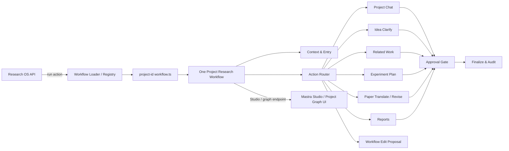

# Research OS 项目级单一 Workflow 与热加载实施计划书

> 文档状态：Phase 0-5 主体完成，Phase 6 收尾中
> 对应 TODO：`P0-WORKFLOW-125`  
> 创建日期：2026-08-05（Asia/Shanghai）  
> 适用代码副本：`/mnt/d/ResearchOS`（WSL2 内开发，Windows 侧为 `D:\ResearchOS`）

## 1. 目标

把 Research OS 当前分散注册的多个 Mastra workflow 改造成“每个科研项目一个独立 TypeScript 文件、一个巨大的项目级 workflow”：

- 每个项目有自己的 `projects/<project-id>/workflow.ts`，该文件详细编码这个项目的科研工作流，包括 Idea 澄清、相关工作调研、实验规划与审批、论文撰写、报告、项目对话等能力。
- 新项目创建时自动从默认模板复制出 `workflow.ts`，所有项目一开始继承同一个默认 workflow；之后用户可以通过项目内多轮自然语言对话，让 AI 生成受审批约束的代码补丁，把每个项目改造成不同的 workflow。
- 运行期支持热加载：`workflow.ts` 被修改并提交后，无需重启 Mastra/API 服务，后续新运行立即使用新版本。
- 使用 Mastra 的 Workflow 原语实现图结构，并使用 Mastra Studio / 项目内可视化展示 workflow 图、实时执行路径和步骤状态。
- 保持项目隔离：所有项目工作流代码都在项目目录下，删除项目时只删除对应目录即可；共享逻辑进入只读的 workflow-kit，不属于任何项目。

## 2. 非目标与边界

本阶段不做以下事情：

- 不允许模型直接把代码写入项目文件。所有 workflow 修改必须先生成可审阅的 `code_patch` Proposal，经过用户审批、严格校验和项目 Git 提交后才生效。
- 不引入新的 Python 业务模块，不调用旧项目 `/mnt/d/auto-related-work` 的 Python 代码。
- 不破坏现有 PGlite、Supermemory、审批、实验、论文和报告的数据门禁；workflow 只是编排层，真实状态仍由既有 TypeScript 服务写入。
- 不把 workflow 文件当作跨项目共享配置；默认模板是模板，项目文件是项目自己的代码。
- 不把“热加载保留旧版本”误解为模型失败 fallback：旧版本只用于已经启动或挂起的运行；新请求必须使用最新有效版本，加载失败返回结构化错误，不静默回退。
- 不把 Mastra Editor 当作 workflow 图编辑器。Mastra Editor 当前用于 Agent 的 instructions/tools 管理，不管理 workflow 图；本计划只参考其“草稿 / 发布 / 版本”概念。

## 3. 现状核对（2026-08-05）

### 3.1 当前 Mastra 版本

- `@mastra/core`：`1.55.0`
- `mastra` CLI：`1.21.0`
- 运行时入口：`apps/mastra/src/mastra/index.ts`

### 3.2 当前 workflow 与注册方式

当前存在 4 个独立 workflow，集中在 `apps/mastra/src/mastra/workflows/research-workflows.ts`：

| 当前 workflow | 当前职责 | 当前触发方式 |
| --- | --- | --- |
| `researchBootstrapWorkflow` | 文献/资源搜索 + 证据覆盖评估 | `/internal/workflows/research-bootstrap` |
| `projectChatWorkflow` | 项目对话调用 `/api/chat` | 内部 API / Agent 编排 |
| `supervisionReportsWorkflow` | 每日/每周生成项目汇报 | Mastra cron schedule |
| `approvalGateWorkflow` | Proposal 人工审批 suspend/resume | `/internal/workflows/approval-gate`、`/approval-gate/resume` |

它们通过 `apps/mastra/src/mastra/index.ts` 中的 `workflows: { ... }` 注册，并通过 `mastra.getWorkflow('...')` 调用。

**2026-08-05 实施结果**：旧的 4 个 workflow 注册与 `research-workflows.ts` 已删除。`apps/mastra/src/mastra/index.ts` 不再注册项目 workflow；`ProjectWorkflowRuntime` 在启动后扫描 `projects/*/workflow.ts`，为每个项目构建唯一的 `project-<projectId>-research` workflow，并通过项目级注册表调度。Idea/项目对话/实验规划等模型能力仍由 Mastra Agent 提供，项目 workflow 通过受限内部 API 编排这些能力；初始 Idea 讨论在项目创建前发生，因此仍由 Idea Agent 处理，不属于某个项目 workflow。

### 3.3 Mastra 动态注册能力

已核对 `@mastra/core@1.55.0` 类型和实现：

- `mastra.addWorkflow(workflow, key?)` 可以动态注册 workflow。
- 当 key 已存在时，当前实现会**静默跳过**，没有公开的 `removeWorkflow` / `replaceWorkflow`。
- 因此不能用“同一个 key 反复 addWorkflow”实现热加载；需要自建项目级注册表，在应用层做原子实例替换。
- `Workflow` 提供 `stepGraph` / `serializedStepGraph`，可用于图形校验和可视化。
- `createRun({ runId, resourceId })` 与 suspend/resume 原生支持；热加载必须为已启动/挂起运行记录版本，并在 resume 时使用旧版本实例。

### 3.4 项目目录现状

- 项目目录：`projects/<project-id>/`，已包含 `code/`、`experiment/`、`paper/`、`literature/`、`data/`、`artifacts/`、`idea.json`、`README.md`、`.gitignore` 和项目内 Git。
- 项目创建入口：`apps/server/src/project-service.ts` 的 `createProjectWorkspace`。
- 项目删除入口：`apps/server/src/project-delete-service.ts`。
- 项目级设置：`runtime/project-settings.json`；全局外观/代理分别保存在前端 localStorage 与 `runtime/model-settings.json`。
- WSL2 `/mnt/d` 是 drvfs，没有可靠 inotify；热加载默认采用轮询 + 文件哈希，必要时叠加 `fs.watch`。

## 4. 目标架构

### 4.1 总体结构

每个项目只注册一个顶层 workflow：`project-<projectId>-research`。这个 workflow 内部用分支、并行、循环、挂起/恢复等 Mastra 原语覆盖所有科研动作；不再把 Idea、聊天、审批、汇报注册成互相独立的 Mastra workflow。



### 4.2 项目 workflow 文件

每个项目文件位于 `projects/<project-id>/workflow.ts`，由模板复制而来，属于项目内 Git 的一部分。文件导出：

```ts
export const workflowManifest = {
  schemaVersion: 1,
  templateVersion: 'default-project-workflow@1',
  entryStep: 'workflow-entry',
  exitStep: 'workflow-exit',
}

export default function defineProjectWorkflow(ctx: ProjectWorkflowContext) {
  // 只在这里定义这个项目自己的 workflow 图
  return createWorkflow({
    id: ctx.workflowId,
    inputSchema: ProjectWorkflowInputSchema,
    outputSchema: ProjectWorkflowOutputSchema,
  })
    .then(projectContextStep)
    .then(routeProjectActionStep)
    .branch([...])
    .then(finalizeStep)
    .commit()
}
```

`ProjectWorkflowContext` 由运行时注入：

```ts
type ProjectWorkflowContext = {
  projectId: string
  slug: string
  workflowId: string
  version: number
  sourceHash: string
  apiBase: string
  dryRun: boolean
}
```

实际实现与上述结构一致，但 `settings` 不注入 workflow 上下文；项目设置由 API 侧读取并通过内部 API 传入具体步骤。

### 4.3 统一输入/输出契约

顶层输入使用严格 Zod discriminated union，所有动作共享同一个入口：

```ts
type ProjectWorkflowInput =
  | { action: 'project_chat'; project_id: string; conversation_id: string; message: string; attachment_context?: unknown }
  | { action: 'idea_clarify'; project_id: string; ... }
  | { action: 'related_work'; project_id: string; operation: 'search' | 'expand' | 'status'; ... }
  | { action: 'experiment_plan'; project_id: string; ... }
  | { action: 'paper_translate'; project_id: string; ... }
  | { action: 'paper_revise'; project_id: string; ... }
  | { action: 'approval_gate'; project_id: string; proposal_id: string; ... }
  | { action: 'reports'; project_id: string; period: 'daily' | 'weekly' }
  | { action: 'workflow_edit_proposal'; project_id: string; instruction: string }
```

顶层输出统一为：

```ts
type ProjectWorkflowOutput = {
  status: 'success' | 'suspended' | 'failed'
  project_id: string
  action: ProjectWorkflowAction
  result: unknown
  audit: {
    workflow_version: number
    source_hash: string
    started_at: string
    finished_at: string
  }
}
```

### 4.4 默认 workflow 的图内容

默认模板把当前 4 个 workflow 与论文相关 Agent 能力统一进一个图：

| 图节点区域 | 步骤示例 | 来源 |
| --- | --- | --- |
| 入口 | `workflow-entry`：校验输入、加载项目上下文、读取项目设置、记录 run 版本 | 新增 |
| 路由 | `route-project-action`：按 `action` 分支 | 新增 |
| 项目对话 | `run-project-chat-agent`：调用现有 `/api/chat` 或统一对话 Agent | 原 `projectChatWorkflow` |
| Idea | `clarify-idea`、`record-idea-version`：现有 Idea Agent 能力 | 原 `researchBootstrapWorkflow` 相关部分 |
| 相关工作 | `search-literature-and-resources`、`recursive-expand`、`evaluate-evidence-coverage`、`summarize-research-matrix` | 原 `researchBootstrapWorkflow` |
| 实验规划 | `create-experiment-plan`、`queue-experiment` | 现有实验 Agent/队列服务 |
| 审批 | `human-approval`：suspend/resume | 原 `approvalGateWorkflow` |
| 论文 | `paper-translate`、`paper-revise`、`create-patch-proposal`、`compile-latex` | 现有论文 Agent 能力 |
| 汇报 | `list-active-projects`、`foreach generate-project-reports` | 原 `supervisionReportsWorkflow` |
| 工作流编辑 | `generate-workflow-diff`、`apply-workflow-patch` | 新增 |
| 出口 | `workflow-exit`：审计、归一化输出 | 新增 |

子图以“步骤库/helper”形式被模板组合，不注册为独立 Mastra workflow，不暴露为独立 API 入口。

### 4.5 共享 workflow-kit

为了避免把公共逻辑复制到每个项目文件，项目文件允许导入只读共享包 `@research-os/workflow-kit`：

- `contracts.ts`：统一输入/输出/步骤 Zod schema。
- `api.ts`：带超时、结构化错误的 Research OS 内部 API 客户端；禁止 fallback。
- `steps/`：`projectContextStep`、`approvalGateStep`、`finalizeStep`、`chatStep`、`paperSteps`、`reportSteps` 等公共步骤。
- `graph.ts`：读取 `workflow.serializedStepGraph`，生成图校验与前端图数据。
- `validate.ts`：供 loader 使用的静态校验 helper。

默认模板仍然是一个“项目自己的单文件”；共享包是只读运行库，不属于任何项目，也不会随项目删除。

## 5. 热加载运行期设计

### 5.1 目录与缓存

```text
apps/mastra/src/mastra/workflow-runtime/loader.ts
apps/mastra/src/mastra/workflow-runtime/registry.ts
apps/mastra/src/mastra/workflow-runtime/validator.ts
apps/mastra/src/mastra/workflow-runtime/audit.ts
apps/mastra/src/mastra/workflows/templates/default-project-workflow.ts
packages/workflow-kit/src/...
projects/<project-id>/workflow.ts
runtime/workflow-cache/<project-id>/workflow-<sha256>.mjs
```

`projects/<project-id>/workflow.ts` 是唯一业务源；`runtime/workflow-cache/` 只是编译缓存，可随时重建。

### 5.2 加载与监听

默认每 500ms 扫描一次 `projects/*/workflow.ts`，可通过环境变量 `RESEARCH_WORKFLOW_POLL_INTERVAL_MS` 调整；如果 `fs.watch` 在某个目录可靠，则叠加事件监听，但仍以轮询为兜底。

每次发现哈希变化时：

1. 连续两次读取并计算 SHA-256，直到文件稳定，避免读到半截写入。
2. 用 esbuild 编译并打包到 `runtime/workflow-cache/<project-id>/workflow-<sha256>.mjs`。
3. 校验模块导出、工厂返回对象、输入/输出 schema、步骤 ID、图结构和 dry-run。
4. 校验通过后构造新版本实例，原子替换注册表中的 active 版本。
5. 记录审计：`project_id`、`version`、`source_hash`、`git_commit`、`status`、`error`。

### 5.3 校验规则

热加载不是“只要语法正确就生效”，至少包含：

- 语法与类型：`tsc` / esbuild transform 必须通过。
- 模块契约：必须导出 `defineProjectWorkflow` 工厂和 `workflowManifest`。
- 工厂返回：必须是 committed Mastra `Workflow`，`id` 必须等于 `project-<projectId>-research`。
- schema 契约：输入/输出必须兼容 `ProjectWorkflowInputSchema` / `ProjectWorkflowOutputSchema`，使用 Zod 严格解析。
- 图结构：步骤 ID 唯一，必须包含 `workflow-entry` / `workflow-exit`，不允许裸奔的外部步骤；`serializedStepGraph` 可序列化。
- 安全检查：不允许 import 任意文件系统、Shell、SQL、网络工具或密钥文件；workflow-kit 只开放白名单 API。
- dry-run：在 `dryRun: true` 上下文下执行一个最小命令路径，所有 `callResearchApi` 返回结构化 stub，不产生真实副作用。

任意一项失败时，新版本不生效，注册表继续使用当前版本；新请求返回结构化错误，不静默回退到旧版本。

### 5.4 运行版本与恢复

为每个 Mastra run 记录 `run_id -> project_id -> version`：

```text
当前实现：runtime/workflow-runs.json
- mastra_run_id
- project_id
- workflow_version
- source_hash
- status
- created_at
```

- 新请求：始终使用最新 active 版本。
- suspend/resume：通过 `mastra_run_id` 找到创建该运行时的版本，继续使用旧版本实例，避免“审批后工作流突然变成另一张图”。
- 服务器重启：从 `runtime/workflow-runs.json` 恢复活动/挂起运行对应的版本和哈希，再从编译缓存恢复该版本。
- 版本实例在没有活动运行且已被替换后，从内存释放；缓存文件按需保留一段时间，便于审计和调试。

> 已知偏差：运行记录暂存于 `runtime/workflow-runs.json` 而不是 PGlite `workflow_runs` 表。重启后 `ProjectWorkflowRuntime` 会从 JSON 恢复 run -> version 映射，并从 `runtime/workflow-cache/<project-id>/` 恢复旧版本；后续迁移到 PGlite 时保持同一字段契约。

### 5.5 项目创建、删除与迁移

- 创建项目：`createProjectWorkspace` 增加“复制默认模板到 `workflow.ts`”和“提交到项目 Git”两个动作。
- 已有项目：提供 `scripts/init-project-workflows.ts`，为没有 `workflow.ts` 的项目生成文件并提交；只写缺失文件，不改项目其他内容。
- 删除项目：在 `project-delete-service` 中清理 loader 注册表、编译缓存、`workflow_runs` 相关行和 PGlite 中的 workflow 版本记录；删除项目目录后不留孤儿状态。

## 6. API 与调度迁移

### 6.1 内部 API

新增项目级 workflow 路由：

```text
POST /internal/workflows/project/:projectId/run
POST /internal/workflows/project/:projectId/resume
GET  /internal/workflows/project/:projectId
GET  /internal/workflows/project/:projectId/graph
GET  /internal/workflows/project/:projectId/runs
```

`run` 接收 `ProjectWorkflowInput`；`resume` 接收 `mastra_run_id` 与 resume data；`graph` 返回 `serializedStepGraph`、版本、哈希和状态，供前端可视化。

旧路由 `/internal/workflows/research-bootstrap`、`/approval-gate`、`/approval-gate/resume` 在迁移期保留为兼容入口，内部转发到对应项目 workflow；完整迁移完成后从 API 文档中移除。

### 6.2 汇报调度

推荐方案：把 `supervisionReportsWorkflow` 的 Mastra cron 迁移到 API 的确定性调度器：

- 每天/每周到点时，API 枚举 active 项目，逐项目调用 `POST /internal/workflows/project/:projectId/run`，输入 `{ action: 'reports', period: ... }`。
- 这样所有 workflow 都是项目级，不需要一个跨项目的全局 workflow，也不把项目 A 的调度行为放到项目 B 的 workflow 中。

POC 需要确认 Mastra 的 workflow schedule 是否能可靠绑定“每个项目的独立 workflow 实例”；如果不能，上述 API 调度器为唯一实现。

## 7. 自然语言修改 workflow

### 7.1 流程

用户在多轮项目对话中说“把相关工作放到实验之前”或“论文生成前先汇总实验指标”：

1. 项目对话识别 `workflow_edit_proposal` 意图。
2. `workflowEditAgent` 读取当前 `workflow.ts`、workflow-kit API 文档、当前图 manifest 和用户指令。
3. Agent 只生成结构化 `WorkflowEditProposal`：变更摘要、unified diff、影响的步骤 ID、计划中的校验命令。
4. 系统先在临时工作区应用 diff，执行类型检查、图校验、dry-run，并把结果附到 Proposal。
5. Proposal 进入既有审批门禁；用户批准后，系统把 patch 写入 `projects/<project-id>/workflow.ts` 并提交项目 Git。
6. loader 检测到新哈希，立即热加载；后续新运行使用新图，已挂起运行继续使用旧版本。

### 7.2 安全约束

- 模型永远不直接调用文件写入、shell、SQL 或网络命令；只输出结构化 diff。
- diff 必须能干净地应用到项目文件，不能修改项目目录外的文件。
- 每次修改都必须经过项目 Git commit，保留版本历史。
- 工作流文件不得包含 API key、token、Cookie 或绝对主机路径；loader 在写入/加载时做敏感内容扫描。
- 项目工作流代码在当前 Mastra 进程内执行，本计划把它视为“用户批准后可信的本地项目代码”；未来如果引入不受信协作者，再评估独立进程沙箱，不在本阶段假装成虚拟机隔离。

## 8. 可视化

### 8.1 Mastra Studio

Mastra Studio 已经内置 workflow graph、实时步骤状态、输入表单、trace 和时间旅行，运行于 `http://127.0.0.1:4111`。

需要先做 POC 验证：

- 动态 `addWorkflow(workflow, 'project:<id>:v<hash>')` 后，Studio 是否立即列出该 workflow。
- 热加载后旧版本是否残留在 Studio 列表；如果残留，是否能用唯一 key 的“仅展示最新图”策略。
- 不调用 `mastra.addWorkflow`、只用项目注册表运行时，Studio 能否看到图；若不能，`serializedStepGraph` 是否可以用于自定义图视图。

POC 结论决定最终方案：

- 方案 A：Studio 原生支持项目级动态图，项目页提供“打开 Mastra Studio”链接。
- 方案 B：自建项目内 Workflow Graph 面板，复用 Mastra `serializedStepGraph`，在 Research OS 前端渲染同样信息。

### 8.2 前端图面板（如需方案 B）

- 图数据来自 `GET /internal/workflows/project/:projectId/graph`，节点/边只属于当前项目。
- 展示步骤 ID、类型、输入/输出 schema 摘要、审批/挂起节点、当前运行状态和最近错误。
- 视觉遵循 Apple 设计契约：磨砂玻璃卡片、半透明分层、柔和阴影、节点激活时发光/位移动效、标签切换平滑过渡、明暗主题自适应、`prefers-reduced-motion` 支持。
- 所有 UI 文案走 i18n（`zh-CN` 默认、`zh-TW`、`en`、`es`），不硬编码中文。

## 9. 实施阶段

> 用户长期要求“先做网页上可见的功能”，因此可视化相关 POC 与后端 loader POC 并行推进；验收顺序仍按依赖关系：先有可加载的 workflow，才有可展示的图。

### Phase 0：POC（已完成）

- 验证 Node 26 / esbuild 能否在 Mastra 构建产物中动态 `import()` 项目 TS 文件。
- 验证 `mastra.addWorkflow` 唯一 key、Studio 图刷新、旧版本残留行为。
- 验证 workflow 实例在不经过 `addWorkflow` 时的 storage/logger/mastra 注入方式。
- 验证 `serializedStepGraph` 的内容完整度。
- 输出 POC 报告，固化方案 A/B 和热加载模块边界。

验收记录：`docs/workflow-poc.md` 已写入。Node 26 可直接动态加载 esbuild 编译产物；`serializedStepGraph` 可提供结构化图；workflow 可通过 `__registerMastra`/`__registerPrimitives` 不注册到 Mastra 直接运行；`addWorkflow` 同 key 不会替换，因此热加载采用项目注册表 + 原子实例替换，前端图面板以 `serializedStepGraph` 为数据源，Studio 保留为开发辅助工具。

### Phase 1：契约、模板与 workflow-kit

- 新增严格 `ProjectWorkflowInput/Output` 契约。
- 新增 `@research-os/workflow-kit` 共享步骤库。
- 新增 `default-project-workflow.ts` 模板，把当前 4 个 workflow 统一为一个大图。
- 更新 `createProjectWorkspace`，让新项目创建即获得 `workflow.ts` 并提交项目 Git。
- 新增 `scripts/init-project-workflows.ts` 迁移已有项目。

验收：创建新项目后能看到 `workflow.ts`；模板可以通过校验；已有项目迁移后不改变现有业务状态。

实施记录：`packages/workflow-kit/` 提供 `contracts.ts`、`api.ts`、`steps.ts`；`apps/server/src/project-service.ts` 在创建项目时复制模板并随项目 Git 初始提交；`scripts/init-project-workflows.ts` 只补缺失文件，`scripts/sync-project-workflows.ts` 不覆盖已定制 workflow。当前 `projects/` 下 75 个 UUID 项目目录均有一份 `workflow.ts`，3 个历史语义名目录已迁到 UUID 目录。

### Phase 2：loader、注册表与热加载

- 实现扫描、哈希、编译、校验、dry-run、原子替换。
- 实现 run 版本记录、suspend/resume 旧版本恢复、重启恢复。
- 实现项目删除清理。
- 新增单元/集成测试，覆盖：文件修改立即生效、非法文件不生效、挂起运行跨版本恢复、项目隔离、删除清理。

验收：修改 `workflow.ts` 后无需重启，新运行使用新图；旧挂起运行 resume 后仍按旧图执行；非法文件返回结构化错误。

实施记录：`apps/mastra/src/mastra/workflow-runtime/loader.ts` 默认每 500ms 扫描 `projects/*/workflow.ts`（可用 `RESEARCH_WORKFLOW_POLL_INTERVAL_MS` 调整），按 `workflow.ts + workflow-kit 源码哈希` 判定变更；编译缓存 `runtime/workflow-cache/<project-id>/workflow-<sha256>.mjs`；加载时校验 manifest、workflow id、图结构、安全 import 白名单和 dry-run；旧版本保留用于挂起运行恢复。非法或缺失源码会把 `lastError` 记录下来并让新请求失败关闭，不再静默使用旧版本；修复后重新激活。删除项目时 `project-delete-service.ts` 调用 Mastra `DELETE /internal/workflows/project/:id` 清理注册表、缓存与 `runtime/workflow-runs.json` 记录。新增 `apps/server/tests/project-workflow-runtime.test.ts`（4 个用例）覆盖编译激活、热加载、非法文件失败关闭、修复恢复与删除清理；挂起恢复通过 `scripts/verify-mastra-hitl.ts` 真实验证。已知偏差：运行记录暂存 JSON 而非 PGlite，见 5.4。

### Phase 3：API 路由迁移

- 新增项目级 run/resume/graph/runs 路由。
- 旧路由改为兼容转发。
- 汇报调度迁移到 API 确定性调度器或确认后的 Mastra schedule 方案。
- 更新所有内部调用方与测试。

验收：现有聊天、Idea、审批、汇报、论文、实验入口全部通过项目级 workflow 工作，旧路由兼容期间不破坏前端。

实施记录：`apps/mastra/src/mastra/index.ts` 新增 `/internal/workflows/project/:projectId/{run,resume,graph,preview,runs}` 与 DELETE；旧 `research-bootstrap`、`approval-gate`、`supervisionReports` 路由已删除；`apps/server/src/task-worker.ts` 和 `apps/server/src/report-scheduler.ts` 逐项目分发 workflow；API 暴露 `/api/projects/:projectId/workflow-graph|runs` 与 workflow 编辑闭环。已知偏差：项目创建前的 Idea 讨论没有项目 workflow，仍由 Idea Agent 直接处理；项目对话、论文翻译/修订、实验规划的 API 层仍直接调用 Mastra Agent（这些动作的 workflow 分支已经存在并通过同一契约运行），完整“一切 API 动作都经 workflow”的迁移列入 Phase 6。

### Phase 4：自然语言编辑工作流

- 实现 `workflowEditAgent`、结构化 `WorkflowEditProposal`、临时校验、审批、写入、提交、热加载闭环。
- 在项目对话与“待审批与决策”中呈现 workflow 变更建议。
- 补充安全扫描与 diff 白名单测试。

验收：用户用一句自然语言要求调整步骤顺序后，能看到 diff 预览和校验结果；批准后图立即变化，新运行按新顺序执行。

实施记录：`apps/server/src/workflow-edit-service.ts` 生成 diff Proposal，先临时应用、校验、预览，审批时再次校验后写入项目 `workflow.ts` 并提交项目 Git；`apps/mastra/src/mastra/skills/research-skills.ts` 为 Agent 提供 diff 生成约束；`apps/server/tests/workflow-edit.test.ts` 覆盖路径白名单、不落盘预览、失败不建 Proposal 等 5 个用例。

### Phase 5：可视化

- 根据 Phase 0 结论实现 Studio 集成或前端 Workflow Graph 面板。
- 展示当前项目 workflow 图、版本、哈希、活动运行路径和最近错误。
- 完成四语言、浅/暗主题、桌面/移动端真实浏览器截图验收。

验收：每个项目只能看到自己的 workflow 图；运行中节点状态实时更新；空、失败、加载状态完整；无横向溢出，交互符合 Apple 设计契约。

实施记录：`apps/web/src/components/WorkflowGraphCard.tsx` 展示当前项目 `serializedStepGraph`、版本、源码哈希、最近运行，并提供打开 Mastra Studio 的链接；四语言文案已补齐，浅/暗主题使用语义 CSS 变量；真实浏览器四语言/双主题截图验收仍在 Phase 6 收尾。

### Phase 6：全量验证与文档

- 运行 `npm run typecheck`、`npm test`、`npm run build`、`npm run check`、`npm run mastra:hitl:check`、适用 acceptance。
- 同步 `README.md`、`README.zh-CN.md`、`AGENTS.md`、架构/运维/安全文档与 `DOCS_SYNC_VERSION`。
- 更新 `.env.example` 中的 workflow 相关配置。
- 真实浏览器验收所有可见功能。

当前状态（2026-08-05 收尾）：`npm run check` 全部通过（42 个测试文件 / 187 个测试），`npm run build`、`npm run mastra:hitl:check` 均通过；使用最终构建重启后，11 个 active 项目的 workflow 图全部 `active` 且 `last_error` 为空。README/AGENTS/架构/运维/安全/.env.example 已同步；仍待真实浏览器四语言/双主题截图验收与部分 API 动作迁移到 workflow 入口的后续工作。

## 10. 关键决策与风险

| 风险/决策 | 影响 | 处理 |
| --- | --- | --- |
| Mastra 没有公开 workflow remove/replace API | 无法原地替换同一 key | 自建项目注册表 + 原子实例替换；已挂起运行按版本 pin |
| `/mnt/d` 无 inotify | `fs.watch` 不可靠 | 默认轮询 + 哈希，支持可调间隔 |
| 项目 TS 文件在 Mastra 构建产物外 | 构建时不会打包项目文件 | 运行期用 esbuild 编译到 `runtime/workflow-cache`，动态 `import()` |
| Studio 可能展示旧版本/不接受动态图 | 可视化不可靠 | Phase 0 POC；必要时用 `serializedStepGraph` 自建前端图 |
| workflow 代码在进程内执行 | 任意代码有进程权限 | 只接受审批 + 严格校验 + 项目 Git；不传密钥；未来再评估独立沙箱 |
| 自然语言改代码 | 模型可能生成不合法或不安全代码 | 只生成 diff，不直接写文件；先校验再审批；失败结构化报错 |
| 调度迁移 | 全局 cron 与项目级 workflow 冲突 | 推荐 API 确定性调度器逐项目分发 |
| 项目文件删除 | 遗留注册表/缓存/运行记录 | 删除服务统一清理 |

## 11. 验收总清单

- [x] POC 报告完成，热加载与可视化方案已定。
- [x] 新项目创建即生成 `projects/<project-id>/workflow.ts` 并进入项目 Git。
- [x] 已有项目迁移脚本幂等，不覆盖用户已修改的 workflow。
- [x] 修改 `workflow.ts` 后新运行立即使用新版本，无需重启服务。
- [x] 非法文件不会替换 active 版本，并返回结构化错误。
- [x] suspend/resume、服务重启后能按 `mastra_run_id` 恢复对应版本（运行记录暂存 JSON，见 5.4 已知偏差）。
- [x] 删除项目后注册表、缓存、运行记录与项目目录全部清理。
- [~] 项目 chat、Idea、相关工作、实验、审批、论文、汇报都只通过项目级单一 workflow 入口（workflow 分支已覆盖，API 层部分动作仍直接调用 Agent，见 Phase 3 已知偏差）。
- [x] 自然语言 workflow 修改必须经过 Proposal、校验、审批、Git commit 和热加载。
- [x] Mastra Studio 或前端图面板展示当前项目的完整 workflow 图、版本和实时状态。
- [~] UI 通过四语言、浅/暗主题、桌面/移动端真实浏览器截图验收，符合 Apple 设计契约。
- [~] 全量检查、Mastra HITL、适用 acceptance 与文档同步通过（核心检查已通过，Phase 6 收尾中）。

## 12. 参考资料

- Mastra Workflows Overview：https://mastra.ai/docs/workflows/overview
- Mastra Workflows Control Flow：https://mastra.ai/docs/workflows/control-flow
- Mastra Studio Overview：https://mastra.ai/docs/studio/overview
- Mastra Editor Overview：https://mastra.ai/docs/editor/overview
- 仓库 `AGENTS.md`：Mastra、项目隔离、审批、无 fallback、文档与 Git 交付约束
- 当前实现：`apps/mastra/src/mastra/workflows/research-workflows.ts`、`apps/mastra/src/mastra/index.ts`
- 项目目录：`apps/server/src/project-service.ts`、`apps/server/src/project-delete-service.ts`
