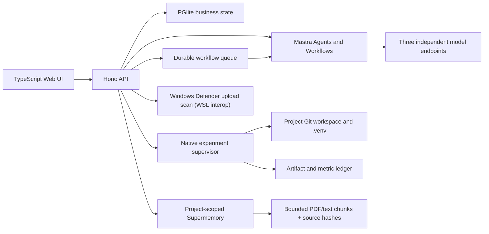

# Architecture

Research OS runs inside WSL2 (Ubuntu 22.04) as Linux processes and keeps every externally reachable listener on `127.0.0.1`. Windows browsers reach the same loopback addresses through WSL's mirrored networking (`networkingMode=mirrored`); the shared LAN IP belongs to WSL2 itself and must not be used to reach Windows-host services from inside WSL2.

## Process Boundaries

`apps/server` owns business state, validation, approvals, project Git, evidence, reports, uploads, experiments, and audit records. `apps/mastra` owns model-backed reasoning and declarative workflow graphs. `apps/web` is built from TypeScript and served by the API.

Mastra can call only fixed high-level loopback endpoints. Agents do not receive arbitrary file, process, SQL, or network tools. A model response cannot become an execution command.

## Project Workflow Boundary

Each project owns exactly one workflow source at `projects/<id>/workflow.ts`, committed in the project-local Git and initialized from the default template. The Mastra process runs a project workflow loader that polls these files, compiles changed sources into `runtime/workflow-cache/<id>/`, validates the manifest, strict input/output schema, unique graph IDs, import allowlist, and a dry run, then atomically replaces the active version. Suspended runs stay pinned to the version that created them. `workflow.ts` may import only `@research-os/workflow-kit`, `zod`, and the Mastra workflow API; filesystem, network, process, dynamic import, and credential patterns are rejected. Workflow edits are generated as reviewable diffs, validated in a temporary workspace, approved, written, and committed to the project Git before hot loading. Run records are currently persisted in `runtime/workflow-runs.json`.

Project chat, paper translation/revision, and experiment planning requests are dispatched through the project workflow entry; the workflow branches call restricted internal API endpoints for the actual model and state work. Idea clarification before project creation remains outside a project workflow by design.

## Related Work Boundary

`apps/server/src/related-work/` owns the TypeScript source-adapter boundary and project-scoped related-work service. Crossref, OpenAlex, Semantic Scholar, DBLP, and arXiv search adapters return strict paper candidates and source-attempt records; Crossref, OpenAlex, and Semantic Scholar also return reference batches with ranking signals. `related_work_seeds`, `related_work_candidates`, `related_work_candidate_sources`, `related_work_source_attempts`, `related_work_recursive_runs`, `related_work_run_events`, and `related_work_citation_edges` keep seed inputs, provider evidence, approvals, progress, failures, and graph edges inside one project scope. A failed provider remains a structured failure. The user's `D:\auto-related-work` is an algorithm and test reference only; its Python files, runtime, proxy tunnel, keys, and business modules are not dependencies.

`related_work_request_cache` is a separate project-scoped persistence layer for real provider responses. Its canonical request hash includes project, provider, operation, query and bounded request parameters together with `related-work-request-v1`; rows retain the request URL, parameters, response, provider status, TTL and hit count. The service only replays an unexpired row with the current schema version. Cache audit events distinguish miss, hit, expiry, schema mismatch, invalid stored response, and a failure that was intentionally prevented from replacing a prior success. The cache is an optimization and an auditable replay of a provider result, never a provider switch or a fallback result.

Related-work processing does not end at a paper list. A verified repository is a separate reproduction lineage with a fixed commit, its own project experiment environment, and separately approved download/dependency/run/artifact steps. TypeScript compares real reproduction outputs with the paper's located evidence and records an auditable comparison; Mastra may propose a user-reviewable innovation or research-gap candidate from those bound records, but cannot promote it to a scientific conclusion.

Repository discovery is a separate deterministic boundary: it extracts only explicit GitHub/GitLab URLs from a Paper's stored metadata/source URL, records the locator, and does not infer a repository from a title. Repository verification then combines the Paper record with provider API metadata and bounded citation/manifest files. Its readiness checks are independent fields, so an unknown entrypoint, dependency list, data requirement, or system requirement cannot silently become a downloadable reproduction.

Code reproduction is a separate experiment boundary rather than a method-code import. A verified fixed-commit download creates a `reproductions` record and stores source under `projects/<id>/experiment/reproductions/<reproduction-id>/source`; `repository_download`, `repository_dependency_install`, `repository_reproduction_run`, and `repository_artifact_write` are separate approval states. The dependency service creates a per-reproduction `.venv`, the task worker copies source into a run workspace and records fixed seeds/config/logs/metrics, and only a second integrity check can materialize outputs as `reproduction_output` Artifacts. `reproduction` and `reproduction_run` are lineage node types, so repository changes invalidate dependent runs and outputs. No external Python module is imported by `apps/` and no reproduction result is a method or paper conclusion.

`apps/server/src/research-status/` owns the evidence-gated research-status matrix and graph projection. `papers.confirmed` records the user's confirmation of a Paper and is intentionally separate from `papers.verified`; a matrix row additionally requires located Evidence and accepted ClaimReview IDs. The `research_status_matrices`, `research_status_matrix_rows`, and `research_status_gap_candidates` tables retain Idea-version and source provenance. The graph is a read projection of explicit foreign-key/array relations only: provider citation edges remain metadata-only, while Paper-Evidence and ClaimReview-Evidence edges expose their evidence state. Gap, cluster, and duplicate-risk records are candidate annotations with audit decisions, never scientific conclusions.

The Web graph view consumes that projection without inventing relationships. It renders deterministic candidate/Paper/Evidence/ClaimReview columns as an accessible SVG, keeps node status separate from evidence status, and exposes source ID, stable ID, provider, locator, and project permission in the selected-node detail. Mouse and keyboard selection are supported, and the container scrolls horizontally on narrow screens. Empty, partial, and failed API states are separate UI states; a graph screenshot or fixture does not close the related-work workflow until the applicable provider and browser acceptance has also passed.

## Paper Workspace

The paper workspace reads and edits `projects/<id>/paper/main.tex` and `references.bib` inside the project-local Git repository. The default draft is a self-contained CVPR-style template: `paper/cvpr.sty` is a portable layout file stored with the paper and approved together with the generated `main.tex`. Section edits and AI revisions are `code_patch` Proposals with `patch_kind=latex`; approval writes the file, commits it in the project-local Git, and automatically queues a fixed `compile_latex` experiment. Linux `latexmk` produces the PDF into the controlled artifact run directory, so a failed compile leaves a structured error and never reuses an old PDF. Chinese sentence translations are generated separately, written atomically to `paper/translations.json` with an audit event, and are UI-reference data that never enters the PDF. Projects created before project-local Git was introduced are migrated on first paper access: `ensureProjectGit` initializes the nested repository, adds a project `.gitignore` excluding runtime/artifact directories, and records the baseline commit.

## Persistence

- `runtime/research-os.pglite`: embedded PostgreSQL-compatible business database.
- `runtime/mastra.db`: Mastra workflow and memory state.
- `runtime/model-settings.json`: ignored runtime overrides; keys are never returned by the API.
- `projects/<id>`: project Git repository, Idea, paper (`paper/main.tex`, `references.bib`, `translations.json`, `cvpr.sty`), experiment source, per-project `.venv`, and project-owned files under `projects/<id>/artifacts/`.
- `artifacts`: shared immutable or append-only acceptance files, test/operations material, backups, and legacy migration sources; it is not the live home of new project files.

Project URLs use two lowercase English words and a four-character lowercase alphanumeric suffix. The same semantic slug is the canonical `projects.id` primary key and is used for project directories, workflow IDs, Supermemory container tags, and project settings. `project_slug_aliases` keeps pre-migration slugs and legacy UUIDs resolvable as compatibility aliases, so URL cleanup does not break historical links.

The database is the business state source. Supermemory is the project-scoped semantic memory and RAG provider; its `memory_links` ledger keeps source IDs, upload/Artifact IDs, SHA-256 values, locators, evidence status, remote IDs, and revoke/delete state. Mastra Memory is used only where the official Mastra Agent runtime needs conversation continuity and cannot approve actions or replace project state.

## Report Lineage

`reports.source_snapshot` records the project scope and the source IDs used to generate a report: Papers, Evidence, Experiments, valid Artifacts, and Proposals. `projectDetail` revalidates every declared source against the current project before returning the report. A pre-lineage row with an empty snapshot is exposed as `legacy_unverified`; a malformed snapshot, scope mismatch, cross-project source, deleted source, or invalid Artifact is `blocked`. The Web UI renders Markdown only for `valid` reports and shows the blocking reason for every other state. Historical report text is therefore never treated as an independent evidence store, and report lineage validation cannot replace the stronger Paper/Evidence/ClaimReview and Experiment approval gates.

## Material Indexing

After Defender-scanned upload, the durable queue dispatches a fixed `material_index` task. PDF text is extracted from a bounded page range and text-like files are normalized into bounded overlapping chunks. Images and PDFs with no extractable text are sent as controlled multimodal documents. Each semantic write includes the immutable project container tag and source metadata. `/materials/search` calls Supermemory directly with the current project scope; missing configuration or remote failure is returned as a structured error, never as a local keyword fallback.

## Experiment Boundary

An approved request selects an allowlisted type and project semantic slug. The supervisor derives all paths. Scientific Python executes with the project `.venv` on the fixed Linux backend (`python3 -m venv` + `.venv/bin/python`). Native Windows hosting is not supported; the legacy `windows`/`wsl2` launchers were removed. The child receives a minimal environment without application model keys.

The supervisor enforces timeout, process-tree cancellation, bounded logs, required finite `metrics.json`, structured `checkpoint.json`, path containment, SHA-256 artifact registration, and terminal audit state. This is native process control, not a virtual-machine security boundary.

## Failure Semantics

Model calls use zero retries at the Agent boundary and the OpenAI Responses provider. Operation-free base URLs are validated before use. Structured requests use strict `text.format.type=json_schema` output and do not send legacy `response_format` or `json_object` fields. Configuration errors, upstream failures, timeouts, and invalid structured output return explicit API errors. No assistant message is stored unless Mastra produced a valid result. Workflow queue retries apply only to fixed deterministic workflow dispatch, not to model substitution. The closed Supermemory child is given a loopback Chat-compatible base only so its legacy protocol can be terminated at the local TypeScript bridge; the bridge sends the fixed gateway only Responses requests and fails closed on every conversion or upstream error.
