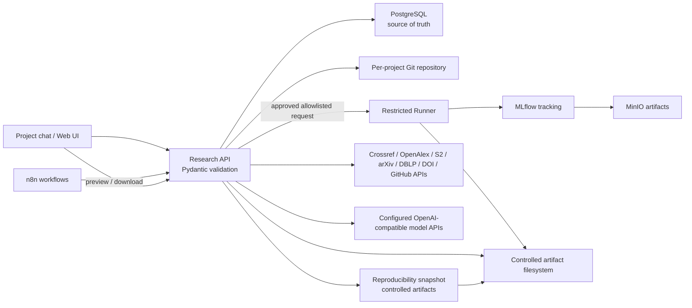

# Architecture



PostgreSQL 是状态源，聊天历史不是。核心依赖链为：

## 自适应 Idea 澄清

`POST /api/chat` 是 Research OS 网页的直接入口；n8n `chat-gateway` 只是把 `/webhook/research-os/chat` 代理到同一接口。确认项目之前不会触发 `research-main`。旧版 `QUESTIONS/ORDER` 固定问题队列已经移出运行路径，当前每轮流程为：

```text
  用户消息 + 当前结构化草稿 + 最近对话
  -> 本地确定性复杂度评分
  -> Luna(simple) / Terra(medium) / Sol(complex)
  -> API 容器直连对应 OpenAI-compatible URL（严格 JSON Schema）
  -> 整体更新 draft + 自然回复 + assumptions/risks/unresolved_items
  -> Pydantic + 必要 ProjectSpec 缺口检查
  -> 继续澄清或显示待用户确认的 ProjectSpec
```

模型可以依据 PyTorch/CNN/MNIST 等明确线索推断候选领域，但必须公开为可纠正假设；不得推断数据授权、GPU 可用性、预算、截止时间或科研新颖性。模型不可自行提高成本层级，也没有 Shell、文件、SQL 或网络工具。ReAct/外部编码 Agent 只有在出现真实的受控工具循环需求后才评估，并且仍必须经过高层工具 Schema 与审批闸门。

模型 URL、key、model 和 reasoning effort 由 `.env` 或网页模型设置面板分别配置；key 只保存于忽略的 runtime 挂载文件。模型请求失败直接返回结构化错误，不做 provider 切换、本地降级或规则回复。Windows 不启动 API、Bridge 或模型服务。上传先经过私有 ClamAV、受限解析和事务配额检查；任一扫描/解析/配额失败都会阻止材料进入模型上下文。

```text
IdeaVersion -> Proposal/Policy -> Experiment -> Metric/Artifact -> Report/Paper claim
                   |                  |
                   +---- approval ----+
```

Idea 修订创建新版本并进入 `impact_review`。API 依据 `ArtifactDependency` 计算 Idea、策略、代码、数据或产物删除变更的依赖后代，只使受影响的有效产物失效，并在 Proposal 与审计事件中记录可审阅的节点/边影响图、重跑候选和关联检查点。批准变更后，API 会为每个可安全恢复的终态实验自动创建待审批的局部重跑 Proposal；每个 Proposal 重新绑定源实验、检查点、白名单配置和随机种子，绝不会自动执行或替换为无关实验。批准的检查点重跑仍通过受控实验提交链执行，主题专属重跑和检查点恢复也使用固定主题入口。

项目状态是执行闸门，不只是 UI 标签。`paused` 和 `cancelled` 会阻止检索、创新性评估、实验/编译计划及 Runner 提交；暂停/取消会取消活动任务和 Runner run，并写入状态检查点。恢复仅允许从 `paused` 回到检查点保存的稳定阶段；`cancelled` 是终止状态。定时 n8n 报告只枚举 active 项目。

项目策略先生成 `config_change` Proposal，明确批准后才写入 `policies`。策略编译器识别中英文随机种子下限、引用 DOI/来源与原文证据要求，以及高成本/对外操作审批要求。实验计划按当前规则生成，`POST /api/experiments` 重新读取数据库策略，Runner 再校验受限策略快照；策略在批准后变化时，旧 Proposal 不能绕过新规则。无法识别的自由文本规则会保留并显示为人工规则，不会虚假标记为自动执行。

## n8n orchestration boundary

n8n owns the JSON workflow graph for the chat gateway, research start/search/evidence review, and scheduled reports. Its nodes call fixed high-level `http://api:8080` endpoints inside the Compose network; they do not read environment variables, hold model keys, construct SQL, or submit Runner commands. The API remains the enforcement boundary for model routing, strict Pydantic output, approvals, database state, and fail-fast errors. Moving a model request into an n8n HTTP node would duplicate secret/configuration state and bypass the shared three-tier settings panel, so the current design keeps that request in the API container while n8n coordinates the surrounding workflow.

## Project supervision intent

Messages in an existing project conversation are classified by the configured container-internal model into a strict `SupervisionIntent` schema: explanation, advice, Idea change, long-term policy, pause/resume/cancel, approval/rejection, or ambiguous. The classifier receives only bounded project context and recent messages. A concrete change must include an allowlisted Idea field/value or a policy rule before the API creates a Proposal; state and approval intents never execute from chat. Classification failures return structured `llm_*` errors, and the old keyword marker path is not used.

## Idea-specific experiment planning

`POST /api/projects/{project_id}/experiment-plan` reads the current `ProjectSpec`, verified page-level `Evidence`, and active policy snapshot, then calls only the configured complex model tier for a strict `ExperimentPlan`. The API validates every referenced evidence ID, the current Idea version and fingerprints, topic relevance, policy seed minimum, and confirmed resource budget before storing a pending `experiment_plan` Proposal. The payload contains no shell command, path, arbitrary runner argument, or generic demo task. Approval is mandatory; submission revalidates the stored plan against current state and sends it to the fixed topic template only when the request exactly matches the approved plan. The template runs the project's fixed `experiment/main.py`, passes plan/resume JSON through fixed environment paths, and requires numeric `metrics.json` plus structured `checkpoint.json`; missing or invalid output is a structured failure. It never substitutes `demo_classification` or `point_cloud_demo` for an unsupported or failed topic.

## Checkpoint-scoped rerun boundary

`POST /api/projects/{project_id}/checkpoints/{checkpoint_id}/rerun` creates a pending `experiment_rerun` Proposal only for an `experiment_succeeded` or `experiment_failed` checkpoint whose source experiment is terminal. The payload is rebuilt from the source experiment and contains only the existing allowlisted template fields and persisted random seeds; for a topic run it also contains the original structured plan and fixed resume context. The generic Proposal endpoint cannot create this kind; approval and submission rebuild and compare the payload again. The Web UI exposes the action beside the matching terminal experiment, and approval automatically submits it through the normal approved experiment path without a second UI execution action. Missing topic inputs or process/artifact failures remain structured errors with no unrelated demo substitution.

Code, configuration, and LaTeX changes use structured `create`, `replace`, or `delete` operations under fixed project roots. A patch Proposal binds a clean base Git commit and expected file hashes, records a deterministic diff, and requires approval. Approval validates the operations in an isolated staging tree, rechecks the live workspace, runs fixed syntax/structure checks, and commits only through fixed Git arguments. Write, validation, conflict, and commit failures restore the workspace and return structured errors. Rollback is a separate approval Proposal using only `git revert --no-edit`; external publication is disabled. This path never interprets a diff as a command or substitutes an unrelated experiment.

The Runner service is a non-root, read-only supervisor on the internal `runner-internal` Compose network. Each accepted Run is launched by the separate `runner-launcher` service into a fresh non-root `research-os-runner` job container. Only the launcher has Docker socket access; API, supervisor Runner, and Windows have none. The launcher uses the fixed deployment image, fixed internal network, controlled inherited mounts, fixed `python -m app.worker` entrypoint, and eight allowlisted templates with template-specific CPU/memory/PID/timeout and hard per-run tmpfs output-volume limits. The topic template always invokes the project `experiment/main.py` file and exposes only fixed plan, resume, output, metrics, and checkpoint paths; it does not turn plan text into a command. The general Python template accepts only a single `experiment/*.py` entrypoint; the Conda template uses the prebuilt `/opt/conda/envs/research-os` micromamba prefix with the same entrypoint restriction; the CMake template builds only `experiment/cpp` target `research_os_job`; the GPU template requests one Docker GPU device. Terminal output is synchronized before the job container and volume are removed. Its contract rejects arbitrary command, path, URL, network, image, and environment fields. Real GPU-host validation remains roadmap work.

## Deterministic diagnostics

`POST /api/projects/{project_id}/diagnostics` reads persisted terminal experiment rows and calculates finite numeric metric count, mean, population standard deviation, minimum, maximum, structured failure codes, and succeeded runs with missing metrics. It does not call a model and does not execute a suggested action. When failures, missing metrics, or high dispersion meet a deterministic threshold, the API creates one deduplicated `diagnostic_suggestion` Proposal with the affected run IDs and evidence; approval is required before any follow-up change can be proposed or executed. The LLM may later explain or challenge this report, but it never computes the statistics.

## Reports and notifications

`POST /api/reports` builds daily, weekly, or manual Markdown from persisted rows without a model call. It includes literature and page/section evidence counts, code repository verification state, experiment statuses, explicitly reported resource/cost fields, valid artifact lineage, audit decisions, and pending approvals. It does not infer missing costs or turn metadata into scientific conclusions. `notify` defaults to `false`; when explicitly enabled, `REPORT_NOTIFICATIONS_ENABLED=true` and a credential-free `https://` `REPORT_WEBHOOK_URL` are required. One webhook request is attempted, with an optional bearer secret from `REPORT_WEBHOOK_SECRET`; failure returns a structured error and does not try another channel. n8n continues to generate local reports without notification by default.

## 实验可复现快照

批准的实验进入 Runner 前，API 在固定项目 Git 工作区执行一次可复现快照门禁：工作树必须干净，Git 索引与状态中的文件必须通过扩展名、目录和 10 MB 单文件大小门禁，然后从当前 commit 创建不可变的 `run/<run_id>` annotated tag。`git archive` 生成的 `source.tar` 不写回项目仓库，而是保存到 `artifacts/reproducibility/<project_id>/<run_id>/`。

同一目录保存 ProjectSpec、策略、有效实验配置和随机种子、Runner 环境报告、数据清单、模型清单、依赖锁文件哈希以及顶层 `snapshot.json`。每个文件记录相对 URI、大小和 SHA-256；数据库写入 `Artifact` 和 `ArtifactDependency`，并把快照契约放入实验配置与检查点。`GET /api/experiments/{run_id}/reproducibility` 会重新校验这些内容，并提供源码快照下载入口。

API 提交和 Runner 执行各自校验：项目 commit、tag 指向、快照 manifest、全部文件哈希、固定项目根和 Runner 镜像身份必须一致。项目 Git 只保留源码、配置、BibTeX/LaTeX、证据 JSON、manifest 和哈希；PDF、PLY/PCD、图片、数据集、模型权重、数据库备份、日志归档、源码 bundle 与缓存通过项目 `.gitignore` 和快照门禁排除。`RUNNER_IMAGE_DIGEST=unavailable` 只适用于本地开发，不能作为发布级身份。

## Repository verification and controlled import

Repository search results are stored as unverified `RepositoryRecord` candidates. The verification endpoint reads GitHub/GitLab metadata, the project paper record, and `CITATION.cff` or README content; a DOI or exact paper-title match is required before `verified_official` can be set. A known SPDX identifier and a full 40-character commit are also required. Only an approved `dependency_install` Proposal may download a bounded archive, reject traversal/symlink/special-file entries, record its SHA-256, and commit it under `code/repositories/`.

## PostgreSQL entities

PostgreSQL schema changes are applied by the one-shot Compose `db-migrate` service through versioned Alembic revisions. The API runtime connects with a dedicated CRUD-only role, n8n connects to the same database through a separate role restricted to the `n8n` schema, and MLflow uses a separate `research_os_mlflow` database owned by its own role. The bootstrap role is used only for role provisioning and migrations; API startup fails when `alembic_version` is missing instead of creating or altering tables implicitly.

## Uploaded material boundary

`POST /api/uploads` stores the original file under the controlled artifact root with its MIME type, size, SHA-256, and parser metadata. The parser is bounded: PDF text is page-labelled and truncated, JSON/CSV previews are capped, UTF-8 text and code are read without execution, images expose format and dimensions only, and ZIP files expose a manifest without extraction. Path traversal, invalid encodings, binary text, unsafe ZIP entries, compression-ratio limits, and the 50 MB upload limit fail with structured errors. Parsed summaries are included in clarification and topic-specific planning requests without exposing host paths. They remain untrusted context and cannot be used as commands or as verified scientific evidence.

| Table | Purpose |
|---|---|
| `projects` | 项目 ID、阶段、状态、当前 Idea 版本 |
| `conversation_sessions`, `messages`, `uploaded_files` | 项目对话、澄清状态与附件校验信息 |
| `idea_versions` | 不可变的 `ProjectSpec` 版本 |
| `papers`, `evidence` | 文献元数据、BibTeX 和可追溯证据 |
| `proposals` | diff/影响/成本与两阶段审批 |
| `experiments` | Runner、配置、指标和 MLflow Run ID |
| `artifacts` | PNG/PLY/PDF/JSON 及可复现快照的依赖元数据与有效性 |
| `policies` | 独立于聊天历史的长期规则 |
| `reports`, `audit_events` | 定期报告与审计轨迹 |
| `tasks`, `checkpoints` | 异步编排状态与可恢复检查点 |
| `human_feedback` | 独立于聊天历史的人工指导与变更分类 |
| `repositories` | 代码候选来源、许可证、commit/tag 与官方验证状态 |
| `artifact_dependencies` | 产物到实验、Idea、Git、数据和 MLflow 的依赖边 |

开放 PDF 证据只从检索记录中的 `pdf_url` 获取，Agent 不能传入任意 URL。API 对原始 URL 和重定向后的 URL 都执行 HTTPS、固定学术开放域名、端口、25 MB、PDF magic 和超时校验；PDF 位于独立的 `artifacts/literature/<project_id>/` 命名空间，避免与 Runner 的非 root run 目录发生所有权冲突。页码 quote、PDF/quote SHA-256、BibTeX、解析器和 PDF Artifact ID 写入 `evidence.metadata`，小型证据 JSON 同时进入项目 Git。

## Project directory permissions

```text
projects/<slug>/
  idea/                   ProjectSpec versions; Git tracked
  literature/evidence/    quoted evidence; Git tracked when text-sized
  literature/pdfs/        large, ignored; controlled storage reference
  code/                    reviewed source repositories
  configs/                 experiment configs; Git tracked
  experiments/runs/        generated run state; ignored
  source-bundles/          generated source archives; ignored
  logs/                    runtime logs; ignored
  paper/                   LaTeX, BibTeX, figures/tables; Git tracked
  reports/                 generated project reports
  artifacts/               metadata links; large binaries ignored

artifacts/reproducibility/<project_id>/<run_id>/
  snapshot.json            manifest and hashes
  source.tar               controlled source recovery bundle
  *.json                   ProjectSpec, policy, config, environment and input manifests
```

API 用户可写项目目录；Runner 以独立 UID 运行，只使用固定项目根和受控 artifact 根。生产环境应将代码输入挂载为只读，为每个 run 创建独立可写卷，并将数据库、Runner 和 MinIO 放入无公网入口的内部网络。
