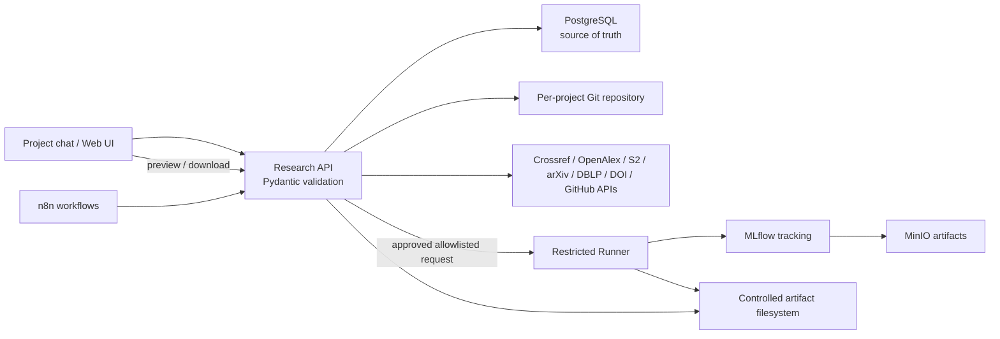

# Architecture



PostgreSQL 是状态源，聊天历史不是。核心依赖链为：

```text
IdeaVersion -> Proposal/Policy -> Experiment -> Metric/Artifact -> Report/Paper claim
                   |                  |
                   +---- approval ----+
```

Idea 修订创建新版本并进入 `impact_review`。当前 MVP 保守地将项目内已有产物全部标为无效；生产实现应增加实体依赖图，按检索查询、数据版本、配置字段和论文 claim 精确计算局部重跑集合。

项目状态是执行闸门，不只是 UI 标签。`paused` 和 `cancelled` 会阻止检索、创新性评估、实验/编译计划及 Runner 提交；暂停/取消会取消活动任务和 Runner run，并写入状态检查点。恢复仅允许从 `paused` 回到检查点保存的稳定阶段；`cancelled` 是终止状态。定时 n8n 报告只枚举 active 项目。

项目策略先生成 `config_change` Proposal，明确批准后才写入 `policies`。策略编译器识别中英文随机种子下限、引用 DOI/来源与原文证据要求，以及高成本/对外操作审批要求。实验计划按当前规则生成，`POST /api/experiments` 重新读取数据库策略，Runner 再校验受限策略快照；策略在批准后变化时，旧 Proposal 不能绕过新规则。无法识别的自由文本规则会保留并显示为人工规则，不会虚假标记为自动执行。

## PostgreSQL entities

| Table | Purpose |
|---|---|
| `projects` | 项目 ID、阶段、状态、当前 Idea 版本 |
| `conversation_sessions`, `messages`, `uploaded_files` | 项目对话、澄清状态与附件校验信息 |
| `idea_versions` | 不可变的 `ProjectSpec` 版本 |
| `papers`, `evidence` | 文献元数据、BibTeX 和可追溯证据 |
| `proposals` | diff/影响/成本与两阶段审批 |
| `experiments` | Runner、配置、指标和 MLflow Run ID |
| `artifacts` | PNG/PLY/PDF/JSON 的依赖元数据与有效性 |
| `policies` | 独立于聊天历史的长期规则 |
| `reports`, `audit_events` | 定期报告与审计轨迹 |
| `tasks`, `checkpoints` | 异步编排状态与可恢复检查点 |
| `human_feedback` | 独立于聊天历史的人工指导与变更分类 |
| `repositories` | 代码候选来源、许可证、commit/tag 与官方验证状态 |
| `artifact_dependencies` | 产物到实验、Idea、Git、数据和 MLflow 的依赖边 |

开放 PDF 证据只从检索记录中的 `pdf_url` 获取，Agent 不能传入任意 URL。API 对原始 URL 和重定向后的 URL 都执行 HTTPS、固定学术开放域名、端口、25 MB、PDF magic 和超时校验；PDF 位于独立的 `artifacts/literature/<project_id>/` 命名空间，避免与 Runner 的非 root run 目录发生所有权冲突。页码 quote、PDF/quote SHA-256、BibTeX、解析器和 PDF Artifact ID 写入 `evidence.metadata`，小型证据 JSON 同时进入项目 Git。

## Project directory permissions

```text
projects/<slug>/
  idea/                   ProjectSpec versions; Git tracked
  literature/evidence/    quoted evidence; Git tracked when text-sized
  literature/pdfs/        large, ignored; controlled storage reference
  code/                    reviewed source repositories
  configs/                 experiment configs; Git tracked
  experiments/runs/        generated run state; ignored
  paper/                   LaTeX, BibTeX, figures/tables; Git tracked
  reports/                 generated project reports
  artifacts/               metadata links; large binaries ignored
```

API 用户可写项目目录；Runner 以独立 UID 运行，只使用固定项目根和受控 artifact 根。生产环境应将代码输入挂载为只读，为每个 run 创建独立可写卷，并将数据库、Runner 和 MinIO 放入无公网入口的内部网络。
