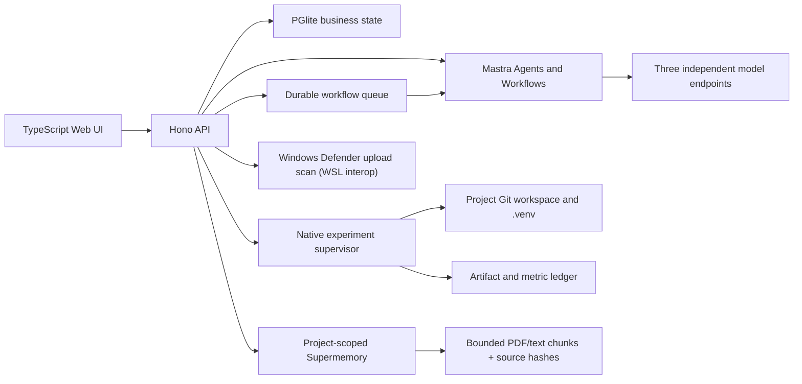

# Architecture

Research OS runs inside WSL2 (Ubuntu 22.04) as Linux processes and keeps every externally reachable listener on `127.0.0.1`. Windows browsers reach the same loopback addresses through WSL's mirrored networking (`networkingMode=mirrored`); the shared LAN IP belongs to WSL2 itself and must not be used to reach Windows-host services from inside WSL2.

## Process Boundaries

`apps/server` owns business state, validation, approvals, project Git, evidence, reports, uploads, experiments, and audit records. `apps/mastra` owns model-backed reasoning and declarative workflow graphs. `apps/web` is built from TypeScript and served by the API.

Mastra can call only fixed high-level loopback endpoints. Agents do not receive arbitrary file, process, SQL, or network tools. A model response cannot become an execution command.

## Persistence

- `runtime/research-os.pglite`: embedded PostgreSQL-compatible business database.
- `runtime/mastra.db`: Mastra workflow and memory state.
- `runtime/model-settings.json`: ignored runtime overrides; keys are never returned by the API.
- `projects/<id>`: project Git repository, Idea, paper, experiment source, and per-project `.venv`.
- `artifacts`: immutable or append-only evidence, uploads, experiment outputs, acceptance files, and backups.

The database is the business state source. Supermemory is the project-scoped semantic memory and RAG provider; its `memory_links` ledger keeps source IDs, upload/Artifact IDs, SHA-256 values, locators, evidence status, remote IDs, and revoke/delete state. Mastra Memory is used only where the official Mastra Agent runtime needs conversation continuity and cannot approve actions or replace project state.

## Material Indexing

After Defender-scanned upload, the durable queue dispatches a fixed `material_index` task. PDF text is extracted from a bounded page range and text-like files are normalized into bounded overlapping chunks. Images and PDFs with no extractable text are sent as controlled multimodal documents. Each semantic write includes the immutable project container tag and source metadata. `/materials/search` calls Supermemory directly with the current project scope; missing configuration or remote failure is returned as a structured error, never as a local keyword fallback.

## Experiment Boundary

An approved request selects an allowlisted type and project UUID. The supervisor derives all paths. Scientific Python executes with the project `.venv`; the Linux backend (`python3 -m venv` + `.venv/bin/python`) is the default when the service runs on WSL2/Linux, while a Windows host may explicitly select the legacy `windows` (`cmd.exe`) or `wsl2` launchers. Cross-host backend combinations are rejected with a structured 400. The child receives a minimal environment without application model keys.

The supervisor enforces timeout, process-tree cancellation, bounded logs, required finite `metrics.json`, structured `checkpoint.json`, path containment, SHA-256 artifact registration, and terminal audit state. This is native process control, not a virtual-machine security boundary.

## Failure Semantics

Model calls use zero retries at the Agent boundary. Configuration errors, upstream failures, timeouts, and invalid structured output return explicit API errors. No assistant message is stored unless Mastra produced a valid result. Workflow queue retries apply only to fixed deterministic workflow dispatch, not to model substitution.
