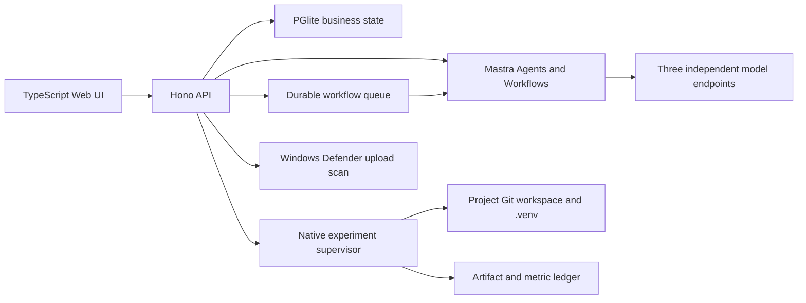

# Architecture

Research OS runs as native Windows processes and keeps every externally reachable listener on `127.0.0.1`.

## Process Boundaries

`apps/server` owns business state, validation, approvals, project Git, evidence, reports, uploads, experiments, and audit records. `apps/mastra` owns model-backed reasoning and declarative workflow graphs. `apps/web` is built from TypeScript and served by the API.

Mastra can call only fixed high-level loopback endpoints. Agents do not receive arbitrary file, process, SQL, or network tools. A model response cannot become an execution command.

## Persistence

- `runtime/research-os.pglite`: embedded PostgreSQL-compatible business database.
- `runtime/mastra.db`: Mastra workflow and memory state.
- `runtime/model-settings.json`: ignored runtime overrides; keys are never returned by the API.
- `projects/<id>`: project Git repository, Idea, paper, experiment source, and per-project `.venv`.
- `artifacts`: immutable or append-only evidence, uploads, experiment outputs, acceptance files, and backups.

The database is the business state source. Mastra Memory improves conversation continuity but cannot approve actions or replace project state.

## Experiment Boundary

An approved request selects an allowlisted type and project UUID. The supervisor derives all paths. Scientific Python executes with the project `.venv`; Windows `cmd.exe` is the default fixed launcher and WSL2 is an explicit alternative. The child receives a minimal environment without application model keys.

The supervisor enforces timeout, process-tree cancellation, bounded logs, required finite `metrics.json`, structured `checkpoint.json`, path containment, SHA-256 artifact registration, and terminal audit state. This is native process control, not a virtual-machine security boundary.

## Failure Semantics

Model calls use zero retries at the Agent boundary. Configuration errors, upstream failures, timeouts, and invalid structured output return explicit API errors. No assistant message is stored unless Mastra produced a valid result. Workflow queue retries apply only to fixed deterministic workflow dispatch, not to model substitution.
